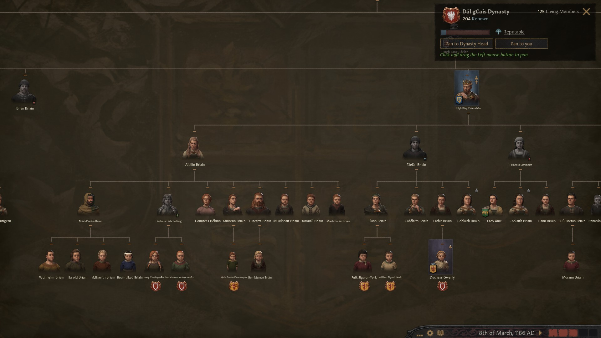
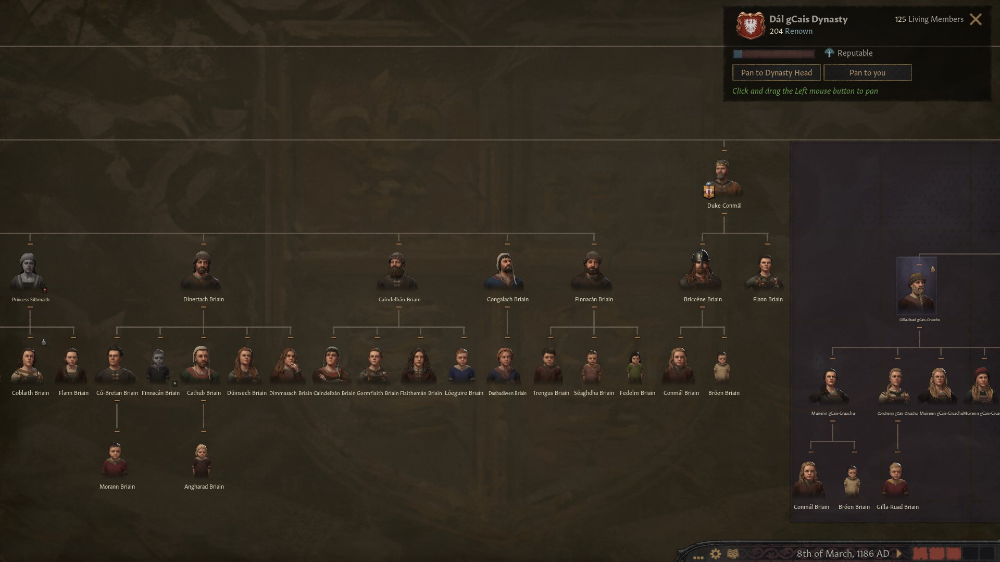
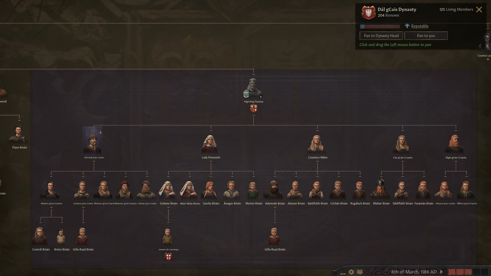
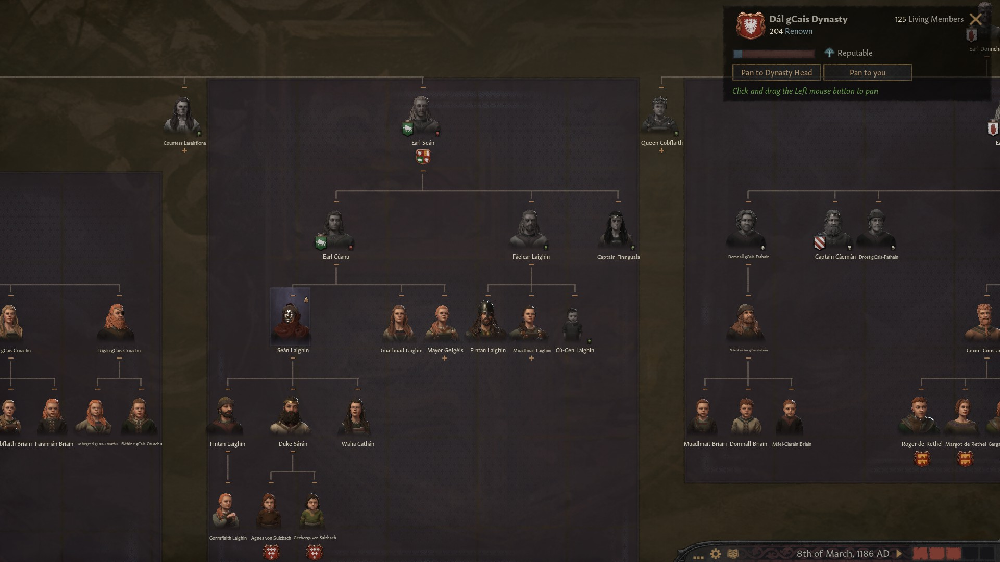
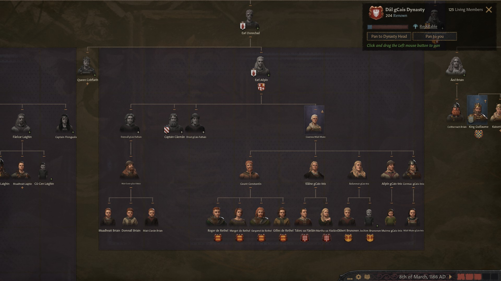
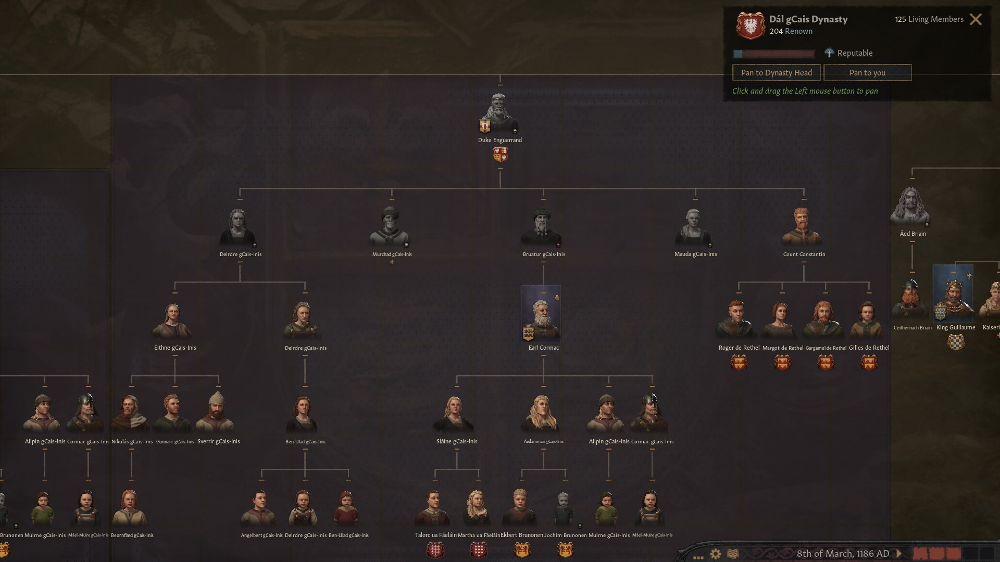
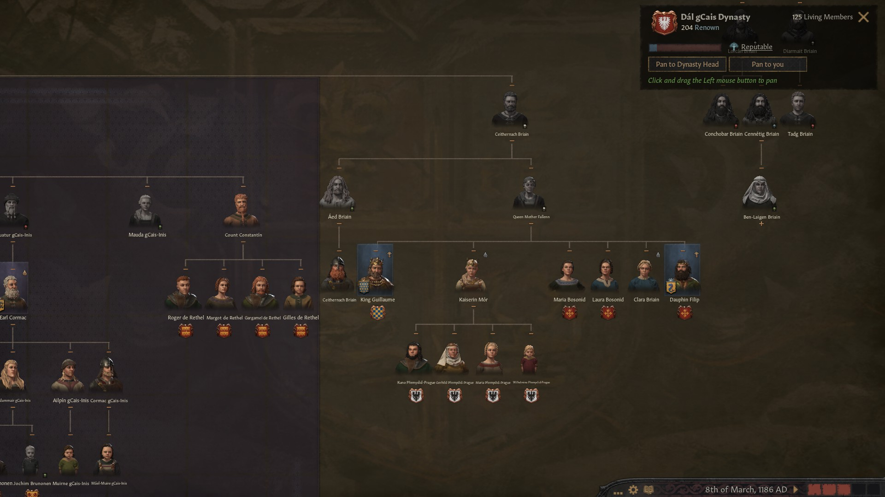
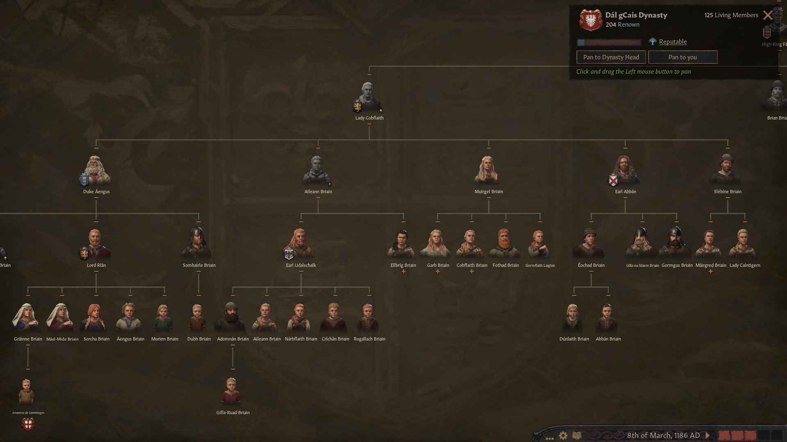
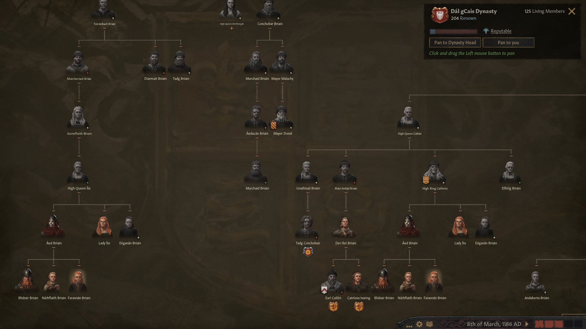

The Brian dinasty had 125 living members and was getting mixed up with many families all over Europe, so it would be not before long that we could be able to meet unexpected relatives all over the place.

