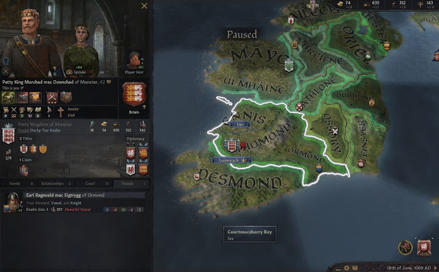

### Murchad mac Donnchad of Munster - 1069

The **Petty King Murchad mac Donnchad of Munster** - we all know him, right ?

But how good do we know him ? In 1067, he was **Petty** **King of Munster** and also **Earl of Ennis** and **Earl of Thomond**.

He belonged to the house **Briain**, the only house of the dinasty **Dal-gCais** .

He had one vassal, **Earl Ragnvald mac Sigtrygg of Ormond**, from the house **Vedrafjord.**

He had married **Adelais**, 20, from the obscure **Ponthieu** house. He had already had the first kid from her, **Donnchad mac Murchad Briain**, named after his grandfather. Not that was absolutely necessary, as there was already an heir.

Adelais's mother was **Adelaide de Normandie**, and her grandfather was the late **Duke Robert 'the Magnificent' of Normandy.** Her uncle **Duke William II 'the Bastard' of Normandy** was the ruling King of Normandy, and Adelais herself might inherit a claim on Normandy from her mother. 

Directly marrying the King of Normandy's niece had ensured an alliance between Munster and Normandy. In 1069, it was actually Normandy who had triggered this alliance in a war to conquer England.

Murchad had inherited his titles from his father **Donnchad Briain**, who had previously ruled over the kingdom of Munster. His father had ended up giving up any claims when he stepped down.

Donnchad Briain, in turn, had inherited his titles from his father **King Brian mac Cennetig of Ireland**, the first king of Ireland, and founder of the house Briain. King Brian's older sons were already dead at that time. Therefore King Murchad had still a claim on the kingdom of Ireland, a title that in the meantime had been destroyed.

King Brian had had many women in his life, and of his eleven children Donnchad was the only child he had had with **Gormflaith nic Murchad ua Faelain.** After her second husband King Brian had died, she herself had moved on to marry **King Mael-Sechnaill mac Dunflaith of Ireland,** previously also **Earl of Athlone,** who had received the title of King of Ireland after King Brian's death, as the assignment of this title followed special rules.

However, that also meant that there were many other claimants to the kingdom of Munster. In real history, Murchad's reign was very short - he was deposed by his cousin **Toirdelback Briain**, who had found allies in Connacht and in Leinster. Luckily, this did not happen in our alternate history.

Murchad's only son, **Brian mac Murchad Briain**, 19, whose mother is unknown, was Murchad's first heir. Next in the succession line were Murchad's two half-brothers, **Conchobar Briain** and **Lorcan Briain**, who were also claimants to Munster. Both owned children who could also inherit.

Brian mac Murchad Briain had just married **Hunydd ferch Bleddyn**, 25, now **Petty Queen Hunydd ferch Bleddyn of Munster**. She belonged to the Welsh house **Mathrafal,** in the **Caerloyw** dinasty**.**

Her father, **Prince Bleddyn ap Cynfyn of Gwyneed**, owned the **Principalities of Gwyneed** and **Powys**, and the **Lordships of Merionnydd, Eryri** and **Ynys Mon.** He wasn't doing too well in a war he was fighting in 1067 and had been taken prisoner. 

 

His primary heir was Queen Hunydd's bigger brother **Cadwgan Mathrafal**

**
**

Murchad's nephew, **Earl Murchad mac Diarmait of Dubhlinn,** belonged to the **Chinnselaig** house and dynasty. Murchad's late sister **Countess Derbforgail nic Donnchad of Leinster** had married patrilineally to **Earl Diarmait mac Donnchad of Leinster** also from the **Chinnselaig** house, Murchad's still living brother in law, who owned Leinster.

  

Murchad's cousin **Earl Conchobar mac Dommall of Athlone** belonged instead to the **Mail Sechlainn'**s house, in the **Cetchathach** dinasty. His father, **Domnall mac Mael-Sechnaill ua Mail Sechlainn,** had been born from Murchad's great mother Gormflait nic Murchad ua Faelain**'**s previously mentioned third (patrilineal) wedding with King Mael-Sechnaill mac Dunflaith of Ireland, and had inherited the title to Athlone.

