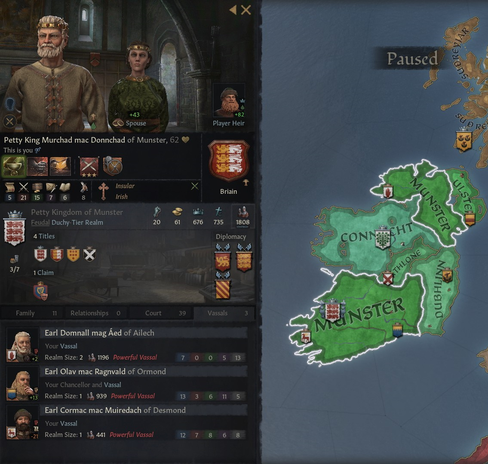
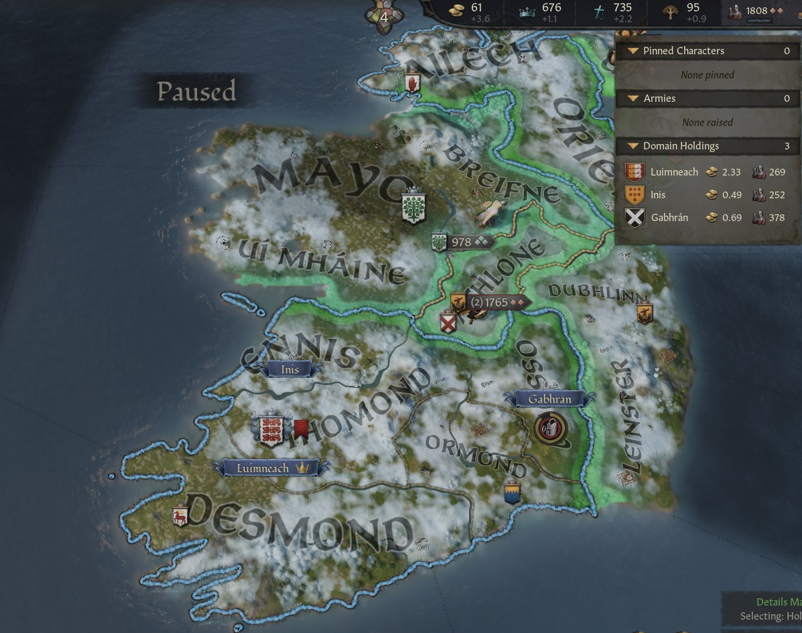
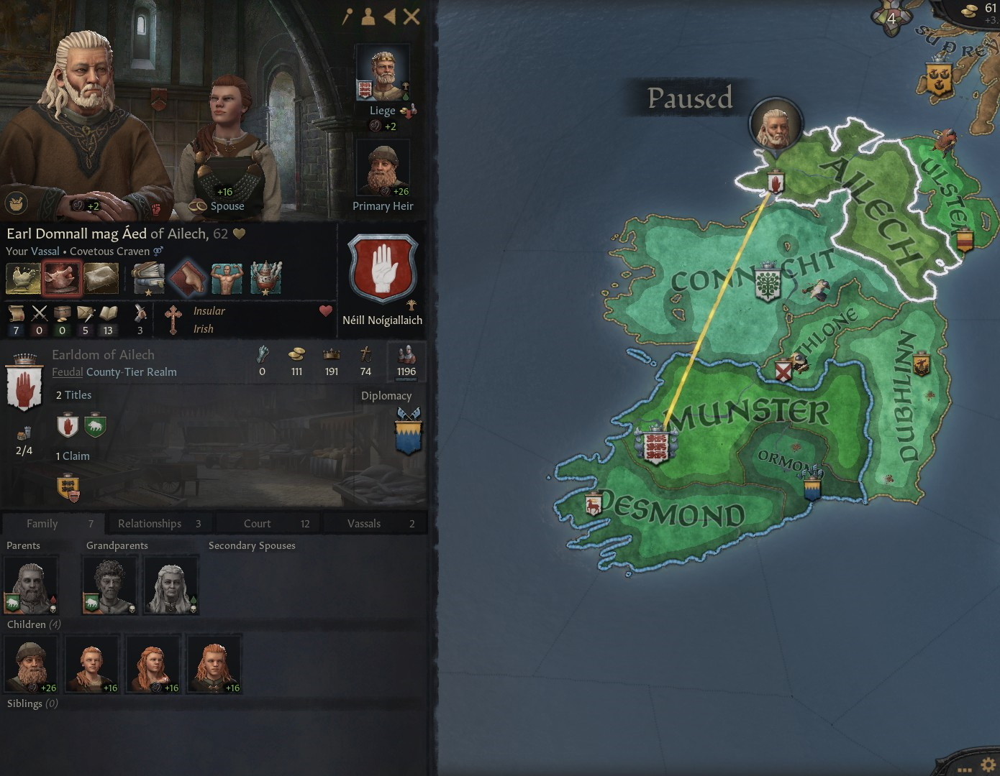
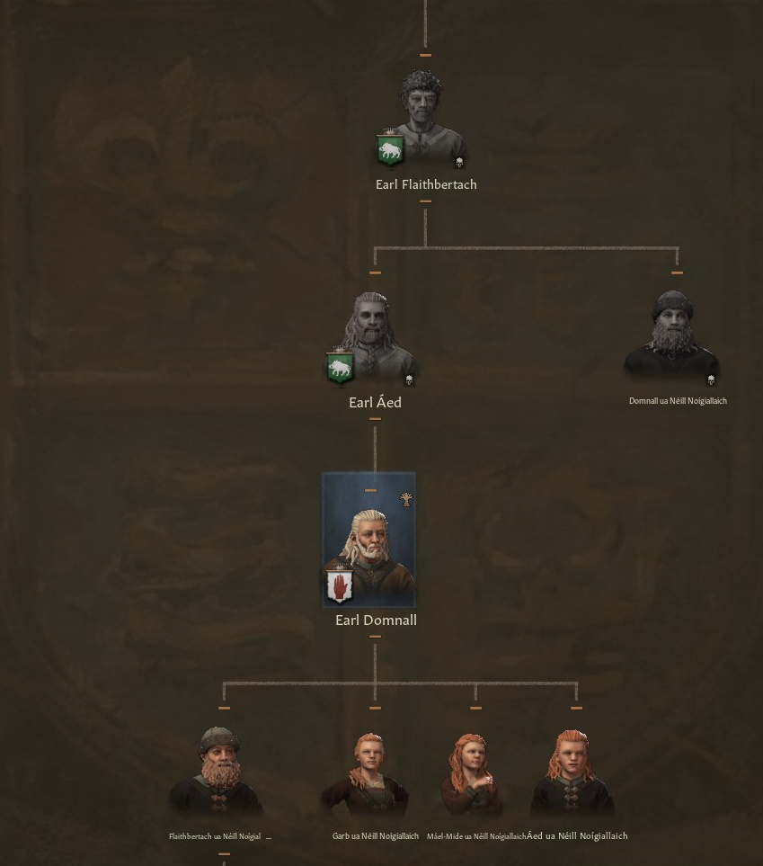
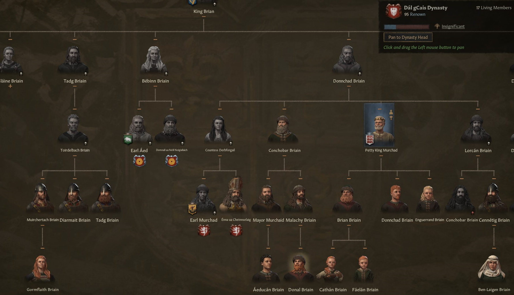
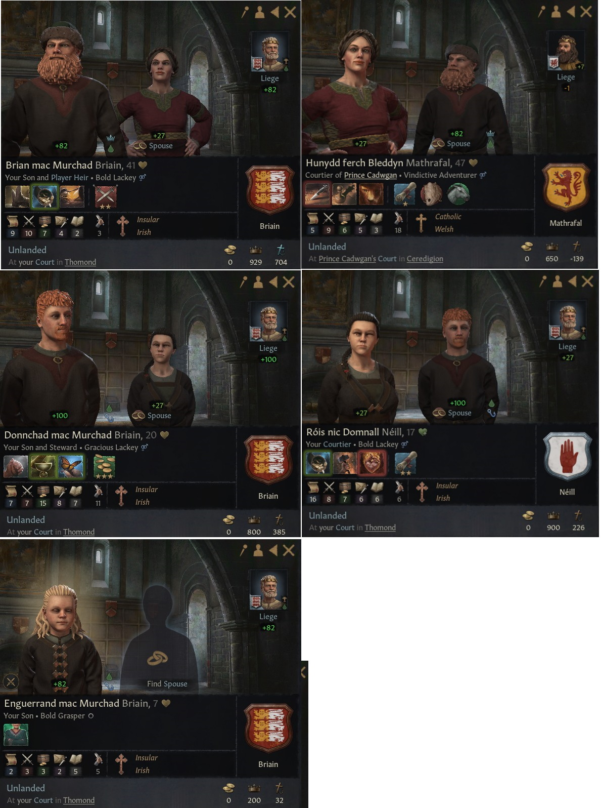
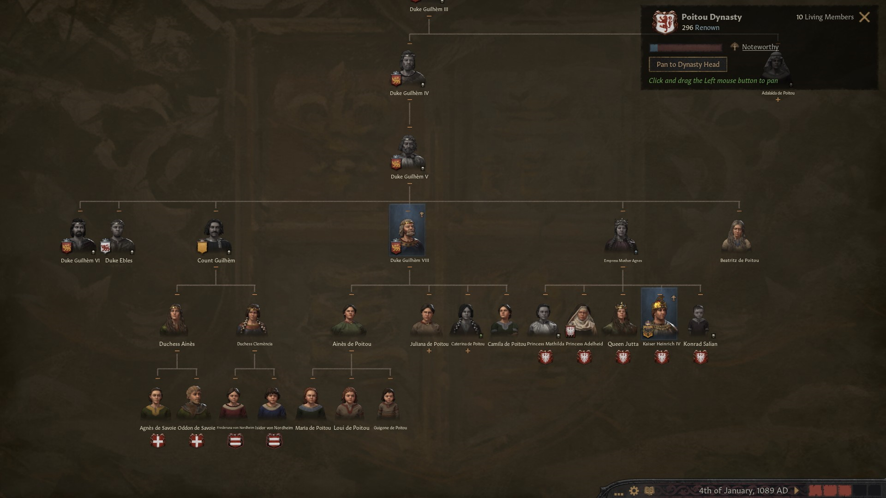
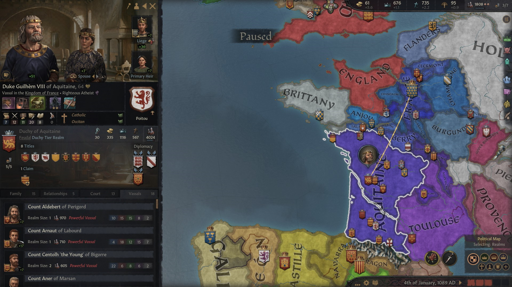
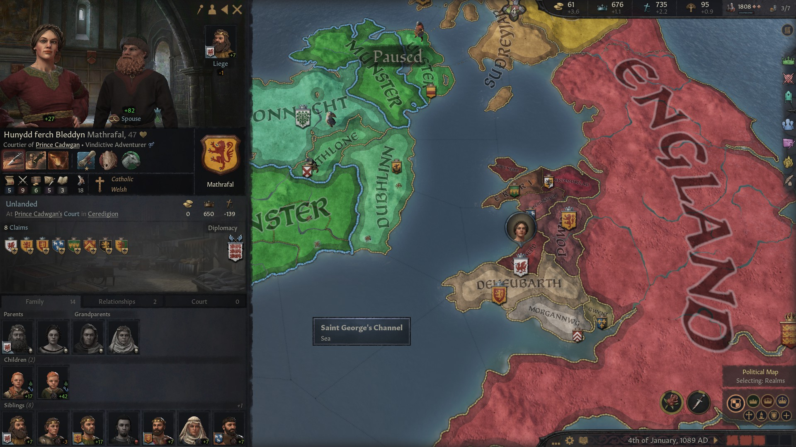
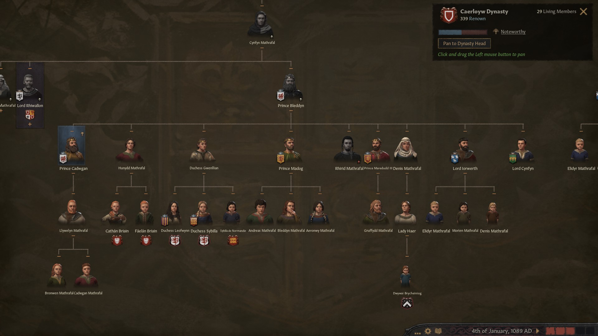

### Murchad Mac Donnchad of Munster - 1089

By 1089, the **Petty King Murchad mac Donnchad of Munster** was still holding on to his kingdom, and had even expanded it. Beside the titles of **King of Munster**, **Earl of Thomond** and **Earl of Ennis**, he was also **Earl of Ossory,** thanks to a fabricated claim**.**

He was now reigning over three vassals: **Earl Domnall mag Aed of Ailech,** who controlled also **Oriel, Earl Olav mac Ragnvald of Ormond,** who had succeeded his father **Earl Ragnvald mac Sigtrygg of Ormond,** and **Earl Comrac mac Muiredach of Desmond.**

**Earl Domnall mag Aed of Ailech** was a claimant Murchad had helped get back to power. He was actually Murchad's cousin **Earl Aed mac Flaitherbach of Oriel**'s son. He was born in the house **Neill Noigiallaich** from the marriage between Murchad's aunt **Bebinn nic Brian** and **Earl Flaithbertach mac Muirchertach of Oriel.** A relative, but not in Murchad's dinasty.

Murchad had three sons. Confederate Partition was still active, therefore they would inherit equally.

The oldest one **Brian Briain**, 41, whose mother is unknown, had already two children of his own, **Cathan** and **Faelan Briain,** from his marriage with **Hunydd ferch of Bleddyn.** His stats (9 10 7 4 2 ). and those from his spouse ( (5 9 6 5 3 ) were average-ish. He would inherit the **Kingdom of Munster** and the **Earldoms of Thomond** and **Ossory**

The second son, **Donnchad mac Murchad Briain**, 20, born from **Adelais**, had married **Rois nic Domnall Neill**, from the **Neill** house. Funnily enough, her father **Domnall mac Niall Neill** was the previous ruler of **Oriel** and **Ailech**, usurped with Murchad's help by Earl Domnall mag Aed of Ailech, as written before. The house Neill seemed to be headed to insignificance. 

Donnchad's stats (7 7 15 8 7) might have been better than Brian's stats. Historians wondered for a long time why Murchad didn't disinherit Brian and pick Donnchad as main heir, considering also the stats of his spouse (16 8 7 6 6) vs the stats of Brian's spouse. We know now that he just was not aware he could do that.

Donnchad was primed to inherit the title of **Duke of Ulster** and become a Petty King himself and therefore independent.

The third son, **Enguerrand mac Murchad Briain,** 7, had already impressive stats for his age (2 3 3 2 5). He wasn't betrothed yet. He was bound to inherit the **Earldom of Ennis** and become Brian's vassal.

Murchad's half brother **Lorcan** had died, while Murchad's other half brother **Conchobar** had married **Beatritz de Poitou**, the powerful **Duke Guilhem VIII of Aquitaine**'s sister. That had secured an alliance between **Munster** and **Aquitaine**. Guilhem VIII was **King Philippe of France's** most powerful vassal, controlled the **Duchies of Aquitaine, Poitou, Gascogne** and the **Counties of Bordeaux, Saintonge, Aunis, Poitiers** and **Agenais** and had 18 vassals of his own**.** 

Conchobar's son **Murchaid mac Conchobar** had married the **Mayor Lidia of Monza** and secured a pretty insignificant alliance.

Brian's wife, **Hunydd ferch of Bleddyn,** was now a claimant for the principalities of **Gwynedd, Powys** and **Deheubarth,** claims inherited from her father **Prince Bleddyn ap Cynfyn of Gwyneed.** His death meant that there wasn't an alliance with him any longer and his nearly complete unification of Galles had taken several steps back.

The realm had to be divided between five sons. 

- **Prince Cadwgan ap Bleddyn** had inherited the **Principality of Gwynedd,** the **Lordship of Ynys Mon** and the **Lordship of Ceredigion**
- **Prince Madog ap Bleddyn** had inherited the **Principality of Powys** and the **Lordship of Penllyn**
- **Prince Maredudd III ap Bleddyn** had inherited the **Principality of Deheubarth,** the **Lordship of Dyfed** and the **Lordship of Sir Gaerfyrddin**
- **Lord Iorwerth ab Morien** had inherited the **Lordship of Merionydd**
- **Lord Cynfyn ap Morien** had inherited the **Lordship of Eryri**

Of these, only Prince Cadwgan was Hunydd's full brother, as they both were born from **Branwen Nwrcelyn**, from the house **Nwrcelyn** The other half-brothers were born from other women.

Murchad had focused on martial studies, trying to become a **Strategist** and a **Gallant**, but finishing neither of them. He would manage to become a Strategist just before his death.

