### Petty King Brian II mac Murchad of Munster, 1095

**Murchad mac Donnchad** died in 1095, and the empire was split between the heirs. **Brian II mac Murchad** got the titles of **King of Munster** and **Earl of Thomond** (Barony of **Luimneach**)**, Ossory** (Barony of **Gabhran**) and **Ulster** (Barony of **Dun Padraig**), and as vassals **Earl Olav mac Rangvald of Ormond**, who in the meantime had also conquered the **Earldom of** **Desmond** with a fabricated claim, Brian II's brother **Earl Enguerrand mac Murchad** and **Mayour Muirguis of Carraig Fhearghais**, a town located in the **Earldom of Ulster**.

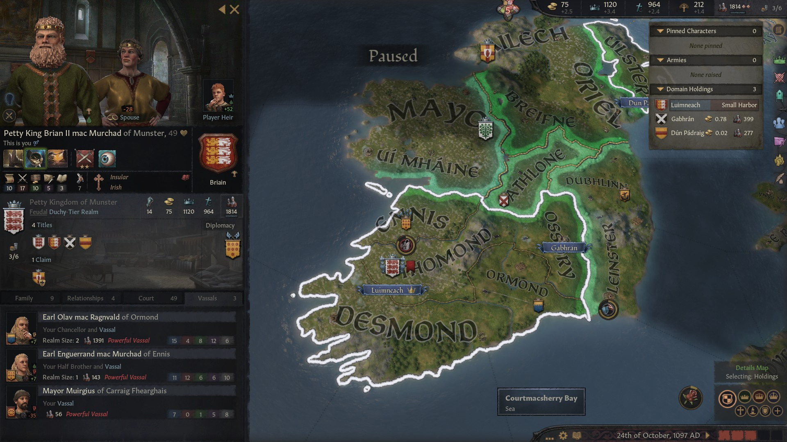

Murchad's second son **Donnchad mac Murchad** had become Duke of Ulster, but did not control the **Earldom of Ulster** itself, as this was in Briain II's possession. Donnchad was managing the **Earldom of Ailech** directly**,** as he had revoked it from his vassal **Earl Domnall mag Aed of Oriel.** Domnall could not complain though, because in the mean time he had conquered **Breifne**, so that he owned the titles to the **Earldoms of Oriel** and **Breifne.** 

Donnchad had a daughter, **Cobflaith nic Donnchad,** 5, who suffered from bleeding and was betrothed to **Prince Odon of Poland,** whose father was the **King Kazimierz of Poland.** Somehow this had not resulted in an alliance between Donnchad and Kazimierz.

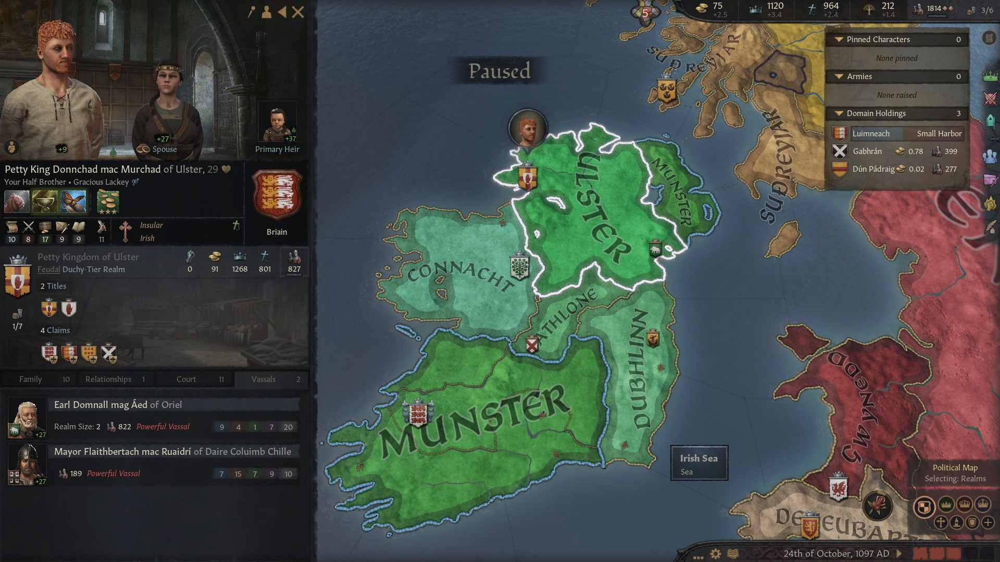

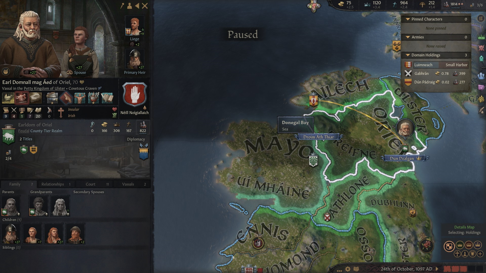

Murchad's third son, **Earl Enguerrand,** 16, had received the **Earldom of Ennis,** and was **Brian II's** vassal**,** as expected**.** He was betrothed to **Margrethe Haraldsdatter Estrid,** from the house **Estrid.** She was the niece of **King Erik Svendsen of Denmark** and the daughter of his vassal and half-brother **Prince Harald the Whetstone of Denmark**, **Count of Slesvig and Dithmarschen,** with whom Enguerrand had now an alliance.

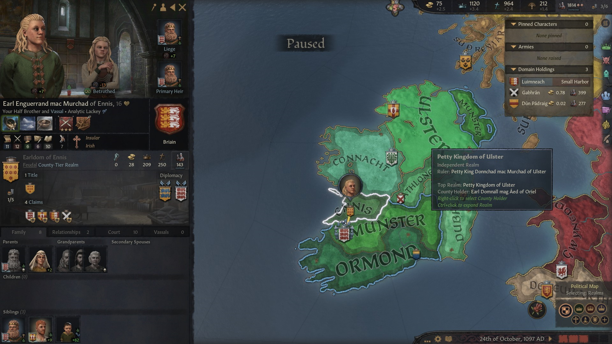

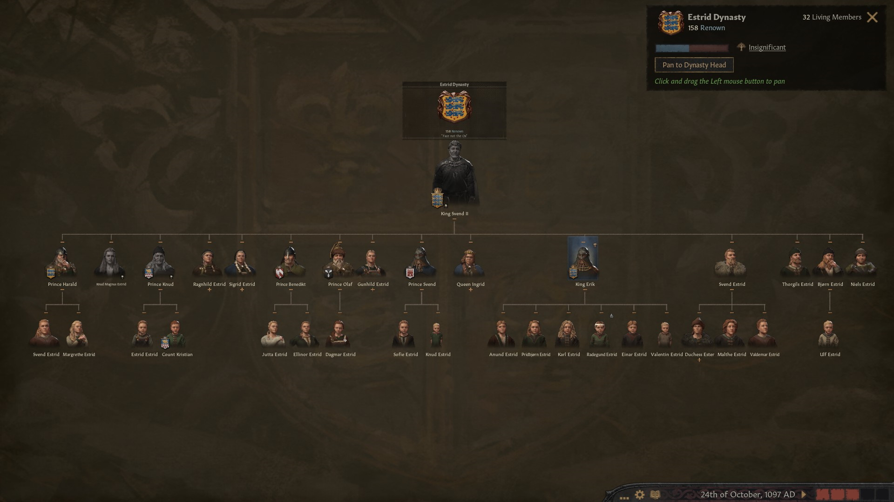

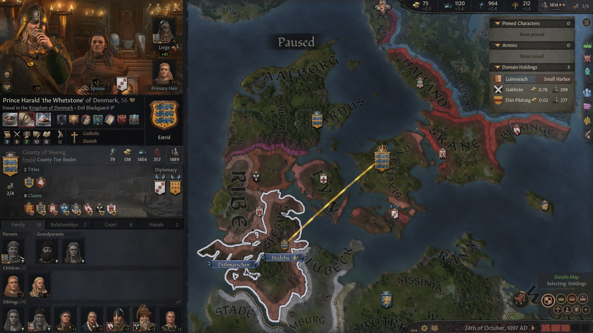

Briain II's half-brother, **Ceithernach mac Murchad Briain,** was born after King Murchad had died. His mother was one of his secondary spouses, **Petty Queen Dub-Dil of Munster**. Therefore he did not receive any land or claims and may end up being forgotten.

Brian II had two cousins who had become mayors through marriage: **Mayor Murchaid mac Conchobar of Monza** and **Mayor Malachy mac Conchobar of Travnik.** Malachy's son had become **Major Donal mac Malachy of An Longphort**, in the Earldom of Breifne, but he was still unmarried.

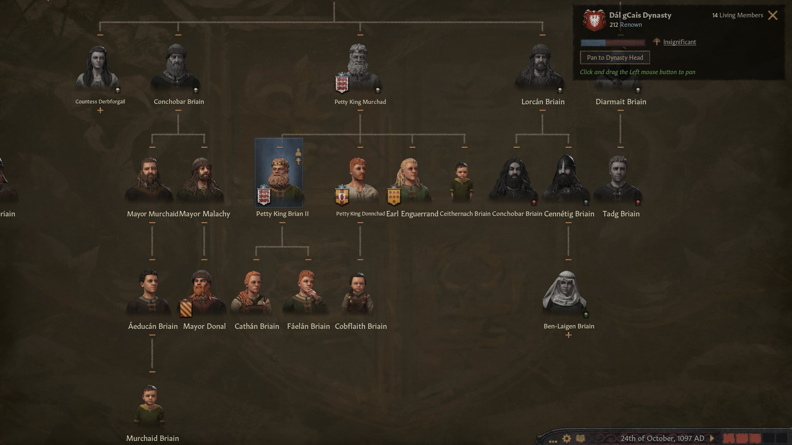

Brian II's daughter, **Cathan nic Brian Briain,** 19, had married matrilineally with **Aed mac Domnall ua Neill Noigiallaich,** Earl Domnall mag Aed of Oriel's first heir. Brian II's son **Faelan mac Brian Briain**, 13, was betrothed to **Elisabet Gudrodsdatter Crovan,** 14, daughter of **Petty King Gudrod Haraldrsson of the Sudreyjar,** from the Crovan's house. Neither of these marriages had brought any alliance to Brian II.

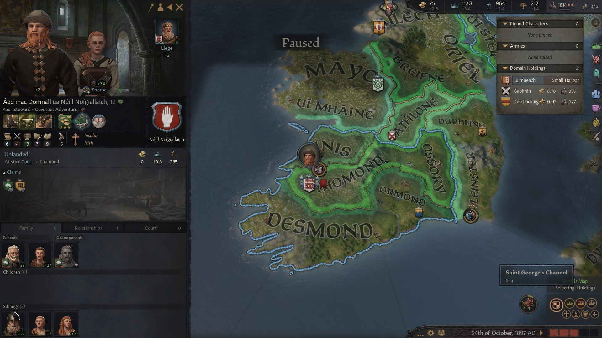

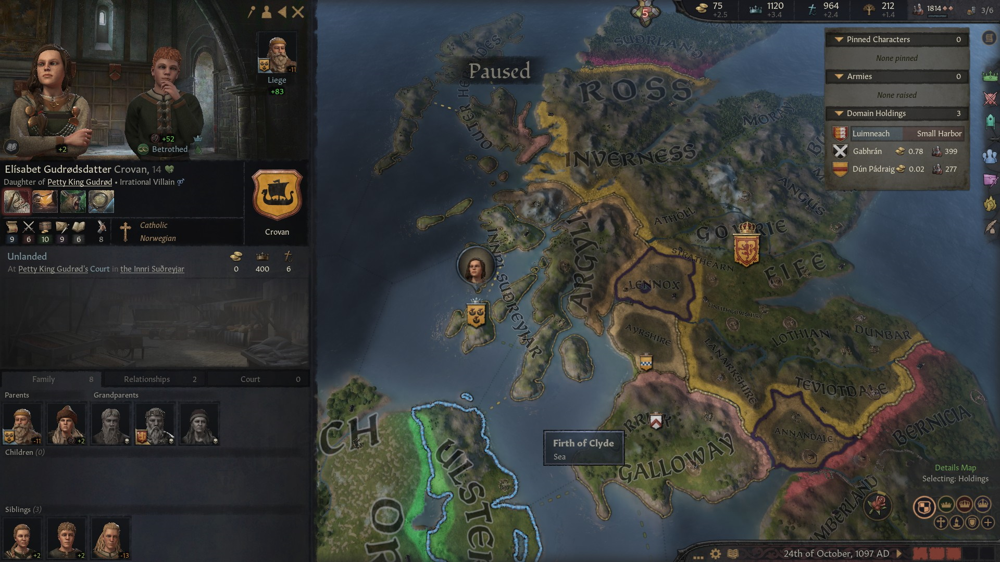

Meanwhile, there had been a consolidation in Wales. **Prince Cadwgan ap Bleddyn** ruled over **Gweddyn** and **Powys**, while **Prince Maredudd III ap Bleddyn** was in control of the whole **Deheubarth.**

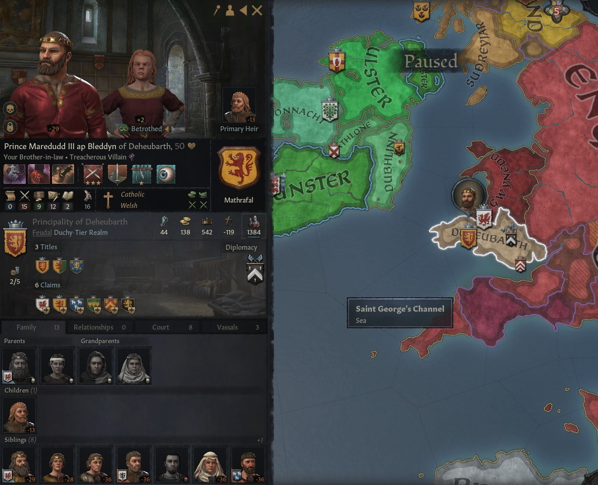

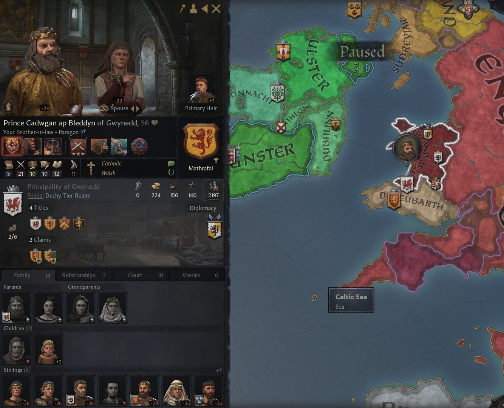