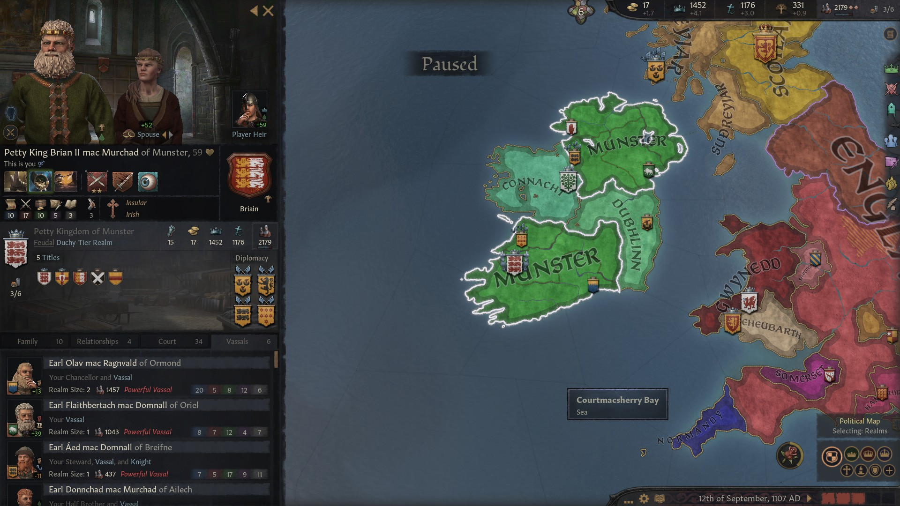
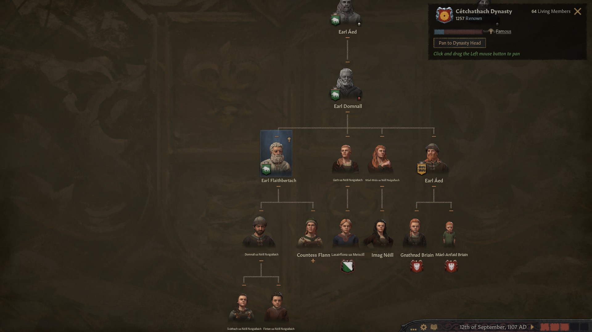
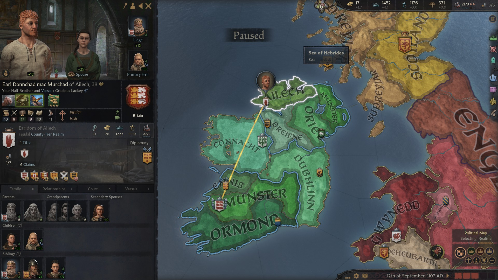
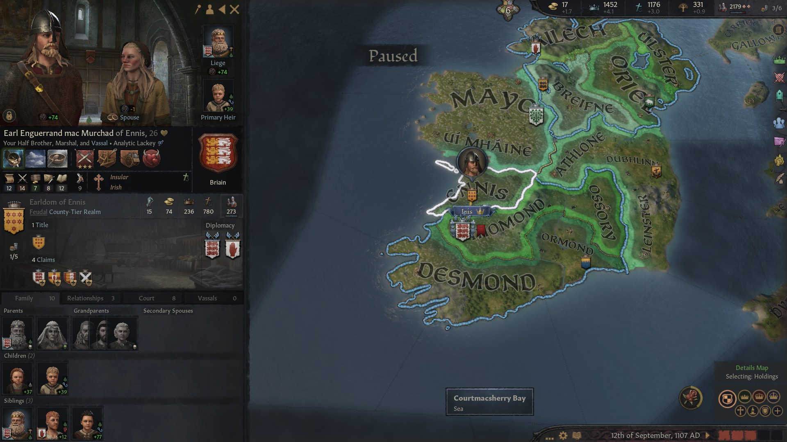
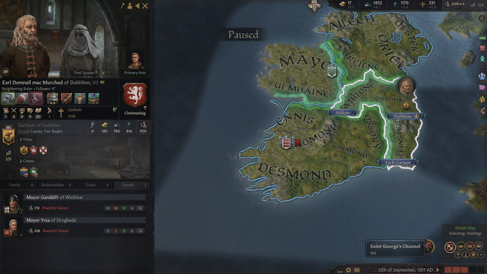
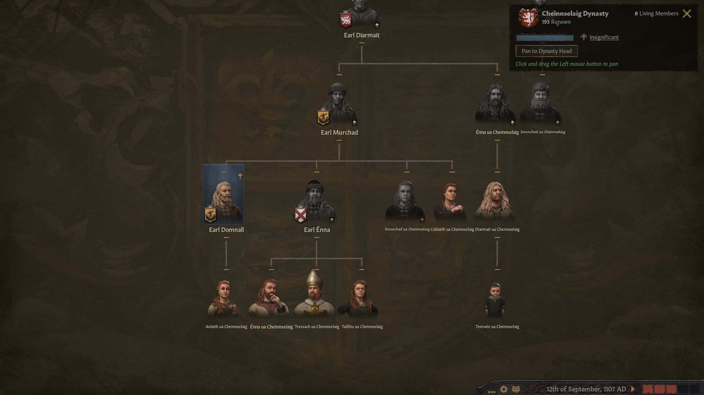
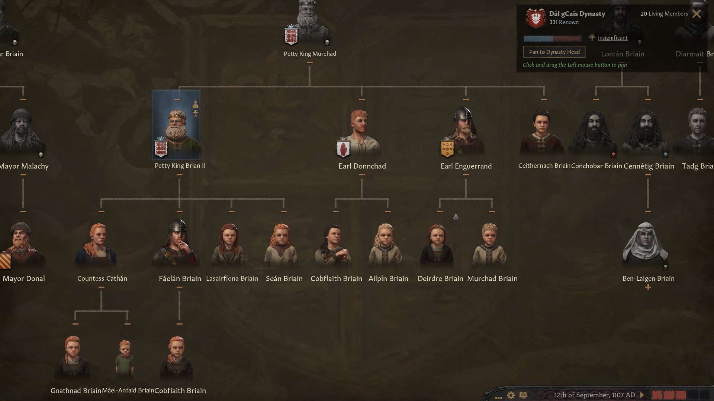
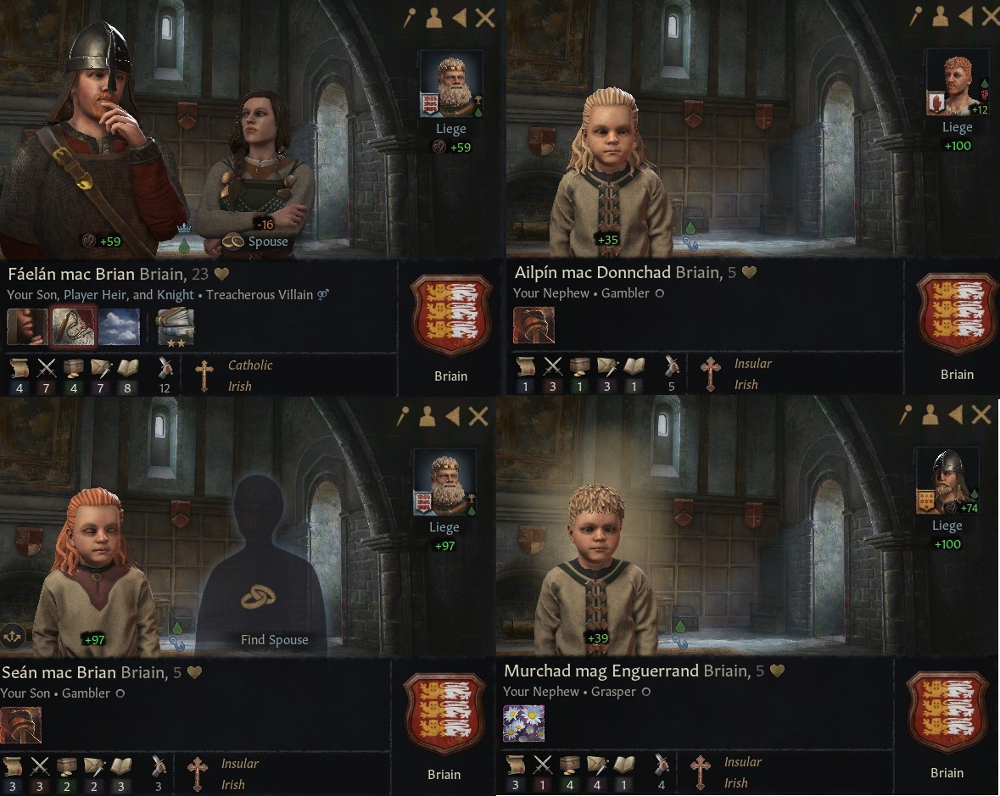

### Petty King Brian II mac Murchad of Munster, 1108

By 1108, **Petty King Brian II mac Murchad of Munster** still controlled the **Kingdom of Munster** and the **Earldoms of Thomond,** **Ossory** and Ulster**.** He had conquered the title of **Kingdom of Ulster** from his brother, now his vassal as **Earl Donnchad mac Murchad of Ailech.**

**Earl Domnall mac Aed of Oriel,** the son of **Earl Aed,** born from a patrilineal wedding of his greatfather's sister **Bebinn Briain,** who ruled over Oriel and Briefne**,** had died, splitting his two Earldoms between his two sons Flaitherbach and Aed.

King Briain II had following vassals:

- **Earl Olav mag Ragnvald of Ormond**, who was also **Earl of Desmond**
- **Earl Flaithbertach mac Domnall of Oriel,** Domnall's first son
- **Earl Aed mad Domnall of Briefne,** Domnall's second son, and husband of Brian II's daughter **Countess Cathan**
- His brother **Earl Donnchad mac Murchad of Ailech.**
- His second brother **Earl Enguerrad mac Murchad of Ennis**

**Earl Domnall mac Murchad** from the house **Chinselaig** now controlled directly the Earldoms of **Dubhlinn**, **Athlon** and **Leinster,** after inheriting the title of Dubhlinn from his father and conquering Athlone from his nephew **Enna mac Enna.**

Brian II had now four children: Countess **Cathan (f)**, **Faelan (m)**, (from his now deceased first wife Hunydd) **Lasairfiona (f)** (from his second lowborned wife **Lasarfiona**) and **Sean (m)** (from the secondary lowborned spouse **Dub-Dil). Cathan** and **Faelan** had already children of their own. 

Brian II's first brother Donnchad had a daughter (**Cobflaith**) and a son (**Ailpin**) from his wife **Rois nic Domnall.** 

Brian II's second brother, Enguerrand, had a bastard daughter, **Deirdre**, from the lowborn Finnguala, and a son, **Murchad,** from his wife **Margrehte Haraldsdatter** in the **Estrid** house**.** 

Brian II's third brother, unlanded, had been born from **Murchad**'s last wife **Dub Dil,** the same Dub-Dil that would end up being Brian II's spouse too, after his death.

Brian II's heir Faelan mac Brian's skills did not look very impressive compared to the skills of his brothers and cousins. Historians wonder why Brian II did not choose another, more capable heir. 

