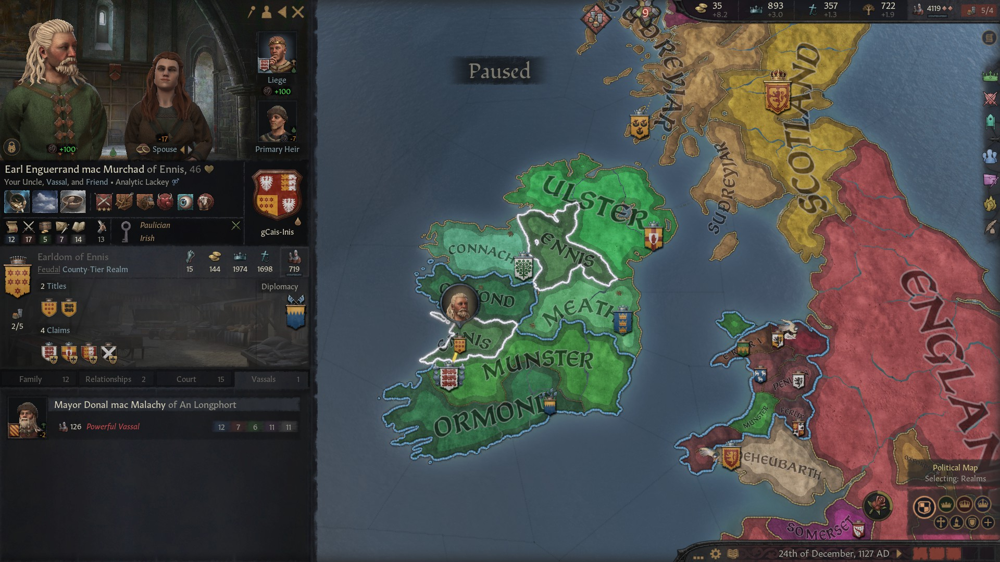
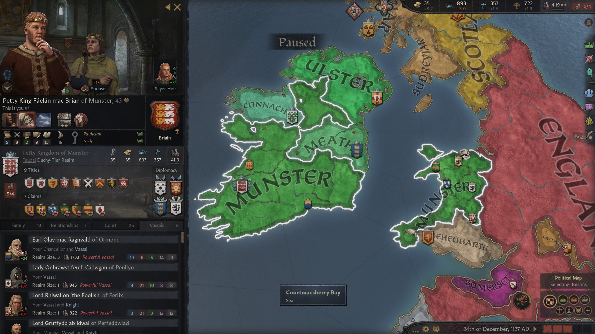
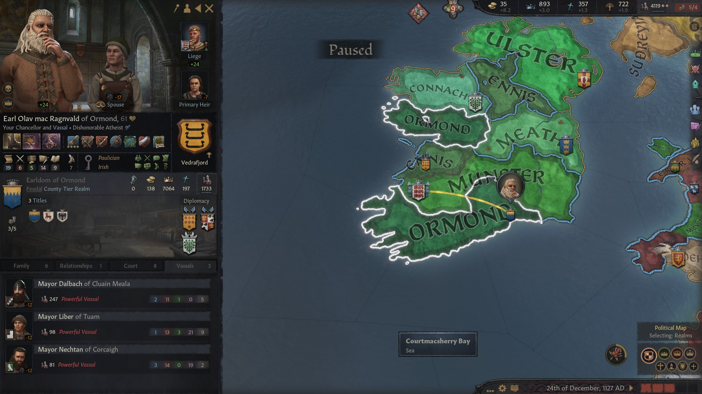
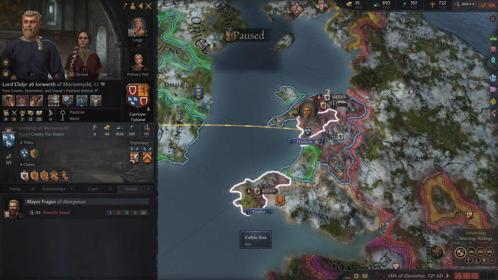
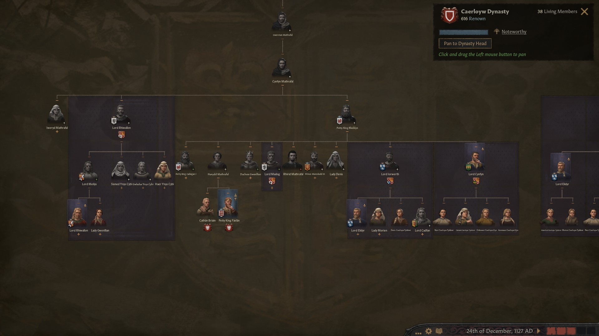
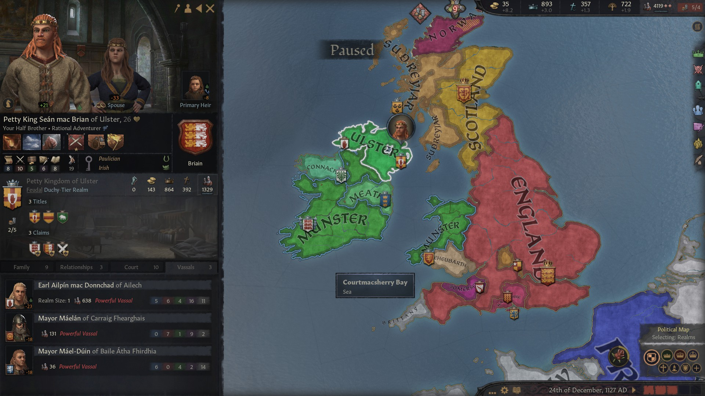
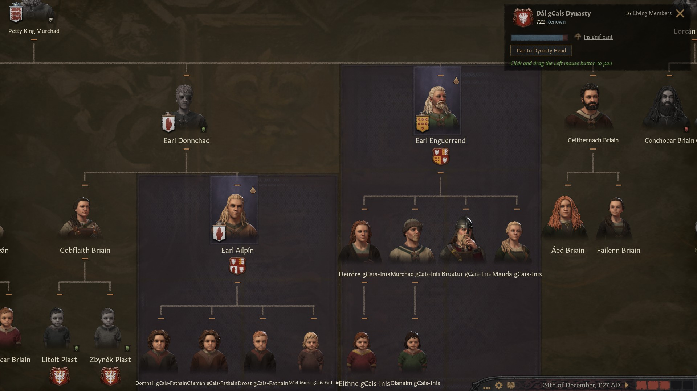
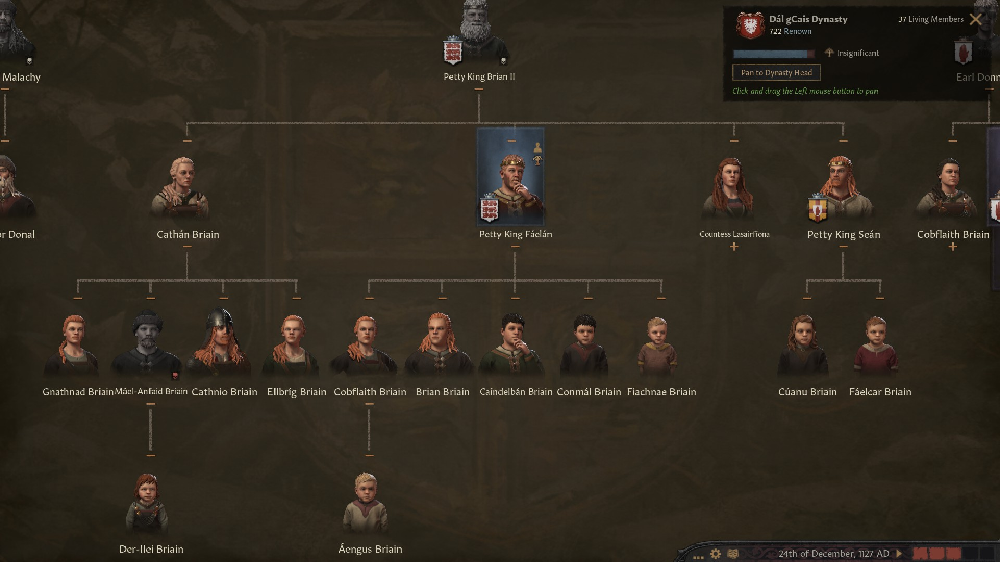

### Petty King Faelan mac Brian of Munster, 1128

How things can change in 20 years. **Petty King [Brian II mac Murchad](../p/brian_ii_mac_murchad_1048.md) of Munster** had died in 1111, leaving his son, now **Petty King [Faelan mac Brian](../p/faelan_mac_brian_1084.md) of Munster**, 43, in charge. He had inherited, of course, the **Petty Kingdom of Munster** and the **Earldoms** of **Thomond** and **Ossory**. 

Rather than take on his smarter brother, **Petty King [Sean mac Brian](../p/sean_mac_brian_1101.md)  of Ulster**, now 26, he had chosen to ally with him and press the claims he had inherited from his mother **[Hunydd ferch Bleddyn](../p/hunydd_ferch_bleddyn_1042.md) Mathrafal** and wrestle the titles of **Petty Kingdom of Gwynedd** and **Powys,** along with the **Earldoms of Ynys Mon and Ceredigion**, from the defeated and now dead **Petty King [Cadwgan II ap Llywelyn](../p/cadwgan_ii_ap_llywelyn_1078.md)  of Powys**. 

Thanks to a fabricated claim, Faelan had also conquered the **Earldom of Leinster** from his distant relative the **Petty King [Murchad mac Domnall](../p/murchad_mac_domnall_1118.md of Meath**, now 9, who had inherited the **Petty Kingdom of Meath** and the **Earldoms of Leinster, Dubhlinn** and **Athlone** from his father **Petty King [Domnall mac Murchad](../p/domnall_mac_murchad_1047.md) of Meath** of the house **Cheinnselaig** (the great son of **Countess [Derbforgail nic Donnchad](../p/derbforgail_nic_donnchad_1005.md)** through a patrilineal marriage, a sister of Faelan's grandfather **King Murchad mac Donnchad**)

An even bigger change had been [Faelan mac Brian](../p/faelan_mac_brian_1084.md)'s conversion to **Paulicianism.** Faelan, who was shy, struggled a lot with stress, and a new outlook on God seemed to bring relief. Of course, this meant that everybody in his court, family and realm had to convert as well. He could not have foreseen how far the consequences of this conversion would have reached. An apparently small decision changed the history of Europe and the World forever. 

Apart from the territories he controlled directly, Faelan had  8 vassals:

- **Earl [Olav mac Ragnvald](../p/olav_mac_ragnvald_1066.md) of Ormond,** who was also **Earl of Desmond** and **Ui Mhaine**
- **Lady [Onbrawst ferch Cadwgan](../p/onbrawst_ferch_cadwgan_1104.md) of Penllyn**
- The distant relative **Lord [Rhiwallon](../p/rhiwallon_1087.md) the Foolish of Ferlix** ( son of **Lord Meilys**, a cousin of Faelan's mother Hunydd)
- **Lord [Gruffydd ab Idwal](../p/gruffydd_ab_idwal_1072.md) of Perfeddwlad**
- His uncle **Lord [Cynfyn ap Morien](../p/cynfyn_ap_morien_1077.md) of Eryri** ( His mother [Hunydd ferch Bleddyn](../p/hunydd_ferch_bleddyn_1042.md)'s brother) 
- His uncle **Earl [Enguerrand mac Murchad](../p/enguerrand_mac_murchad_1081.md) of Ennis** (His father [Brian II mac Murchad](../p/brian_ii_mac_murchad_1048.md)'s brother) who had also received the **Earldom of Breifne** after Faelan had revoked it from his rebel brother-in-law, and his sister **[Cathan nic Brian](../p/cathan_nic_brian_1078.md)**'s husband, **[Aed mac Domnall](../p/aed_mac_domnall_1078.md) ua Neill Noigiallaich**, 
- His cousin **Lord [Elidyr ab Iorwerth](../p/elidyr_ab_iorwerth_1085.md) of Merionnydd** ( His mother [Hunydd ferch Bleddyn](../p/hunydd_ferch_bleddyn_1042.md)'s nephew) , who was also **Lord of Dyfed** 
- **Mayor Lann of Caer Gybi,** a city located in the Earldom of Yves Mon

Faelan's brother [Sean mac Brian](../p/sean_mac_brian_1101.md) controlled the **Petty Kingdom of Ulster, the Earldom of Ulster** and the **Earldom of Oriel**, revoked from the distant relative **[Domnall mac Flaithbertach](../p/domnall_mac_flaithbertach_1069.md) ua Neill Noigiallach** (great-great-great son of **[Bebinn nic Brian](../p/bebinn_nic_brian_989.md)**, Faelan great-great father **[Donnchad Briain](../p/donnchad_briain_990.md) mac Brain's** sister). [Sean mac Brian](../p/sean_mac_brian_1101.md) had three vassals of his own: two mayors and **Earl [Ailpin mac Donnchad](../p/ailpin_mac_donnchad_1101.md) of Ailech**, [Faelan mac Brian](../p/faelan_mac_brian_1084.md)'s cousin and his now deceased uncle **[Donnchad mac Murchad](../p/donnchad_mac_murchad_1068.md) of Ailech**'s son.

[Faelan mac Brian](../p/faelan_mac_brian_1084.md)'s older sister **[Cathan nic Brian](../p/cathan_nic_brian_1078.md)**, who had a claim to all titles in the family, sat unlanded.

Two new houses had been founded in the **Dal-gCais** dinasty. Beside the **Briain** house, there were now Earl [Enguerrand mac Murchad](../p/enguerrand_mac_murchad_1081.md)'s **gCais-Inis** (after the **Barony of Inis** in the Earldom of Ennis) and Earl [Ailpin mac Donnchad](../p/ailpin_mac_donnchad_1101.md)'s **gCais-Fathain** (after the **Bishopric of Fathain** in the Earldom of Ailech) houses. 

Faelan had been blessed with many children, who were also promising: **[Cobflaith nic Faelan](../p/cobflaith_nic_faelan_1101.md)**, f, 26, **[Brian mac Faelan](../p/brian_mac_faelan_1112.md)**, 15, m, **[Caindelban I mac Faelan](../p/caindelban_i_mac_faelan_1114.md)**, 13, m, **[Conmal mac Faelan](../p/conmal_mac_faelan_1122.md)**, 5, m and **[Fiachnae mac Faelan](../p/fiachnae_mac_faelan_1125.md) **, 2, m.

Faelan had also many nephews and nieces. His older sister **[Cathan nic Brian](../p/cathan_nic_brian_1078.md)** had four children, his younger sister **[Lasairfiona nic Brian](../p/lasairfiona_nic_brian_1100.md)** had one daughter, who because of her patrilineal marriage would join the **Flamens-Gladbach** house. His brother [Sean mac Brian](../p/sean_mac_brian_1101.md), married with the lowborn **Finnguala**, had two sons, **[Cuanu mac Sean](../p/cuanu_mac_sean_1121.md)**, 6 and, **[Faelcar mac Sean](../p/faelcar_mac_sean_1123.md)**, 3.

His uncle [Donnchad mac Murchad](../p/donnchad_mac_murchad_1068.md) had died, leaving the daughter **[Cobflaith nic Donnchad](../p/cobflaith_nic_donnchad_1092.md)**, who had married with the King of Poland, and the son **[Ailpin mac Donnchad](../p/ailpin_mac_donnchad_1101.md)**, now Earl of Ailech. His other uncle [Enguerrand mac Murchad](../p/enguerrand_mac_murchad_1081.md) had married again after his alcoholic wife **Margrethe Haraldsdatter** had died of malnutrition, not before giving him three children: **[Murchad mag Enguerrand](../p/murchad_mag_enguerrand_1102.md) ** (m) **[Bruatur mac Enguerrand](../p/bruatur_mac_enguerrand_1108.md)** (m) and **Mauda** (f), born after the bastard **Deirdre** (f). His new wife was the **Countess Aroc nic Muirchertach** from the **Mail Sechlainn** house. 

Faelan's last uncle, the unlanded **[Ceithernach mac Murchad](../p/ceithernach_mac_murchad_1096.md)**, had married **Maria Arnulfdochter van Vlaanderen** from the **Vlaanderen** house and had two children: **Aed** and **Failenn**.

