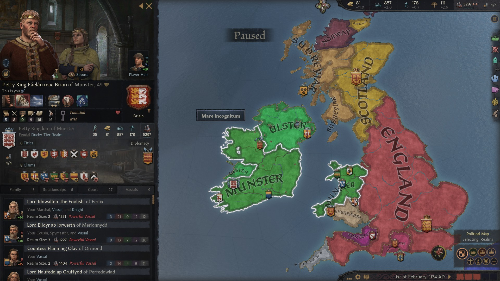
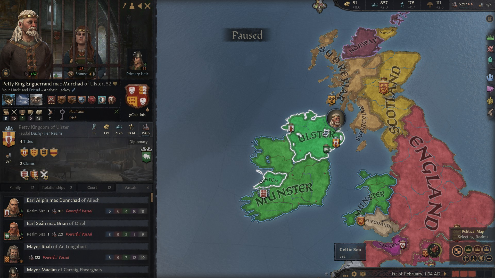
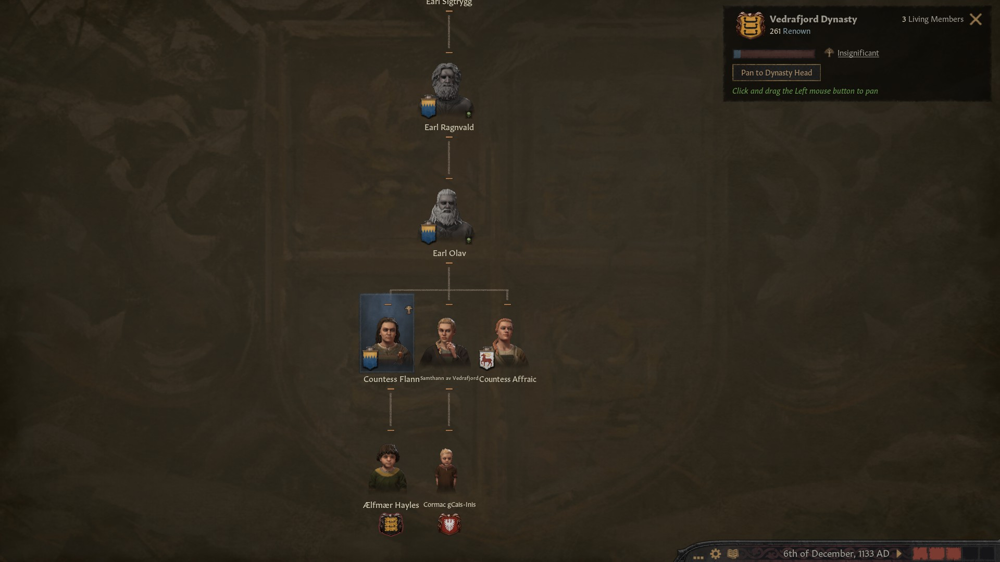
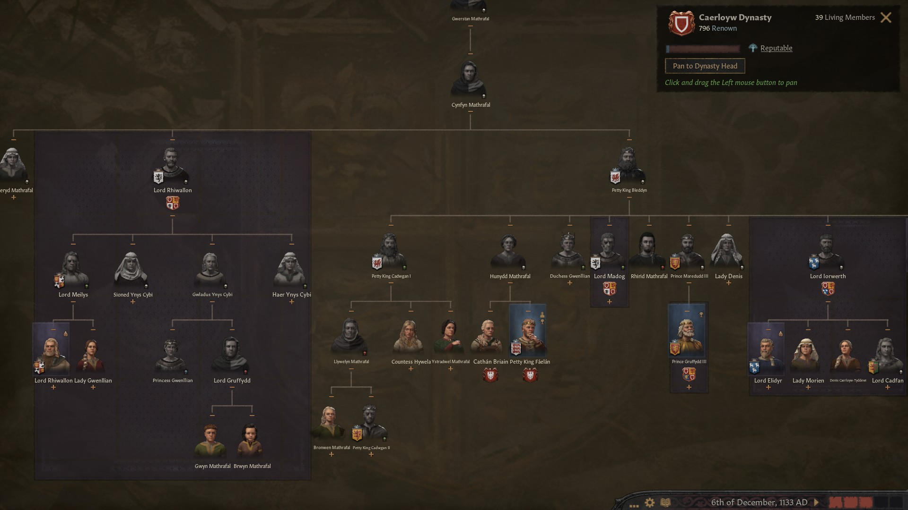
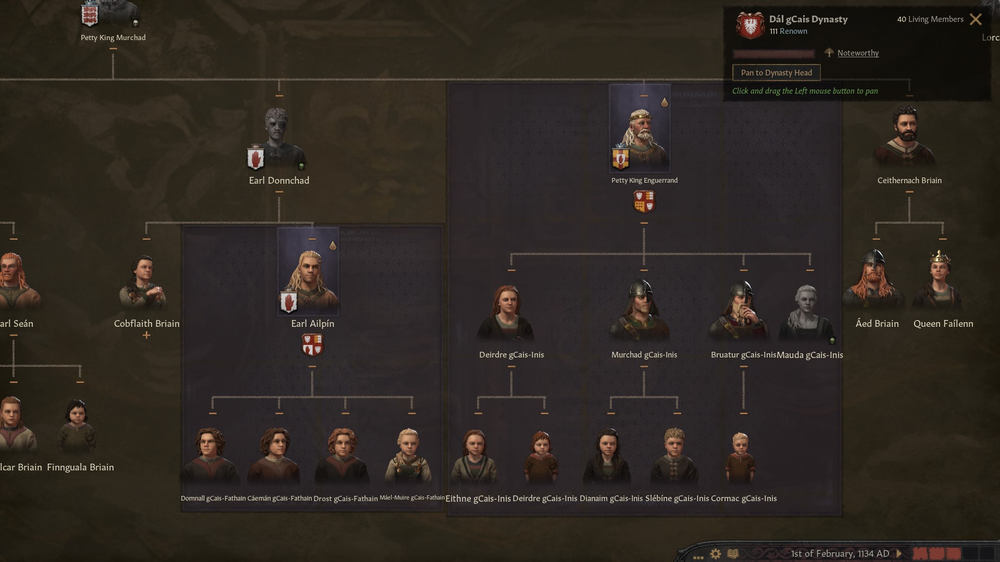
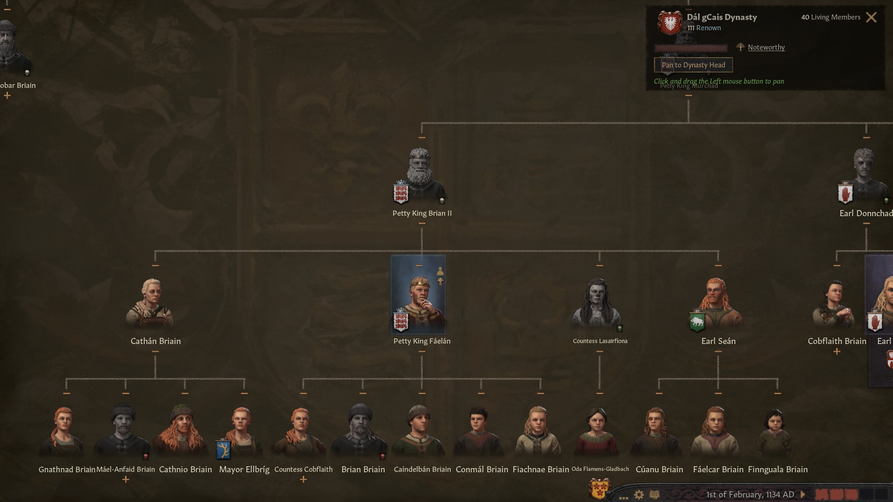
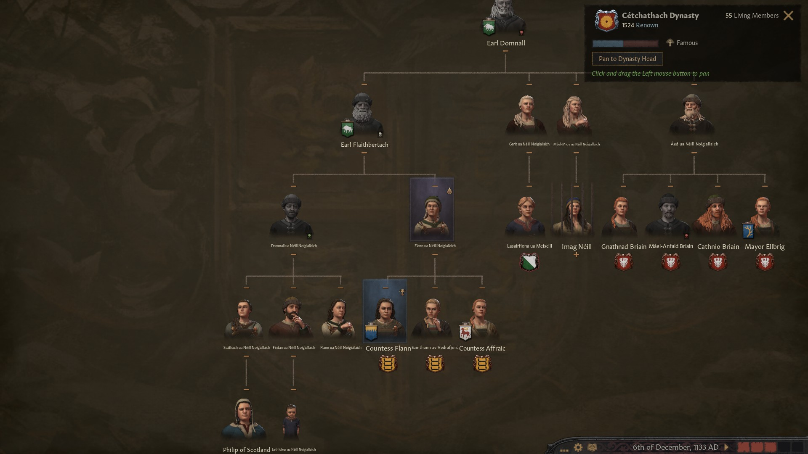
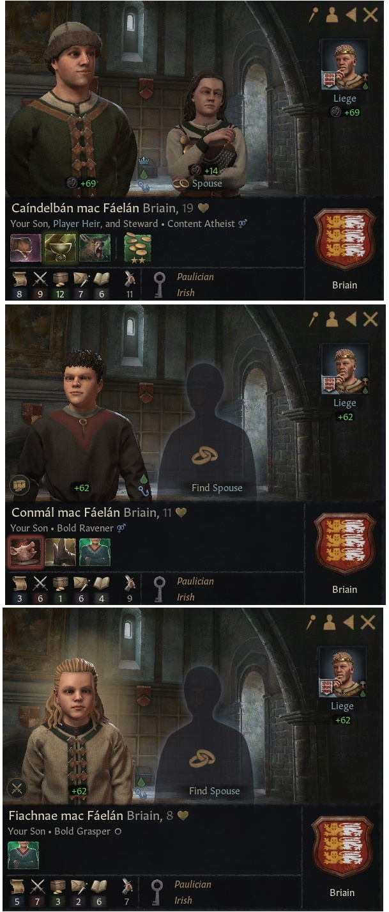

### Petty King Faelan mac Brian of Munster, 1133

During the last years of his reign the **Petty King [Faelan mac Brian](../p/faelan_mac_brian_1084.md)** ensured a total control of Ireland by the house Briain, by means of a couple of holy wars. 

In 1129 he conquered **Mayo** from the house **Cetchathach-Gaillimhe,** a house without any recognizable relation with the **Dal-Gcais** dinasty.

In 1131 he conquered the **Earldoms of Athlone** and **Dubhlinn**, along with the **Petty Kingdom of Meath**, from his distant relative **[Murchad mac Domnall](../p/murchad_mac_domnall_1118.md) ua Cheinnselaig**. During this war, regrettably, **[Brian mac Faelan](../p/brian_mac_faelan_1112.md)**, [King Faelan](../p/faelan_mac_brian_1084.md)'s oldest son and first heir, found his death. 

King Faelan therefore was holding the titles of **King of Munster, Gwynedd, Powys** and **Leinster,** along with the titles of **Earl of Thomond, Ossory, Leinster** and **Dubhlinn.** He had 9 vassals

- **Lord Rhiwallon[Rhiwallon](../p/rhiwallon_1087.md) the Foolish of Ferlix**, now also **Lord of Penllyn** (distant relative)
- His cousin **Lord [Elidyr ab Iorwerth](../p/elidyr_ab_iorwerth_1085.md) of Merionnydd** ( now also **Lord of Dyfed** and **Ynis Mon**)
- **Countess [Flann nig Olav](../p/flann_nig_olav_1097.md) of Ormond,** also **Earl of Ui Mhaine** daughter of **Earl [Olav mac Ragnvald](../p/olav_mac_ragnvald_1066.md)**
- **Lord [Naufedd ap Gruffydd](../p/naufedd_ap_gruffydd_1121.md) ab Perfeddwlad**, from the house of **Seisyll**, son of **Lord [Gruffydd ab Idwal](../p/gruffydd_ab_idwal_1072.md)**, also **Lord of Ceredigion**
- His uncle **Lord Cynfyn ap Morien of Eryri** ( His mother Hunydd's brother) 
- **Earl Udalschalk of Mayo,** from the obscure **Cilli** dynasty, also **Earl of Athlone,** who had married matrilineally Faelan's daughter **Cobflaith nic Faelan**
- **Countess Affraic nig Olav of Desmond** - daughter of **Earl [Olav mac Ragnvald](../p/olav_mac_ragnvald_1066.md)**

Meanwhile, Faelan's uncle **Enguerrand mac Murchad** had conquered the titles of **King of Ulster,** which now held together with the **Earldoms of Ennis, Ulster** and **Briefne.** His vassals were Faelan's younger brother **Sean,** from which he had usurped the title of King of Ulster, but who in turn had managed to hold on to the title of **Earl of Oriel,** and Faelan's cousin **Earl Ailpin mac Donnchad of Ailech.**

Faelan's sister **Cathan nic Brain**, who had a claim to all titles in the family, was languishing with her husband **Aed mac Domnall** at her daughter **Mayor Elbrigs nic Cathan of Sligo'**s court, who herself was a vassal of **Earl Udalschak of Mayo**.

There had been a few more childbirths in Briain's family, but also two deaths. Apart from the death of Faelban's first heir, Brian, also his sister, **Countess Lasairfiona of Cleves**, had died to the bubonic plague.

In the succession (still Confederate partition) **Caindelban mac Faelan** would have inherited the **Kingdoms of Munster** and **Leinster,** along with the **Earldoms of Thomond, Ossory** and **Leinster. Conmal mac Faelan** would inherit the **Kingdoms of Gwynedd** and **Meath** and the **Earldom of Dubhlinn,** and **Fiachnae mac Faelan** would receive **the Kingdoms of Powys and Connacht.-**

**Caindelban mac Faelan** was now married with **Flann nic Rois ua Neill Noigiallach.** Flann's mother **Rois nic Domnall Neill** had married Faelan's uncle **Earl Donnchad mac Murchad** and born Faelan's cousin Earl Ailpin mac Donnchad of Ailech. Flann's father **Donnall mac Flaithbertach ua Neill Noigiallach** had his title of Earl of Oriel revoked from Faelan's half brother Sean mac Brian. Flann's aunt **Flann ua Neill** had borne **Earl Olav mac Ragnvald's** children.

For a change, it seemed that the Faelan's first heir had good skills. Unlike his predecessors, this one would be a good steward.

