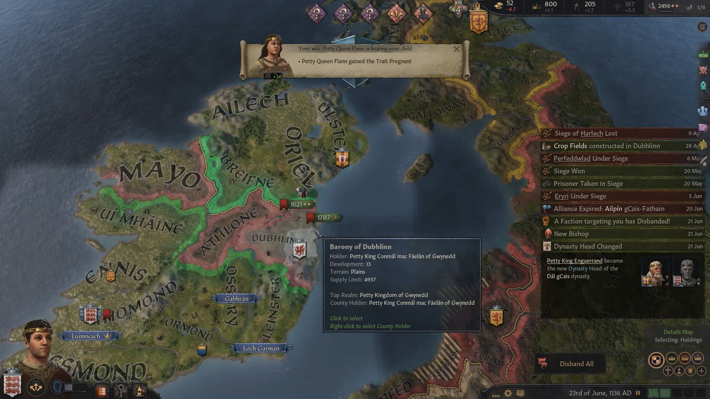
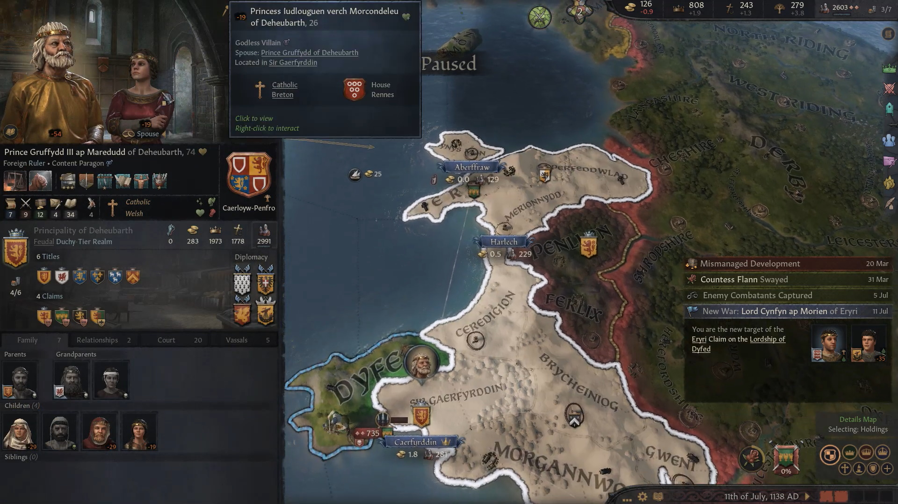
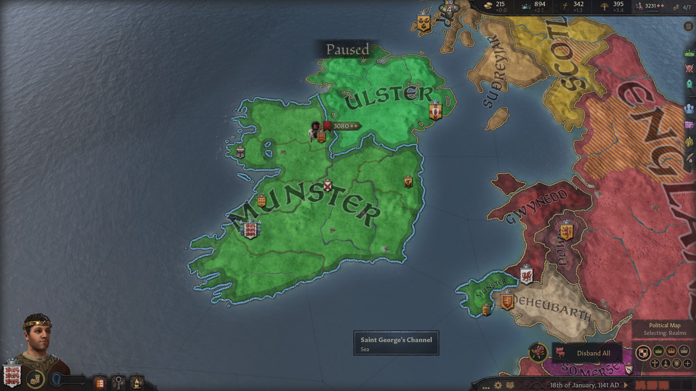
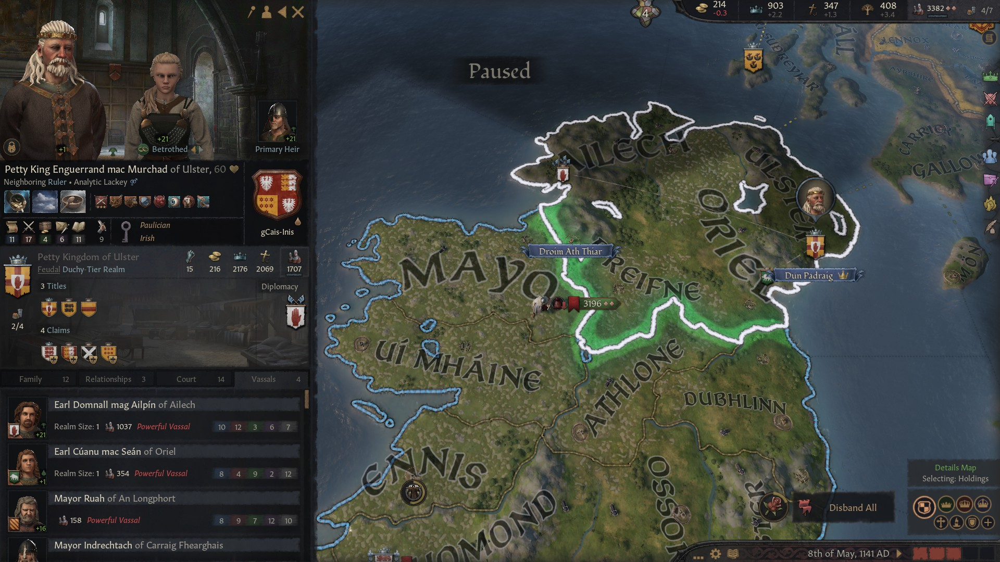

### King Caindelban mac Faelban of Munster, 1141

**King [Faelan mac Brian](../p/faelan_mac_brian_1084.md)** fought a war against his uncle **King [Enguerrand mac Murchad](../p/enguerrand_mac_murchad_1081.md) ,** winning the **Earldom of Ennis** in the process. Regrettably, in that war his brother **Earl [Sean mac Brian](../p/sean_mac_brian_1101.md) of Oriel,** his cousin **Earl [Ailpin mac Donnchad](../p/ailpin_mac_donnchad_1101.md) of Ailster** and his cousin **[Bruatur mac Enguerrand](../p/bruatur_mac_enguerrand_1108.md)  gCais-Inis** were killed - all of them were fighting on the other side. After winning the war, King [Faelan](../p/faelan_mac_brian_1084.md) granted the Earldom of Ennis to his brother in law **[Aed mac Domnall](../p/aed_mac_domnall_1078.md)**, so that his sister **[Cathan nic Brian](../p/cathan_nic_brian_1078.md)** would not stay unlanded. 

[Faelan](../p/faelan_mac_brian_1084.md) then died soon after that in 1136, while he was defending against **Prince [Gruffydd III ap Maredudd](../p/gruffydd_iii_ap_maredudd_1064.md)**, who was claiming **Gwynedd**. 

Faelan's first child **[Caindelban I mac Faelan](../p/caindelban_i_mac_faelan_1114.md)** inherited the **Kingdoms of Munster** and **Leinster,** along with the **Earldoms of Thomond, Ossory** and **Leinster**. His vassals controlled the **Earldoms of Ennis**, **Ormond**, **Desmond,**and **Ui Mhaine.** The second child **[Conmal mac Faelan](../p/conmal_mac_faelan_1122.md)** inherited the **Kingdoms of Gwynedd** and **Meath,** which included only the **Earldom of Dubhlinn,** and **[Fiachnae mac Faelan](../p/fiachnae_mac_faelan_1125.md)** received **the Kingdoms of Powys** and **Connacht,** which only included the **Earldom of Mayo**, while a vassal of his controlled **Athlone**. **Candelbain's** great-uncle **[Enguerrand mac Murchad](../p/enguerrand_mac_murchad_1081.md)** was still in control of the **Kingdom of Ulster**, its de jure territories and the **Earldom of Briefne** . 

[Conmal](../p/conmal_mac_faelan_1122.md) found himself in a continuation war with **Prince [Gruffydd III ap Maredudd](../p/gruffydd_iii_ap_maredudd_1064.md)**, but with much fewer means than his father. To add insult to injury, his greater brother **[Candelbain I mac Faelan](../p/caindelban_i_mac_faelan_1114.md)**, rather than help him, used the opportunity to take the **Earldom of Dubhlinn** from him - as Candelbain considered Wales territories just buffer states. Prince [Gruffydd III](../p/gruffydd_iii_ap_maredudd_1064.md) conquered **Gwynedd**, but the **Earldom of Dyfed** stayed in he hand of Candelbain's vassal and his father's cousin **Lord [Elidyr ab Iorwerth](../p/elidyr_ab_iorwerth_1085.md)**.

**[Fiachnae mac Faelan](../p/fiachnae_mac_faelan_1125.md)** lost control of Powys immediately after inheriting, in 1136, as he was deposed by a faction who gave the title of **Queen of Powys** to **[Elen ferch Idwal](../p/elen_ferch_idwal_1092.md)**, daughter of **Lord [Idwal ap Gruffydd](../p/idwal_ap_gruffydd_1054.md)**. After that debacle, Fiachnae was still in control of **Connacht** and indirectly **Athlone**. That changed quickly, as Candelbain by 1141 recovered those territories as well, bringing back a similar situation in Ireland as when his father was in charge. Apart of the **Earldom of Dyfed**, however, all of Wales had been lost by the **Dal-gCais** dinasty.

[Candelbain]((../p/caindelban_i_mac_faelan_1114.md)) then proceeded to reorganize the control of his domain, trying to balance profit with the happyness of his vassals. He was now **King of Munster, Leinster, Meath and Connacht,** and **Earl of Thomond, Ossory, Leinster** and **Ormond**. **Countess [Flann nig Olav](../p/flann_nig_olav_1097.md)** had ceded voluntarily Ormond to him in exchange for a tax rebate. Candelbain's vassals were:

- **Countess [Flann nig Olav](../p/flann_nig_olav_1097.md) of Ui Mhaine**, who also controlled **Desmond**
- **Lord [Elidyr ab Iorwerth](../p/elidyr_ab_iorwerth_1085.md) of Dyfed**
- His brother **Earl [Comnal mac Faelan](../p/conmal_mac_faelan_1122.md) of Dubhlinn**
- His aunt **[Cathan nic Brian](../p/cathan_nic_brian_1078.md)**'s husband **Earl [Aed mac Domnall](../p/aed_mac_domnall_1078.md) of Ennis**
- His sister **[Cobflaith nic Faelan](../p/cobflaith_nic_faelan_1101.md)'**s husband **Earl [Udalschalk mag Eilika](../p/udalschalk_mag_eilika_1096.md) of Athlone**
- His brother **Earl [Fiachnae mac Faelan](../p/fiachnae_mac_faelan_1125.md) of Mayo**

Great-uncle **[Enguerrand mac Murchad](../p/enguerrand_mac_murchad_1081.md)** of Ulster, for his part, was **King of Ulster, Earl of Ulster** and **of Briefne**. He was now 60 but going strong, betrothed to his nephew late **Earl [Ailpin mac Donnchad](../p/ailpin_mac_donnchad_1101.md)**'s daughter **[Mael-Muire nig Ailpin](../p/mael-muire_nig_ailpin_1125.md) gCais-Fathain**. His two main vassals were **Earl [Domnall mag Ailpin](../p/domnall_mag_ailpin_1119.md) of Ailech** and **Earl [Cuanu mac Sean](../p/cuanu_mac_sean_1121.md) of Oriel,** who had succeeded their fathers who both had died in war.

