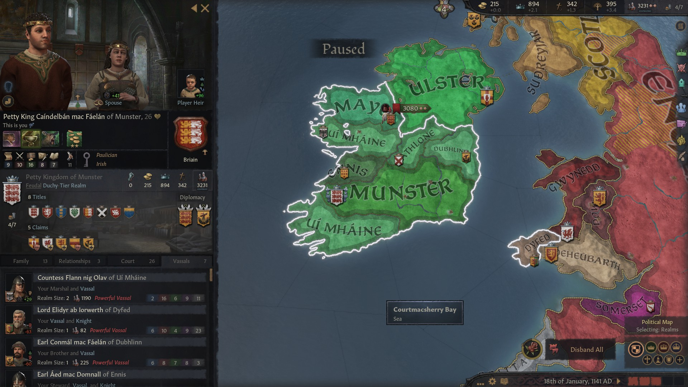

### King Caindelban mac Faelban of Munster, 1141

**King Faelban mac Brian** fought a war against his uncle **King Enguerrand mac Murchad,** winning the **Earldom of Ennis** in the process. Regrettably, in that war his brother **Earl Sean mac Brian of Oriel,** his cousin **Earl Ailpin mac Donnchad of Ailster** and his cousin **Bruatur mag Enguerrand gCais-Inis** were killed - all of them were fighting on the other side. After winning the war, King Faelban granted the Earldom of Ennis to his brother in law **Aed mac Domnall,** so that his sister **Cathan nic Brian** would not stay unlanded. 

Faelban then died soon after that in 1136, while he was defending against **Prince Gruffydd III ap Maredudd,** who was claiming Gwynedd. 

Faelan's first child **Candelbain mac Faelban** inherited the **Kingdoms of Munster** and **Leinster,** along with the **Earldoms of Thomond, Ossory** and **Leinster**. His vassals controlled the **Earldoms of Ennis**, **Ormond**, **Desmond,**and **Ui Mhaine.** The second child **Conmal mac Faelan** inherited the **Kingdoms of Gwynedd** and **Meath,** which included only the **Earldom of Dubhlinn,** and **Fiachnae mac Faelan** received **the Kingdoms of Powys** and **Connacht,** which only included the **Earldom of Mayo,** while a vassal of his controlled **Athlone****.** **Candelbain's** great-uncle **Encherrad mac Murchad** was still in control of the **Kingdom of Ulster,** its de jure territories and the **Earldom of Briefne** . 

Conmal found himself in a continuation war with **Prince Gruffydd III ap Maredudd,** but with much fewer means than his father. To add insult to injury, his greater brother **Candelbain mac Faelban,** rather than help him, used the opportunity to take the **Earldom of Dubhlinn** from him - as Candelbain considered Wales territories just buffer states. Prince Gruffydd III conquered Gwynedd, but the **Earldom of Dyfed** stayed in he hand of Candelbain's vassal and his father's cousin **Lord Elidyr ab Iorwerth.**

**Fiachnae mac Faelan** lost control of Powys immediately after inheriting,, in 1136, as he was deposed by a faction who gave the title of King of Powys to **Princess Elen ferch Idwal**, daughter of **Lord Idwal ap Gruffyydd.** After that debacle, Fiachnae was still in control **Connacht** and indirectly **Athlone**. That changed quickly, as Candelbain by 1141 recovered those territories as well, bringing back a similar situation in Ireland as when his father was in charge. Apart of the **Earldom of Dyfed**, however, all of Wales had been lost by the **Dal-gCais** dinasty.

Candelbain then proceeded to reorganize the control of his domain, trying to balance profit with the happyness of his vassals. He was now **King of Munster, Leinster, Meath and Connacht,** and **Earl of Thomond, Ossory, Leinster** and **Ormond. Countess Flann nig Olav** had ceded voluntarily Ormond to him in exchange for a tax rebate. Candelbain's vassals were:

- **Countess Flann nig Olav of Ui Mhaine**, who also controlled **Desmond**
- **Lord Elidyr ab Iorwerth of Dyfed**
- His brother **Earl Comnal mac Faelan of Dubhlinn**
- His aunt **Cathan nic Brian'**s husband **Earl Aed mac Domnall of Ennis**
- His sister **Cobflaith nic Faelan**'s husband **Earl Udalschalk of Athlone**
- His brother **Earl Fiachnae mac Faelan of Mayo**

Great-uncle Encherrad mac Murchad of Ulster, for his part, was **King of Ulster, Earl of Ulster** and **of Briefne.** He was now 60 but going strong, betrothed to his nephew late **Earl Ailpin mac Donnchad's** daughter **Mael-Muire nig Ailpin gCais-Fathain.** His two main vassals were **Earl Domnall mag Ailpin of Ailech** and **Earl Cuanu mac Sean of Oriel,** who had succeeded their fathers who both had died in war.

Petty King Candelbain had children, unlike his two brothers, so succession was safe. It would be interesting to see how far they would go. His brother Sean had founded the house **Laighin** before dying, and luckily he had managed to have some children before that.

On the other side, it was worth noticing that Candelbain's father's cousins **Cobflaith nic Donnchad** and **Failenn nic Ceithernach** had moved on to become queens of Poland and France respectively, regrettably both in patrilineal marriages.

