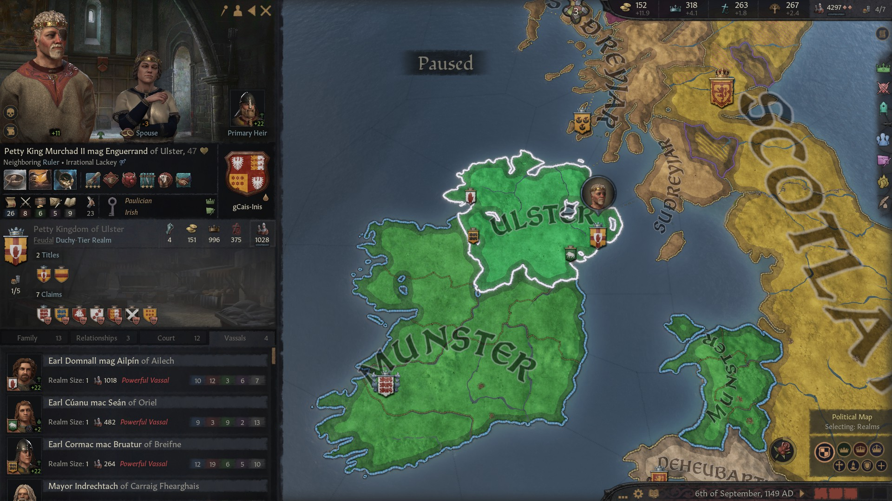

### King Caindelban mac Faelban of Ireland, 1154

Before 1141 was over, **King Caindelban mac Faelan** had managed to reclaim the **Duchy of Gwynedd**, turning **Lord Cynddylan ab Gruffyyd** into his vassal. In 1145, he had moved on to reclaim the title of **Duchy of Powys.**

In 1148, he helped his vassal **Lord Elidyr ab Iorwerth of Dyfed,** and nephew of his great-mother **Hunydd ferch Bleddyn Mathrafal**, claim the title of **King of Dehuerbarth** from **Prince Gruffydd IV ab Maredudd**. That meant, regrettably, that King Elidyr declared independence. In 1849, he abdicated in favour of his son **Prince Iorwerth ap Gwenllian ob Deheubarth,** who had partly taken his name from his mother **Prince Gwenllian ferch Meilys.**

In 1148, great-uncle **Enguerrand mac Murchad of Ulster** died, leaving the **Kingdom and Earldom of Ulster** to his first son **Petty King Murchad II mag Enguerrand of Ulster** and the Earldom of Breifne to his grand son **Earl Cormac mac Bruatur of Breifne**, second heir in line, whose father had died in battle in 1135. Enguerrand's oldest daughter **Deirdre nig Enguerrand** and the youngest son **Constantin mac Mael-Muire** stayed on the sidelines as claimants.
 

Meanwhile, several wars had weakened Britain. The last development had seen the king of Scotland, **King Duff II,** claim huge chunks of England and declare himself King of England in 1145, but he was now overextended, King Caindelban of Irlande declared an holy war on him 1149, which lead to Ireland's conquest of Mercia in 1152. 

 In a curious turn of event, the scot King Duff lost the title of King of Scotland in 1151 to **King Andrew**, who was installed by faction demand.

After that, there war a couple of minor setbacks for Ireland. In 1153, Caindelban's cousin **Halardr II Haraldrsson of the Sudreyjar**, from the house Crovan, a son of Caindelban's mother's brother **late Petty King Haraldr I**, took Ailech from Murchad II mag Enguerrand in a holy war, leaving **Domnall mag** **Ailpin gCais-Fathain** unlanded, and Caindelban's cousin **Earl Cuanu mac Sean of Oriel** dead in the battlefield. Caidelban's brother and vassal **Conmal mac Faelan**, who was **Earl of Dubhlinn,** used the opportunity and to attack his relative Murchad II and take from him the title of **King of Ulster**, but not the **Earldom of Ulster**, and declare himself independent in the process. 

Also in 1154, King Caindelban mac Faealan created the title of **High King of Ireland**, which would possibly lead to a consolidation of Ireland. The Duchy of Mercia had not been created yet, but care was given to distribute the Earldoms there located inside of the **gCais-Dal** dinasty.

**High King Caindelban mac Faelan of Ireland** in 1154 had also the titles of **Petty Kingdom of Munster and Leinster** and the **Earldoms of Thomond, Ossory, Leinster, Ormond, Herefordshire, Leicestershire, Nottinghamshire, Staffordshire** and **Shropshire,** which he could control directly thanks to high stewardship. His vassals:

- His brother-in-law **Duke Udalschalk mag Eilika of Meath,** also **Earl of Athlone,** still married to his sister **Duchess Cobflaith nic Faelan**
- His distant relative (third cousin) **Duke Meilys ab Rhiwallon of Powys,** also **Lord of Ferlix** and as vassal his mother **Lady Elen ferch Idwal of Penllyn**
- His father's cousin **Duchess Nest ferch Morien of Gwynedd,** also **Lady of Eryri,** who ruled over **Lady Efyrddyl ferch Gruffydd of Perfeddwlad** and **Lord Cynddylan ap Gruffydd of Merionydd, Ynys Mon** and **Ceredigion** 
- His brother **Duke Fiachnae mac Faelan of Connacht,** and **Earl of Mayo,** now also head of the **gCais-Cruachu** house, who ruled over **Countess Flann nig Olav of Ui Mhaine** and **Desmond**
- His cousin **Earl Cathnio mac Cathan of Ennis ,** his aunt **Cathan nic Brian'**s son 
- His son **Prince Dinertach mac Caindelban of Ireland, Earl of Worcestershire** and **Warwickshire**
- His son **Prince Caindelban mac Caindelban of Ireland, Earl of Huntingdonshire** and **Northamptonshire**

His brother Comal mac Fealan, independent King of Ulster and Earl of Ulster, had in turn following vassals:

- Caindelban's second cousin **Earl Cormac mac Bruatur of Breifne**
- Caindelban's father's first cousin **Earl Murchad mag Enguerrand of Ulster**
- Caindelban's first cousin's son **Earl Sean mac Cuan of Oriel** 

King Caindelban had six children: **Aibilin** (f)**, Faelan** (m)**, Sithmaith** (f)**, Dinertach** (m)**, Caindelban** (m)**, Congalach** (m) - Down here a breakdown of the extended family.

