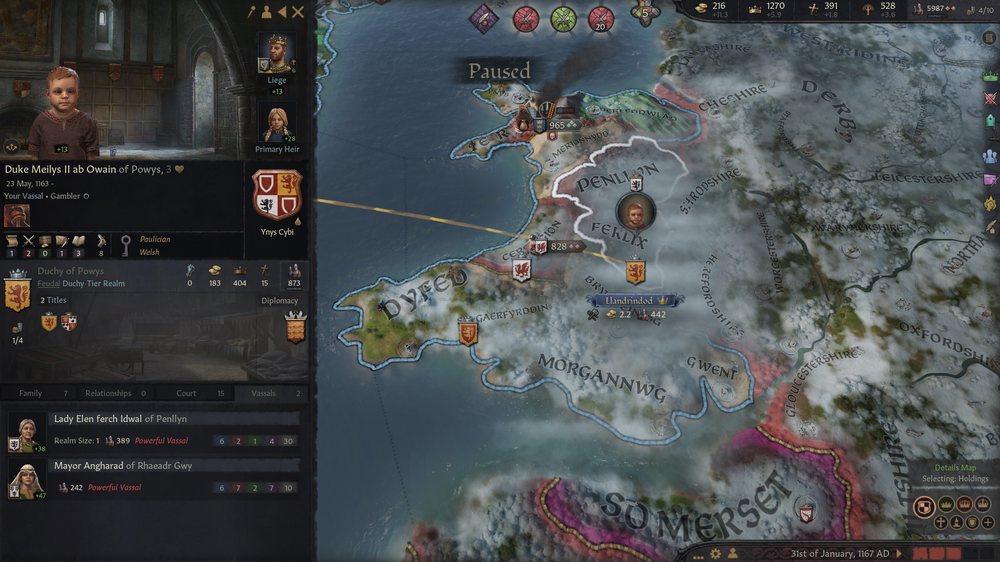

### King Caindelban mac Faelban of Ireland, 1167

In 1155 High King  [**Caindelban mac Faelan**](../p/caindelban_i_mac_faelan_1114.md) of Ireland decided to move on and unify Ireland at last. He declared war on his brother [**Conmal mac Faelan**](../p/conmal_mac_faelan_1122.md), **Petty King of Ulster**, and in a quick campaign conquered the kingdom. He then granted his brother the title of **Duke of Ulster,** without revoking any other title.

He then completed the reunification of Ireland, pressing his brother **Conmal**'s claim over de jure territories in the Duchy of Ulster, specifically the Earldom of **Ailech**, still occupied by Caindelban's cousin **[King Haraldr II Haraldrsson of the Sudreyjar](../p/haraldr_ii_1125.md).** After a costly campaign, in 1158, this Earldom too was brought under Conmal mac Faelan's sovereignty.

Then, still in 1158, Caindelban used a claim from his vassal **[Lord Riaged ap Cynddylan of Merionnydd](../p/riaged_ap_cynddylan_1169.md)** of the house **Caerloyw-Penfro,** his second cousin [**Lord Cynddylan ap Gruffydd**](../p/cynddylan_ap_gruffydd_1099.md)'s son, to put him in on the throne of **Deheubarth** in 1160**.** Lord Riaged himself was overthrown in 1162 by his uncle and Caindelban's second cousin **[Duke Rhufon ap Gruffydd of Deheubarth](../p/rhufon_ap_gruffydd_1140.md)**.

Between 1160 and 1167 the Kingdom of Ireland had reached its maximum extension in his history so far and with it the indissolubly related diffusion of the Paulician religion. 

The **Duchy of Mercia** had been created, too, and assigned to Caindelban's nephew [**Duke Gilla-Ruad mac Fiachne of Mercia**,](../p/gilla-ruad_mac_fiachnae_1142.md) from the house **gCais-Cruachu,** who also controlled the **Earldom of Nottinghamshire.** Gilla-Ruad had been assigned the two vassals, and Candailban's chilren, Prince  **[Caindelban mac Caindelban](../p/caindelban_ii_mac_caindelban_1147.md),** still **Earl of Huntingdonshire** and **Northamptonshire,** and **[Prince Dinertach mac Caindelban](../p/dinertach_mac_caindelban_1141.md),** still **Earl of Worcestershire** and **Warwickshire.**

However, in 1163 there was a devastating setback - the Pope declared a **Crusade** against the Paulician faith over the **Kingdom of England**. Crusader forces outnumbered Paulicians 3 to 1, and on top of that, Irish leaders had no experience fighting crusades. After four years of war, Ireland conceded defeat and gave up on all territories in England. **Mercia** was restored to **King Duff** of England. However, [High King Caindelban mac Faelan](../p/caindelban_i_mac_faelan_1114.md) stayed in full control of Ireland and Wales.

In 1167, Caindelban owned the titles of **King of Ireland** and **Wales, Petty King of Munster** and **Leinster, Earl of Thomond, Ossory, Leinster** and **Ormond.** His vassals were:

- His brother **[Duke Conmal mac Faelan](../p/conmal_mac_faelan_1122.md)** of **Ulster**
- His nephew [**Duke Aengus mac Cobflaith**](../p/aengus_i_mac_cobflaith_1123.md) of **Meath**
- His second cousin [**Duchess Nest ferch Morien of Gwynedd**]((../p/nest_ferch_morien_1104.md)) from the house **Caerloyw-Tyddewi**
- His brother **[Duke Fiachnae mac Faelan](../p/fiachnae_mac_faelan_1125.md)** of **Connacht**
- [**Duke Meilys II ab Owain of Powys**](../p/meilys_ii_ab_owain_1163.md), whose father **Duke Owain II ap Meilys of Powys** and whose grandtfather, and Caindelban's second cousin, **Duke Meilys II ap Rhiwallon of Powys**, had been slain during the crusades.
- **[Duke Cynwrig ab Rhufon of Deheubarth](../p/cynwrig_ap_rhufon_1157.md)** , whose father **[Duke Rhufon ap Gruffydd](../p/rhufon_ap_gruffydd_1140.md)**, Caindalban's second cousin**,** had also died during the crusade
- His cousin **[Earl Cathnio mac Cathan of Ennis](../p/cathnio_mac_cathan_1108.md)** 

Caindalban's brother [**Duke Conmal mac Faelan**](../p/conmal_mac_faelan_1122.md) of **Ulster** had the titles of **Duke of Ulster** and **Earl of Ulster** (this one revoked from Caindalban's father's cousin **[Murchad mag Enguerrand gCais-Inis](../p/murchad_mag_enguerrand_1102.md))** in 1158) and **Ailech,** and only one's vassal, **[Earl Sean mac Cuanu of Oriel](../p/sean_mac_cuanu_1139.md)**, from the house **Laighin,** the son of Caindelban's late cousin **[Earl Cuanu mac Sean](../p/cuanu_mac_sean_1121.md)**.

**Caindelban**'s nephew **[Duke Aengus mac Cobflaith](../p/aengus_i_mac_cobflaith_1123.md)** of **Meath** owned the titles of **Duke of Meath** and **Earl of Dubhlinn,** and as vassal Caindelban's nephew [**Earl Abban mac Cobflaith of Athlone**](../p/abban_mac_cobflaith_1132.md).

Caindelban's brother **[Duke Fiachnae mac Faelan](../p/fiachnae_mac_faelan_1125.md)** of **Connacht** owned the titles of **Duke of Connacht** and **Earl of Mayo.**

He had the vassals:

- [**Earl Aelfamer mag Osraed of Ui Mhaine**](../p/aelfmaer_mag_osraed_1128.md) from the house **Hayles**
- Caindelban's second cousin **[Earl Cormac mac Bruatur of Breifne](../p/cormac_mac_bruatur_1133.md)** from the house **gCais-Inis**
- **[Countess Ben-Ulad of Desmond](../p/ben-ulad_nic_deirdre_1152.md),** Caindelban's second cousin [**Deirdre nic Deirdre gCais-Inis**](../p/deirdre_nic_deirdre_1131.md)'s daughter, from the house **gCais-Inis**.

Caindalban's second cousin **[Duchess Nest ferch Morien of Gwynedd](../p/nest_ferch_morien_1104.md)** owned the titles of **Duchy of Gwynedd, Lordship of Eryri** and **of Ceredigion** and as a vassal had **[Lady Efyrddil ferch Gruffydd of Perfeddwlad](../p/efyrddyl_ferch_gruffydd_1124.md).**

[**Duke Meilys II ab Owain of Powys**](../p/meilys_ii_ab_owain_1163.md) was also **Earl of Ferlix** and as a vassal he had **[Lady Elen ferch Idwal of Penllyn,](../p/elen_ferch_idwal_1092.md)** 

**[Duke Cynwrig ab Rhufon of Deheubarth](../p/cynwrig_ap_rhufon_1157.md)** had the title of **Duke of Deheubarth, Lord of Gwent** and **Lord of Sir Gaerfyrddin**. His vassals were **[Lord Riaged ap Cyndyylan of Merionnydd](../p/riaged_ap_cynddylan_1169.md)** and **Ynys Mon**, **[Lady Haer ferch Bleddyn of Brycheiniog](../p/haer_1132.md)**, [**Lord Iorwerth ap Gwenllian of Morgannwg**](../p/iorwerth_ap_gwenllian_1129.md) and [**Lord Pyr ap Rhufon of Dyfed**](../p/pyr_ap_rhufon_1160.md),.

