### King Caindelban mac Faelban of Ireland, 1167

In 1155 **High King Caindelban mac Faelban of Ireland** decided to move on and unify Ireland at last. He declared war on his brother **Cormal mac Faelan**, **Petty King of Ulster**, and in a quick campaign conquered the kingdom. He then granted his brother the title of **Duke of Ulster,** without revoking any other title.

He then completed the reunification of Ireland, pressing his brother Cormal's claim over de jure territories in the Duchy of Ulster, specifically the Earldom of **Ailech**, still occupied by Caindelban's cousin **King Haraldr II Haraldrsson of the Sudreyjar.** After a costly campaign, in 1158, this Earldom too was brought under Cormal mac Faelan's sovereignty.

Then, still in 1158, Caindelban used a claim from his vassal **Lord Riaged ap Cynddylan of Merionnydd** of the house **Caerloyw-Penfro,** his second cousin **Lord Cynddylan ap Gruffydd'**s son, to put him in on the throne of **Deheubarth** in 1160**.** Lord Riaged himself was overthrown in 1162 by his uncle and Caindelban's second cousin **Duke Rhufon ap Gruffydd of Deheubarth**.

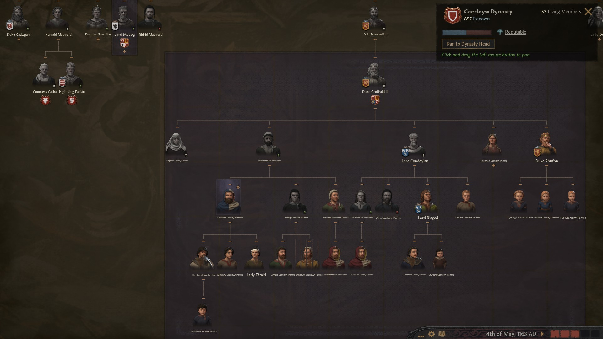

Between 1160 and 1167 the Kingdom of Ireland had reached its maximum extension in his history so far and with it the indissolubly related diffusion of the Paulician religion. 

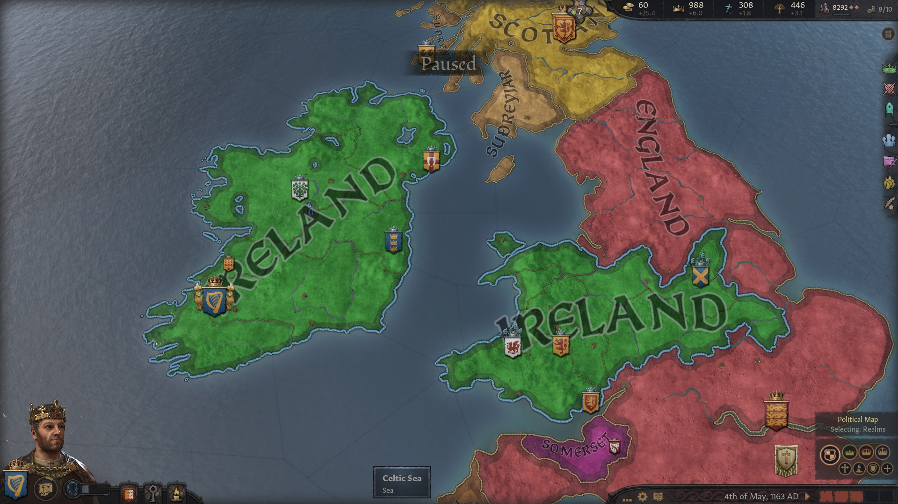

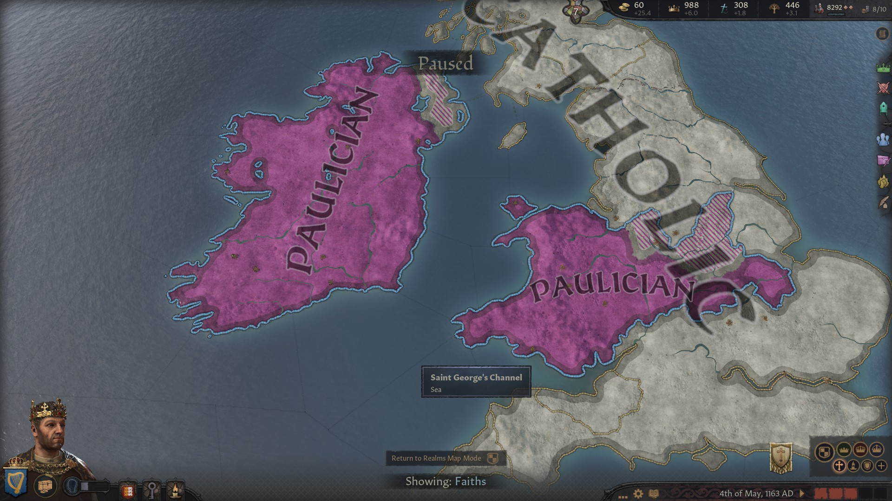

The **Duchy of Mercia** had been created, too, and assigned to Calainban's nephew **Duke Gilla-Ruad mac Fiachne of Mercia**, from the house **gCais-Cruachu,** who also controlled the **Earldom of Nottinghamshire.** Gilla-Ruad had been assigned the two vassals, and Candailban's chilren, **Prince Caindelban mac Caindelban,** still **Earl of Huntingdonshire** and **Northamptonshire,** and **Prince Dinertach mac Caindelban,** still **Earl of Worcestershire** and **Warwickshire.**

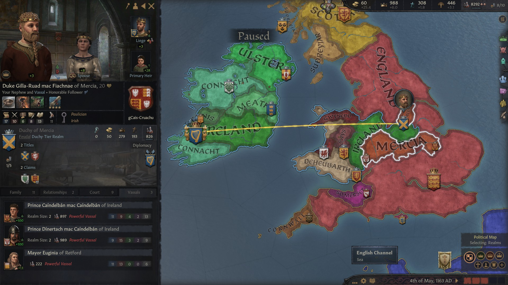

However, in 1163 there was a devastating setback - the Pope declared a Crusade against the Paulician faith over the Kingdom of England. Crusader forces outnumbered Paulicians 3 to 1, and on top of that, Irish leaders had no experience fighting crusades. After four years of war, Ireland conceded defeat and gave up on all territories in England. Mercia was restored to **King Duff** of England. However, High King Caindelban mac Faelan stayed in full control of Ireland and Wales.

In 1167, Caindelban owned the titles of **King of Ireland** and **Wales, Petty King of Munster** and **Leinster, Earl of Thomond, Ossory, Leinster** and **Ormond.** His vassals were:

- His brother **Duke Conmal mac Faelan** of **Ulster**
- His nephew **Duke Aengus mac Cobflaith** of **Meath**
- His second cousin **Duchess Nest ferch Morien of Gwynedd** from the house **Caerloyw-Tyddewi**
- His brother **Duke Fiachnae mac Faelan** of **Connacht**
- **Duke Meilys II ab Owain of Powys,** 3, whose father **Duke Owain II ap Meilys of Powys** and whose greatfather, and Caindelban's second cousin, **Duke Meilys II ap Rhiwallon of Powys**, had been slain during the crusades. Both had been killed by Pope's vassal **Mayor Vincenzo of Ostia,** who had a prowness of 36 and a lot of Paulician blood on his hands.
- **Duke Cynwrig ab Rhufon of Deheubarth, 9,** whose father **Duke Rhufon ap Gruffydd**, Caindalban's second cousin**,** had also died during the crusade
- His cousin **Earl Cathnio mac Cathan of Ennis** 

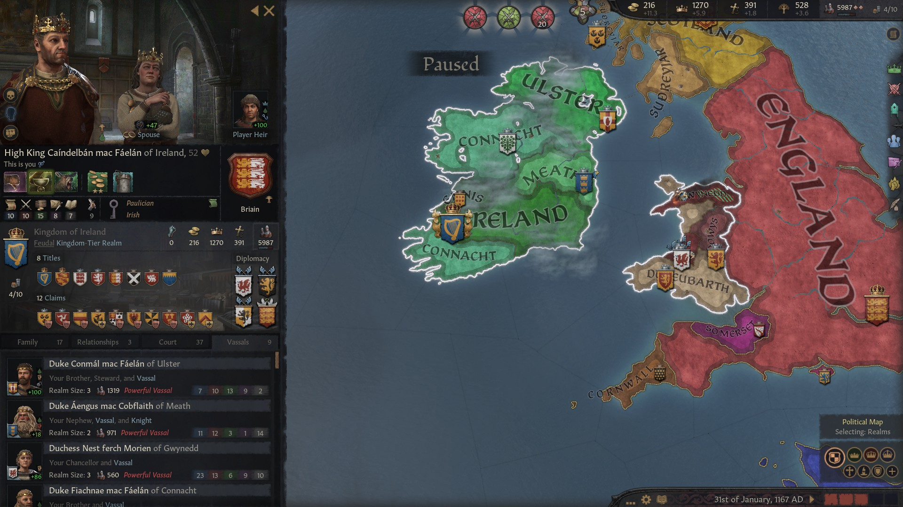

Caindalban's brother **Duke Conmal mac Faelan** of **Ulster** had the titles of **Duke of Ulster** and **Earl of Ulster** (this one revoked from Caindalban's father's cousin **Murchad mag Enguerrand gCais-Inis** in 1158) and **Ailech,** and only one's vassal**, Earl Sean mac Cuanu of Oriel,** from the house **Laighin,** the son of Caindelban's late cousin **Earl Cuanu mac Sean**.

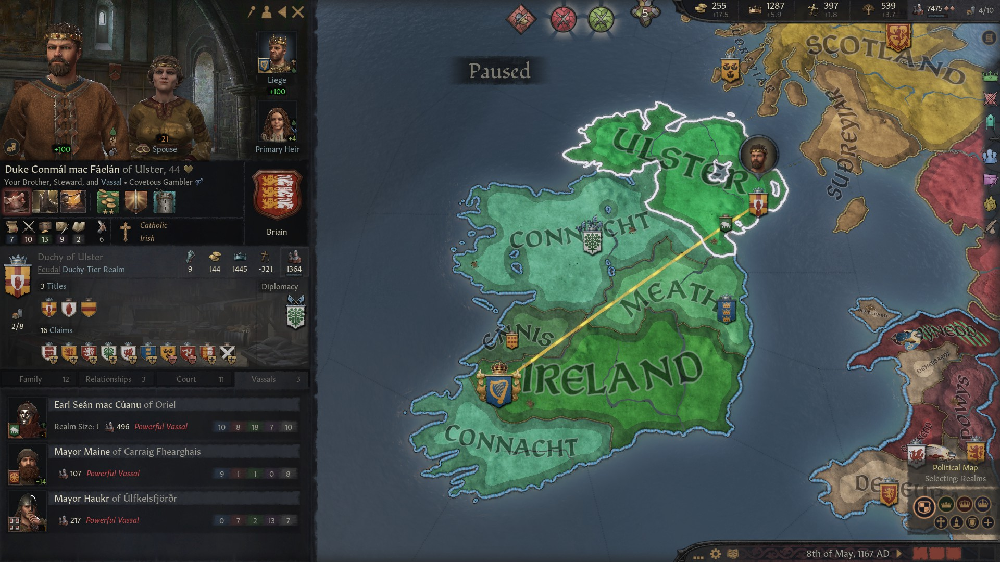

**Caindelban's nephew **Duke Aengus mac Cobflaith** of **Meath** owned the titles of **Duke of Meath** and **Earl of Dubhlinn,** and as vassal Caindelban's nephew **Earl Abban mac Cobflaith of Athlone.**

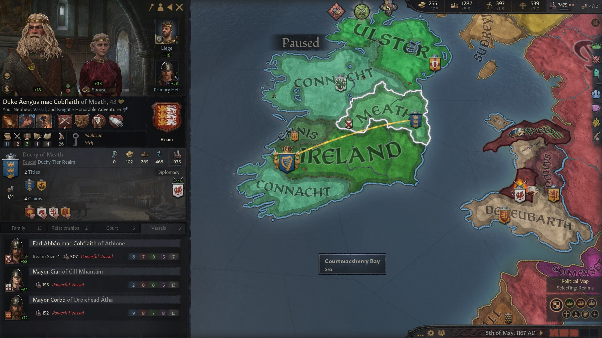

Caindelban's brother **Duke Fiachnae mac Faelan of Connacht** owned the titles of **Duke of Connacht** and **Earl of Mayo.**

He had the vassals:

- **Earl Aelfamer mag Osraed of Ui Mhaine** from the house **Hayles**
- Caindelban's second cousin **Earl Cormac mac Bruatur of Breifne** from the house **gCais-Inis**
- **Countess Ben-Ulad of Desmond,** Caindelban's second cousin **Deirdre nic Deirdre gCais-Inis**'s daughter, from the house **gCais-Inis**.

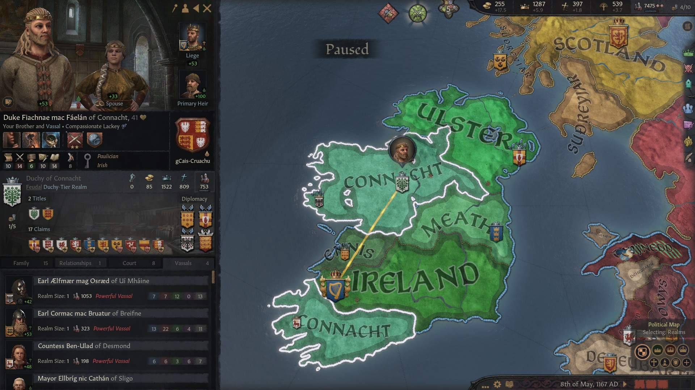

Caindalban's second cousin **Duchess Nest ferch Morien of Gwynedd** owned the titles of **Duchy of Gwynedd, Lordship of Eryri** and **of Ceredigion** and as a vassal had **Lady Efyrddil ferch Gruffydd of Perfeddwlad.**

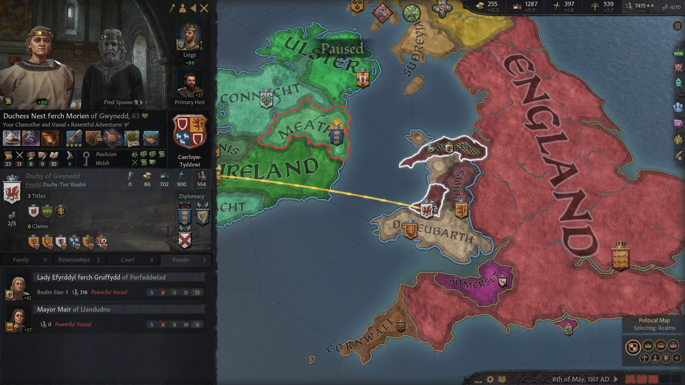

**Duke Meilys II ab Owain of Powys** was also **Earl of Ferlix** and as a vassal he had **Lady Elen ferch Idwal of Penllyn,** 

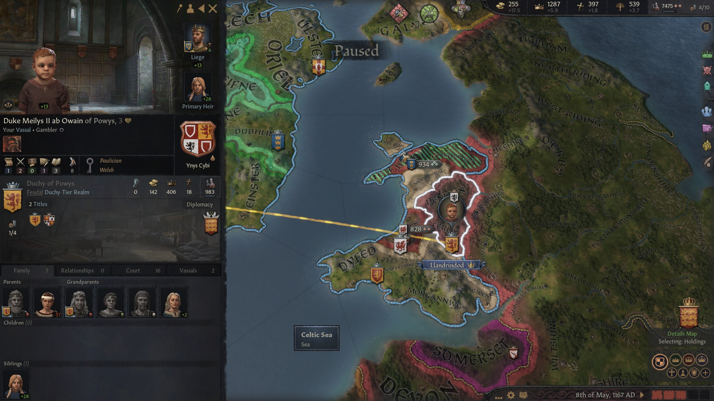

**Duke Cynwrig ab Rhufon of Deheubarth** had the title of **Duke of Deheubarth, Lord of Gwent** and **Lor of Sir Gaerfyrddin**. His vassals were **Lord Riaged ap Cyndyylan of Merionnydd** and **Ynys Mon**, **Lady Haer ferch Bleddyn of Brycheniog**, **Lord Iorweth ap Gwenllian of Morgannwg** and **Lord Pyr ap Rhufon of Dyfed**, who were all somewhat related to Caindalban over his greatmother Hunydd.

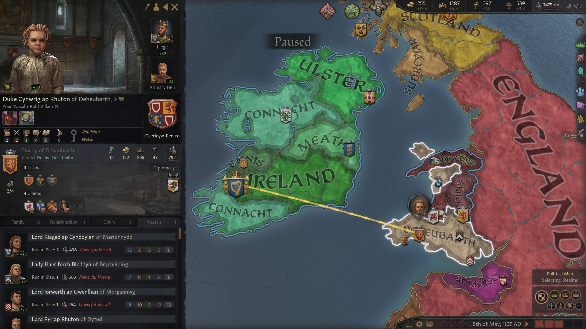

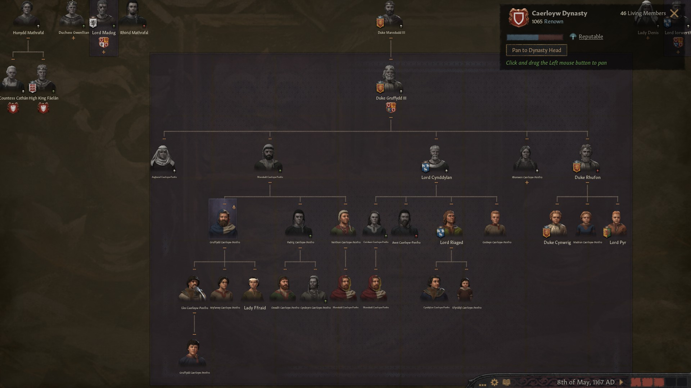

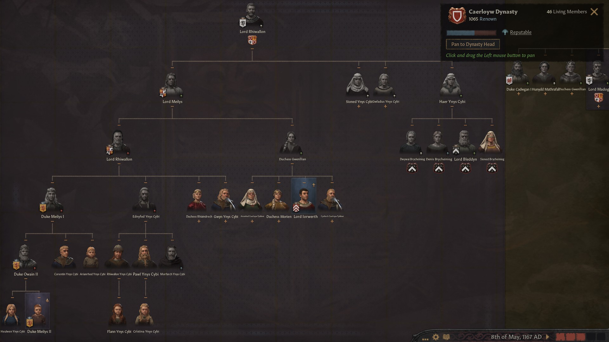

Here an overview of Caindelban's extended family:

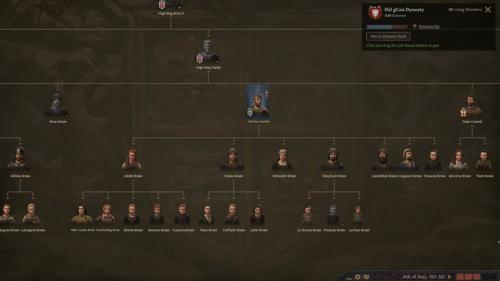

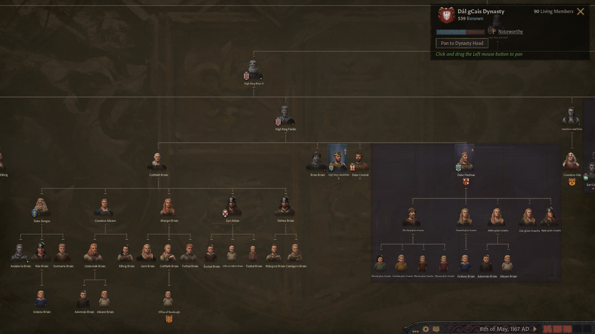

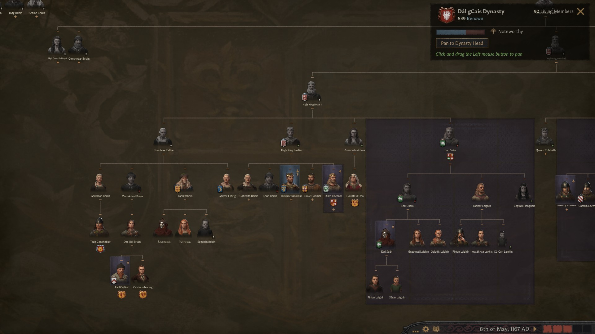

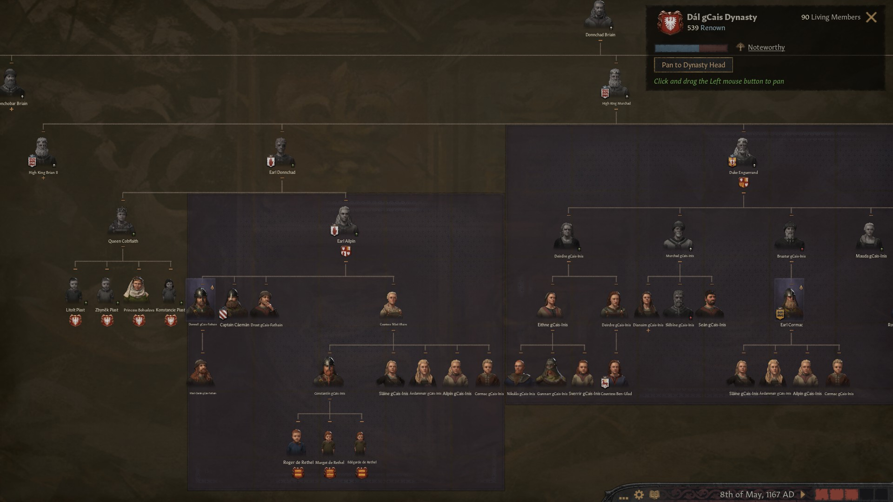

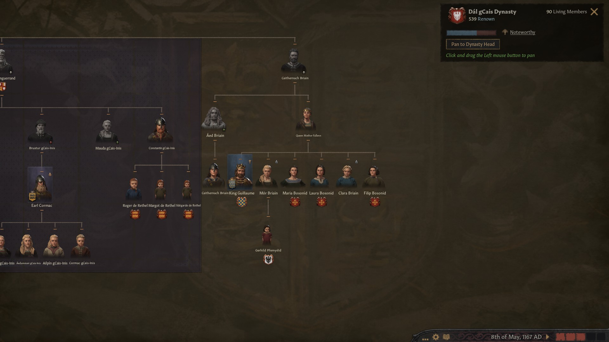
