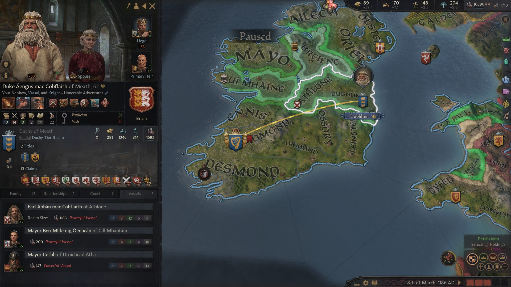

### High King Caindelban mac Faelan of Ireland in 1186

By the year 1186 the borders of Ireland had not changed, as [**Caindelban**](../p/caindelban_i_mac_faelan_1114.md) was still licking his wounds after the shock of the defeat against the crusaders. He had turned out to be a good steward and developed the traits **Architect** and Avaricious, along with **Thrifty Clerk,** which gave him a total stewardship of 18 and some building bonuses. Rather than start other wars, he concentrated on reorganizing his realm and make it more economically viable. He was in fact making 37.1 gold a month, so that he could finance a fairly big army easily. 

He owned the titles of **King of Ireland** and **Wales**, **Petty King of Munster, Leinster, Connacht** (revoked from the nephew **Gilla-Ruad mac Fiachnae**)**, Earl of Thomond, Ossory, Leinster, Ormond, Ennis (**revoked in 1179 from his cousin [**Cathnio mac Cathan**](../p/cathnio_mac_cathan_1108.md)'s son [**Aed mag Ite Briain**](../p/aed_mag_ite_1142.md), **Desmond** (revoked in 1186 from his cousin [**Deirdre nic Deirdre**](../p/deirdre_nic_deirdre_1131.md) cousin's daughter [**Ben-Ulad nic Deirdre**](../p/ben-ulad_nic_deirdre_1152.md) from the house **gCais-Inis**) and **Mayo.**

He was still holding claims to the **Earldom of Ulster, Dubhlinn, Leicestershire, Staffordshire, Shropshire** and **Herefordshire.** 

He had also claims to the **Lordship of Ferlix**, ruled by [**Duchess Gwerfyl ferch Meilys of Powys**](../p/gwerfyl_ferch_meilys_1180.md), the daughter of his granddaughter [**Lathir nic Faelan Briain**](../p/lathir_nic_faelan_1162.md) and late **Duke Meilys II ab Owain.** Through his late mother **Elisabet Gudrodsdatter Crovan** and her father **Duke Gudrod Haraldrsson of the Isles,** he also held claims to **the Isles, Earldoms of Argyll, Inner Hebrides** and **Inverness.**

Caindelban's vassals were:

- His brother [**Duke Conmal mac Faelan of Ulster**](../p/conmal_mac_faelan_1122.md)
- **Duke Cynwrig ab Rhufon of Deheubarth** from the house **Caerloyw-Penfro,** son of his second cousin **Duke Rhufon ap Gruffydd ab Deheubarth**
- His nephew **Duke Aengus mac Cobflaith of Meath**
- **Duchess Gwerfyl ferch Meilys of Powys,** who was the great-granddaughter of his third cousin **Duke Meilys I ap Rhiwallon** a
- **Earl Udalschalk mag Aileann of Ui Mhaine,** son of his niece **Aileann nic Cobflaith Briain** and **Aelfmaer mag Osraed** of the house **Hayles**
- His second cousin **Earl Corman mac Bruatur of Briefne**

Caindalban's brother **Duke Conmal mac Faelan of Ulster** had also expanded inside the realm. He had conquered Gwynedd in 1169. So had now the titles of **Duke of Ulster** and **Gwynedd,** and **Earl of Ailech, Ulster, Oriel** and **Perfeddwlad.** His vassals were:

- Caindalban's granddaughter **Lady Aine nich Sithmaith of Eryri,** born from the matrilineal marriage between **Lord Rodan ap Mo-Lua of Eryri,** son of Caindalban's second cousin **Lady Nest ferch Morien of Eryri,** and Caindalban's daughter **Princess Sithmaith nic Caindelban**
- **Lord Rian ab Aengus of Ceredigion,** who had inherited the title from his grandmother, and Caindalban's sister, **Lady Cobflaith nic Faelan of Ceredigion**

**Duke Cynwrig ab Rhufon of Deheubarth** had the title of **Duke of Deheubarth, Lord of Gwent and Lor of Sir Gaerfyrddin**. His vassals were **Lord Riaged ap Cyndyylan of Merionnydd and Ynys Mon**, **Lord Iorweth ap Gwenllian of Morgannwg**, **Lady Haer 'the Foolish' of Brycheniog**, and **Lord Pyr ap Rhufon of Dyfed**, who were all somewhat related to Caindalban over his greatmother Hunydd. Exactly like 20 years before.

Caindelban's nephew **Duke Aengus mac Cobflaith of Meath** owned the titles of **Duke of Meath and Earl of Dubhlinn**, and as vassal Caindelban's nephew **Earl Abban mac Cobflaith of Athlone**, like 20 years before.

As for family, Caindelban's first wife **Flann nic Rois** had died in 1172. after giving him sevenchildren: **Aibilin (f),** late **Faelan (m),** late **Sithmaith (f), Dinertach (m), Caindelban (m), Congalach (m), Finnalach (m).** He had remarried, with queen **Sofia Styrbjornsdatter** from the house **Orkneyjar**, but she had not given him any children.

Faelan had only daughters and the underwhelming Dinertach had been disinherited, which made Caindelban II the next heir in line, who was bound to inherit the whole of Munster and associated titles. Congalach would get Wales, Finnacan Leinster and Connacht. The brothers were all about equally skilled.

