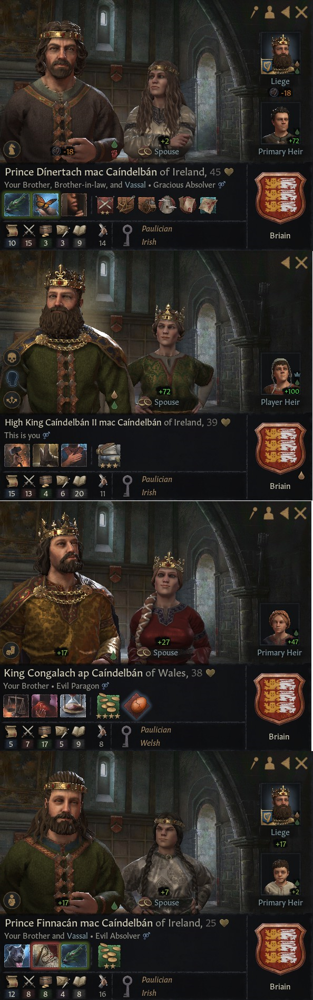
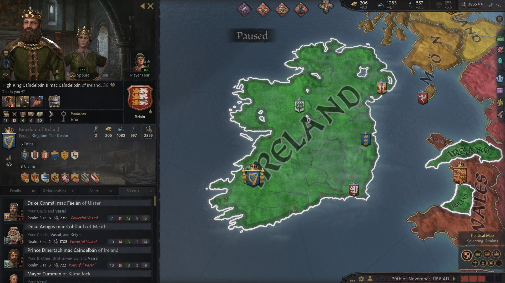
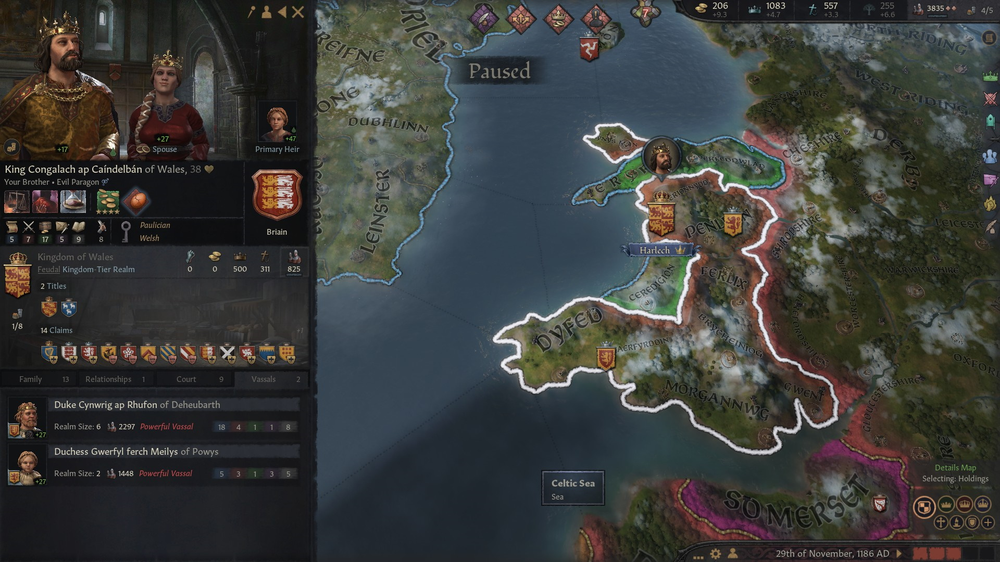
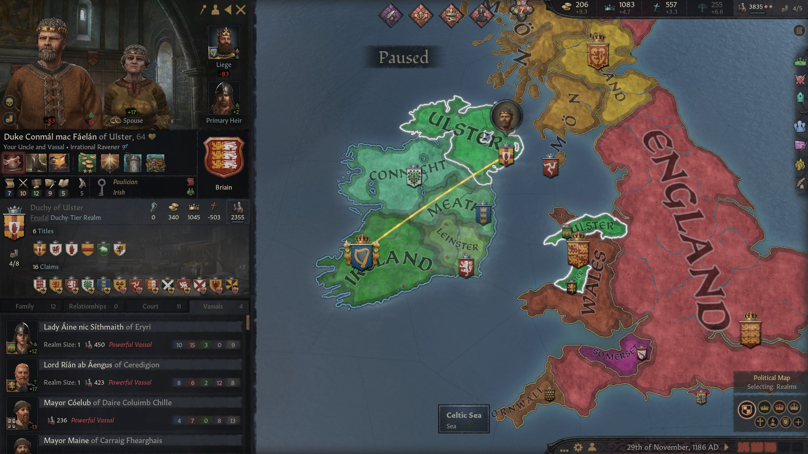
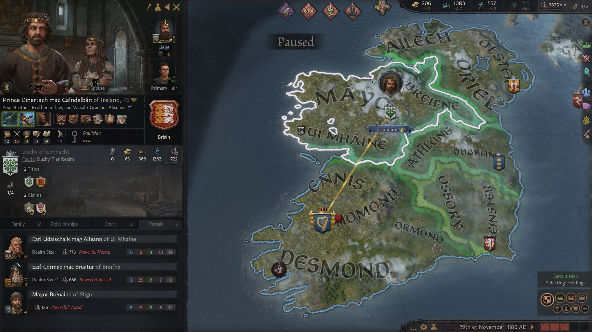
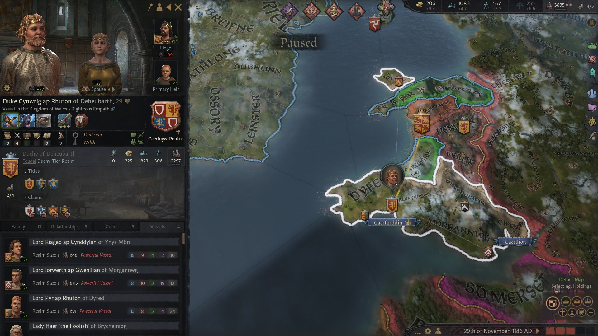
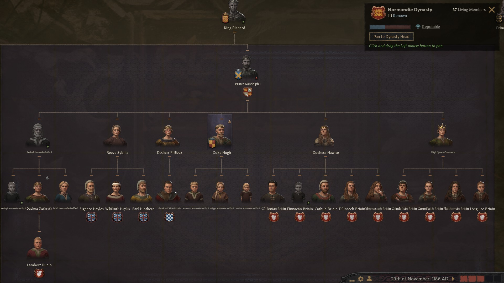

### High King Caindelban II of Ireland, 1186

**[Caindelban I mac Faelan of Ireland](../p/caindelban_i_mac_faelan_1114.md)** died of old age in 1186. The titles were divided between the male heirs **[Caindalban II](../p/caindelban_ii_mac_caindelban_1147.md)**, **[Congalach](../p/congalach_ab_caindelban_1148.md)** and **[Finnacan](../p/finnacan_mac_caindelban_1161.md)**. **[Dinertach](../p/dinertach_mac_caindelban_1141.md)**, the first in line, had been disinherited for no other apparent reason apart from his mediocrity.

Therefore, **[King Caindalban II mac Caindelban](../p/caindelban_ii_mac_caindelban_1147.md)** inherited the titles of **King of Ireland, Munster,** and **Earl of Thomond, Ormond, Ennis** and **Desmond.**

His vassals were:
- His uncle **[Duke Conmal mac Faelan of Ulster](../p/conmal_mac_faelan_1122.md)**
- His cousin **[Duke Aengus mac Cobflaith of Meath](../p/aengus_i_mac_cobflaith_1123.md)**
- His brother **[Prince Dinertach mac Caindelban](../p/dinertach_mac_caindelban_1141.md)**, who was **Duke of Connacht**
- His brother **[Prince Finnacan mac Caindelban of Ireland](../p/finnacan_mac_caindelban_1161.md)**, who was **Duke of Leinster**

Caindalban II's brother was **[King Congalach ab Caindelban of Wales](../p/congalach_ab_caindelban_1148.md)**, who was **King of Wales** and **Earl of Merionnydd.** His vassals were:

- Caindalban II's third cousin **[Duke Cynwrig ap Rhufon of Deheubarth](../p/cynwrig_ap_rhufon_1157.md)**
- Caindalban II's niece **[Lathir nic Faealan](../p/lathir_nic_faelan_1162.md)**'s daughter **[Duchess Gwerfyl ferch Meilys of Powys](../p/gwerfyl_ferch_meilys_1180.md)**, from the house **Ynys Cybi**

Caindalban II's uncle **[Duke Conmal mac Faelan of Ulster](../p/conmal_mac_faelan_1122.md)** was still holding sway in Ulster. He had the title of **Duke of Ulster, Gwynedd** and **Earl of Ailech, Ulster, Oriel and Perfeddwlad.** His vassals were 

- Caindalban II's niece **[Lady Aine nic Sithmaith of Eryri](../p/aine_ferch_sithmaith_1169.md)**
- Caindalban II's cousin [Aengus mac Cobflaith](../p/aengus_i_mac_cobflaith_1123.md)'s son **[Lord Rian ab Aengus of Ceredigion](../p/rian_ab_aengus_1144.md)**

Caindalban II's older and disinherited brother [Dinertach mac Caindelban](../p/dinertach_mac_caindelban_1141.md) had been given the titles **Duke of Connacht** and **Earl of Mayo.** He had the vassals:

- Caindalban II' s cousin **[Aillean nic Cobflaith](../p/aileann_nic_cobflaith_1128.md)**'s son **[Earl Udalschalk mag Aileann of Ui Mhaine](../p/udalschalk_mag_aileann_1145.md)**
- Caindalban II's father **[Caindalban I mac Faelan](../p/caindelban_i_mac_faelan_1114.md)**'s second cousin **[Earl Cormac mac Bruatur of Breifne](../p/cormac_mac_bruatur_1133.md)**

Caindelban II's cousin **[Duke Aengus mac Cobflaith of Meath](../p/aengus_i_mac_cobflaith_1123.md)** owned the titles of **Duke of Meath** and **Earl of Dubhlinn**, and as vassal Caindelban II's cousin **[Earl Abban mac Cobflaith of Athlone](../p/abban_mac_cobflaith_1132.md).**

Caindelban II's youngest brother **[Finnacan mac Caindelban](../p/finnacan_mac_caindelban_1161.md)** held the titles of **Duke of Leinster, Earl of Ossory** and **Earl of Leinster**

[**Duke Cynwrig ab Rhufon of Deheubarth**](../p/cynwrig_ap_rhufon_1157.md) had the title of **Duke of Deheubarth, Lord of Gwent and Lor of Sir Gaerfyrddin.** His vassals were [**Lord Riaged ap Cyndyylan of Merionnydd**](../p/riaged_ap_cynddylan_1169.md) and **Ynys Mon,** [**Lord Iorweth ap Gwenllian of Morgannwg**](../p/iorwerth_ap_gwenllian_1129.md), **Lady Haer 'the Foolish' of Brycheniog**, and **[Lord Pyr ap Rhufon of Dyfed](../p/pyr_ap_rhufon_1160.md)**. 

King Caindalban II was married with **[Queen Constance](../p/constance_randolph_1144.md)** from the house of **Normandie-Bedford,** who had several claims such as Kingdom of England, Mercia, Duchy of Essex and York, as her grandfather **King Richard** had been **King of England,** title now held from **King Evander** of the house **Dunkeld, King Duffy's** greatson. Caindelban II's brother Dinertach was married with Constance's sister **Duchess Hawise,** so that he ended up being Caindelban II's brother and brother in law at the same time.

[**King Congalach ap Caindelban of Wales**](../p/congalach_ab_caindelban_1148.md), who was also Welsh, had married Queen Tegal Ferch Cadwallon of Wales, from the house **Morgannwg,** a house so far with no connection with the Briain. [**Prince Finnacan mac Caindelban**](../p/finnacan_mac_caindelban_1161.md) had married **Infanta Velazquita Todez of Castille**