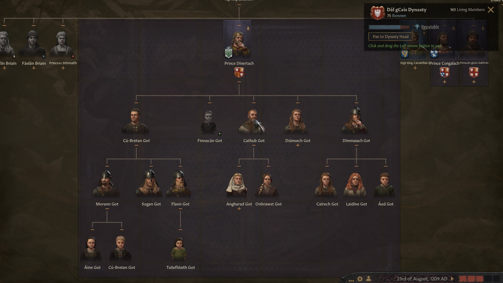
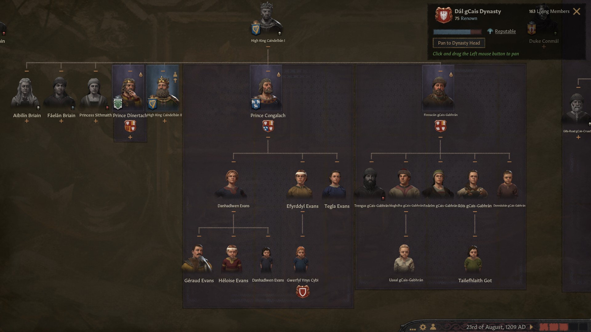
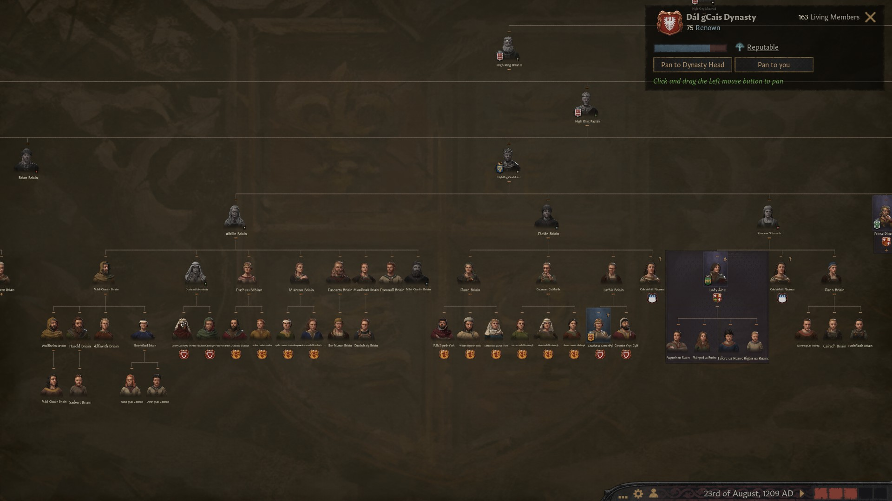
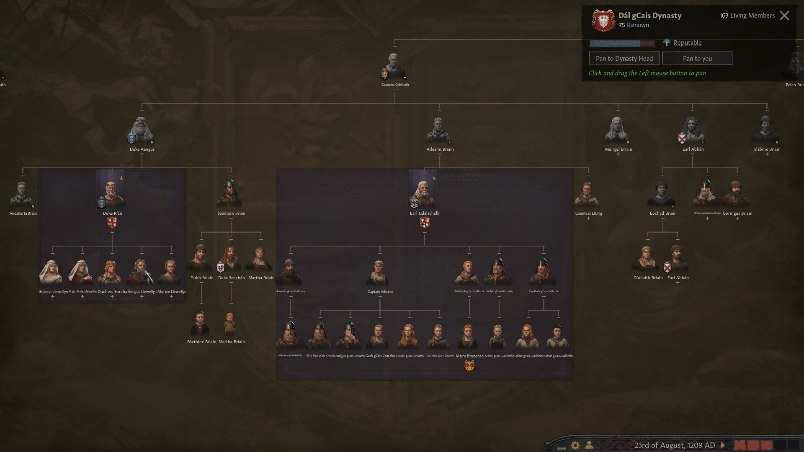
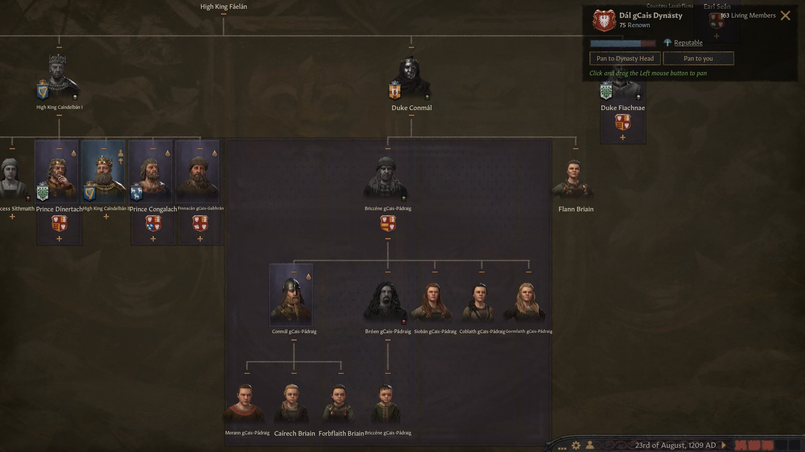
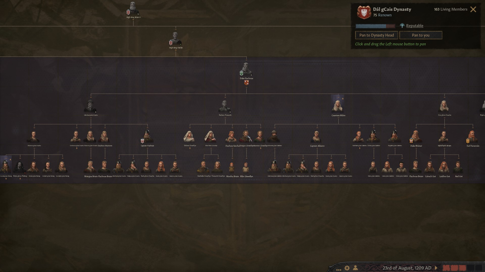
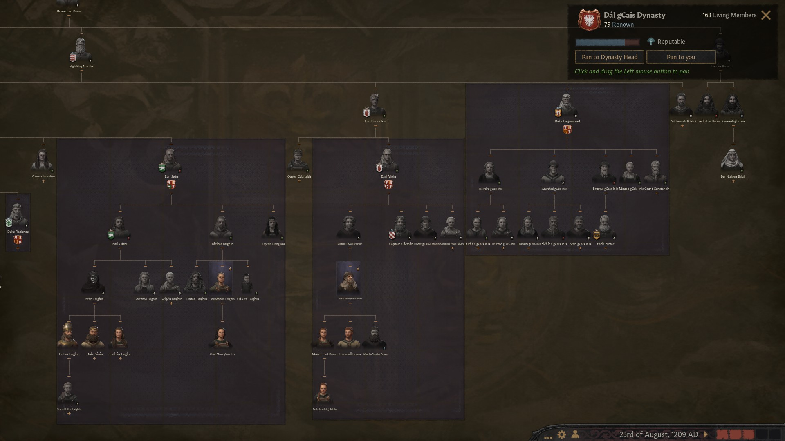

### High King Caindelban II of Ireland, 1209

**[Caindelban II](https://drive.google.com/file/d/1OYmCfAW94AgdpTOPaNEoLrXPtYutIJCH/view?usp=sharing)** concentrated on learning and building up his realm - he wasn't set on expansion and conquest. However, that didn't mean he would be left alone. In 1195, **King Evander** of England took **Deheubarth** from Caindelban II's vassal **[King Congalach ap Caindelban](https://drive.google.com/file/d/1V8cE3GnBrZr-kPyQX_lb-QCVP-2unNFN/view?usp=sharing)' of Wales**' vassal **[Lord Cynwrig ap Rhufon of Ynys Mon](https://drive.google.com/file/d/1N56A2TLL_Dp-KFRRI81dtajUK_6Nzp1P/view?usp=sharing)** in a holy war, which meant that all other vassals were also deposed.

In 1200, King Caindelban II helped **King Conall II of Scotland**, whom he was allied with through marriage between his son **[Flaitheman](https://drive.google.com/file/d/1RxtDCSblhNxbxabNSQs6WKsoGarPmit0/view?usp=sharing)** with **Princess Marthoc of Scotland**, win the **Earldom of Inverness** from **Petty King Haraldr II Haraldrsson of Mön**.

However, the priority was to recover the lost territories in Wales, and for that he declared war over the title of Wales to his brother **[King Congalach ab Caindelban](https://drive.google.com/file/d/1V8cE3GnBrZr-kPyQX_lb-QCVP-2unNFN/view?usp=sharing) of Wales**. He called his ally **[Captain Fiachnae mac Gilla-Ruad of Band of Kerns](https://drive.google.com/file/d/1kuyr5YBmsclKksC8mfRD4NrcaGELOCiW/view?usp=sharing),** his cousin **[Gilla Ruad mac Fiachnae gCais-Cruachu](https://drive.google.com/file/d/1XMdVMKjYb9b4KNEE3n9x6dQSM9xc8KJo/view?usp=sharing)**'s son**,** to arms. In December 1201, King Caindalban II recovered the title of King of Wales, and took his brother Congalach as vassal.

That was not the end of it, as Congalach was at the same time defending against two holy wars for the **Lordship of Ferlix** and **Duchy of Powys,** respectively against **Lord Matad of Brycheniog** and **Countess Sig Wulfdohtor of Herefordshire**. Right after conquering Wales, Caindalban II dealt with these two enemies swiftly, at the same time also helping **King Conall II** defend against the rebel vassal **Banmormaer Anlaith MacFaeldobur of Caithness**. After that, the realm of Ireland was unified, but **Deheubarth** was still in the hands of **King Evander of England**.

In 1204, Caindelban II had to face a revolt for higher autonomy from his vassals, led by his cousin **[Duke Briccene mac Conmal ](https://drive.google.com/file/d/13lPnrl4HWCdmLphBPGeiXf36ZYAJ7uZ8/view?usp=sharing)of Ulster and Gwynedd,** founder and head of the house **gCais-Padraig**, and his brother **[Prince Finnacan mac Caindelban of Ireland](https://drive.google.com/file/d/1vh4id67olHD-pFPnHbSi0uAVODMzDv6j/view?usp=sharing), Duke of Leinster,** founder and head of the house **gCais-Gabhran.** Both had a respectable army, so help from the allies Captain Fiachnae and King Conall II was more than welcome. Only in June 1207 did King Caindelban II manage to crush the revolt, the leaders were imprisoned and had to give up their titles. King Caidelban moved on to reassign them.

So in 1209, High King Caindelban II mac Caindelban was holding the titles of **King and Ireland and Wales, Petty King of Munster and Leinster, Earl of Thomond, Ormond, Desmond, Leinster and Ossory.** His vassals were:

- Caindalban II's cousin late **[Aengus mac Cobflaith](https://drive.google.com/file/d/1lujpbBgf2jeP-a8bqKDJ0P36y3nqxkve/view?usp=sharing)**'s son **[Lord Rian ab Aengus of Meath](https://drive.google.com/file/d/1D7nah49jkysaXf4x4spOgox1PlvRBCDw/view?usp=sharing)**
- Caindelban II's brother **[Prince Dinertach mac Caindelban of Ireland](https://drive.google.com/file/d/1hUcsiPrzosIF6AF-p1X9Cbbd69a_K3ke/view?usp=sharing)**, also **Duke of Connacht**
- Caindalban II's niece **[Lathir nic Faealan](https://drive.google.com/file/d/1GaMrW-GKOsKKgyEL5X9HEHMS2e3S2_I-/view?usp=sharing)'s** daughter **[Duchess Gwerfyl ferch Meilys of Powys](https://drive.google.com/file/d/1TevEJgFGB50l0c_Pe23OmYK1qMj_kctN/view?usp=sharing)**
- Caindalban II's cousin **[Ciar nic Fiachnae](https://drive.google.com/file/d/1yqjaJAeP8APAQvFqO1MYxTAm_bjMj01t/view?usp=sharing)**'s daughter **[Duke Bhatair mac Ciar of Ulster](https://drive.google.com/file/d/1JOssOALdJIfD3mPeSR7UOeMhVcYiOOK3/view?usp=sharing)**
- Caindalban II's cousin late **[Aengus mac Cobflaith](https://drive.google.com/file/d/1lujpbBgf2jeP-a8bqKDJ0P36y3nqxkve/view?usp=sharing)**'s great-son **[Duke Senchan mac Somhairle of Gwynedd](https://drive.google.com/file/d/15My05tZc73OZLLKh9KFUnZSJh82XZLs3/view?usp=sharing)**
- Caindalban II's cousin **[Ciar nic Fiachnae](https://drive.google.com/file/d/1yqjaJAeP8APAQvFqO1MYxTAm_bjMj01t/view?usp=sharing)**' son **[Earl Farannan mac Ciar of Ennis](https://drive.google.com/file/d/1IURSTxAaf9BqWZlS_E0P1_qY-1Ml7rGZ/view?usp=sharing)**

**[Duke Rian ab Aengus of Meath](https://drive.google.com/file/d/1D7nah49jkysaXf4x4spOgox1PlvRBCDw/view?usp=sharing),** head of the house **Llewellyn (Dal-gCais),** had the titles of **Duke of Meath** and **Earl of Ceredigion** and **Dulyn.** His vassal was Caindalban II's cousin late **[Earl Abban mac Coflaith](https://drive.google.com/file/d/1hmP-Y6fYUM-ITI2NDpdtr-RY0VzxfwXN/view?usp=sharing)'s** grandson **[Earl Abban mag Eochad of Athlone](https://drive.google.com/file/d/1pTKoA4mNhZm7Oze4MzV688hotECAkx4r/view?usp=sharing).**

Caindalban's brother **[Prince Dinertach mac Caindelban of Ireland](https://drive.google.com/file/d/1hUcsiPrzosIF6AF-p1X9Cbbd69a_K3ke/view?usp=sharing),** head of the house **Got (Dal-gCais)**, had the titles of **Duke of Connacht** and **Earl of Mayo,** and as vassals Caindalban II's cousin late **[Aileann nic Cobflaith](https://drive.google.com/file/d/1Qf2369N4NK392vDrn8to0fxFv5vcooQ9/view?usp=sharing)**'s son **[Earl Udalschalk mag Aileann of Ui Mhaine](https://drive.google.com/file/d/1jvY7WG9QcPTsCUu9r3Hp_T30sNOTXiQ3/view?usp=sharing),** head of the house **gCais-Gaillimhe,** and Caindalban's cousin late **[Countess Mael Muire nig Ailpin](https://drive.google.com/file/d/1FJRoiNp6DX892_edoDByZP_QkHwpCYR5/view?usp=sharing)**'s son **[Earl Ailpin Mael-Muire of Breifne](https://drive.google.com/file/d/1gBZ3IudhuzW7pUluXllOsZZxbtFFXOej/view?usp=sharing),** head of the house **gCais-Inis.**

**[Duchess Gwerfyl ferch Meilys of Powys](https://drive.google.com/file/d/1TevEJgFGB50l0c_Pe23OmYK1qMj_kctN/view?usp=sharing)** was also **Lord of Ferlix** and **Penllyn** and had no vassals.

Caindelban II's cousin **[Ciar nic Fiachnae](https://drive.google.com/file/d/1yqjaJAeP8APAQvFqO1MYxTAm_bjMj01t/view?usp=sharing)**'s son **[Duke Bhatair mac Ciar of Ulster](https://drive.google.com/file/d/1JOssOALdJIfD3mPeSR7UOeMhVcYiOOK3/view?usp=sharing)**

was **Duke of Ulster** and **Earl of Ulster and Oriel,** and as a vassal he had Caindelban's greatson **[Earl Abel mac Gormflaith of Ailech](https://drive.google.com/file/d/1HuynI7sPLFhrs8ZeZbsKIiBPj7cplQgv/view?usp=sharing).**

Caindalban II's cousin late **[Aengus mac Cobflaith](https://drive.google.com/file/d/1lujpbBgf2jeP-a8bqKDJ0P36y3nqxkve/view?usp=sharing)**'s great-son **[Duke Senchan mac Somhairle of Gwynedd](https://drive.google.com/file/d/15My05tZc73OZLLKh9KFUnZSJh82XZLs3/view?usp=sharing)** was **Duke of Gwynedd, Lord of Perfeddwlad** and as vassals he had 

- Caindelban's niece **[Lady Aine ferch Sithmaith of Eryri](https://drive.google.com/file/d/1VZfz32SithW8yaBqGGOFo5BLrJVjyBlt/view?usp=sharing),** head of the house **Ruairc (Dal-gCais)**
- Caindelban's rebel brother **[Prince of Congalach ab Caindelban of Ireland](https://drive.google.com/file/d/1V8cE3GnBrZr-kPyQX_lb-QCVP-2unNFN/view?usp=sharing)**, now just **Lord of Merionnydd,** head of the house Evans **(Dal-gCais)**
- **[Lord Cynwrig ap Rhufon of Ynys Mon](https://drive.google.com/file/d/1N56A2TLL_Dp-KFRRI81dtajUK_6Nzp1P/view?usp=sharing),** head of the house **Caerloyw-Penfro,** Caindalban II's third cousin.

Caindelban II had three sons (**Caindelban, Flaitheman** and **Loeguire**) and one daughter (**Gormflaith**) None of these had good skills, but anyway Caindelban had picked Flaitheman as a main heir.

All of living Caindelban II's brother had founded new houses. **Dinertach** had founded **Got**, **Congalach** had founded **Evans** and Finnacan had founded **gCais-Gabhran.**

Among the descendants of the other Caindelban II's siblings, only **Sithmaith**'s daughter **Aine** had created a house, **Ruairc**.

On the part of Caindalban's aunt **Cobflaith nic Faelan**, two houses existed: **Duke Rian ab Aengus of Meath's LLewellyn,** and **Earl Udalschalk mag Aileann of Ui Mhaine's** **gCais-Gaillimhe.**

Caindalban's cousin **Briccene mac Comnal** had also founded a house, **gCais-Padraig,** whose head now was **Conmal mac Muirenn.** 

And of course Caindalban's uncle **Fiachnae mac Faelan** had founded **gCais-Cruachu** , whose head was now his daughter **Countess Maire nic Fiachnae of Ui Mhaine.**

Other houses, such as Caindelban II's greatfather **Faelan mac Brian's** brother **Earl Sean mac Brian**'s **Laighin,** Faelan's cousin **Ailpin mac Donnchd of Ailech gCais-Fathain** and Faelan's uncle **Enguerrand mac Murchad of Ulster's gCais-Inis** had become irrelevant.

