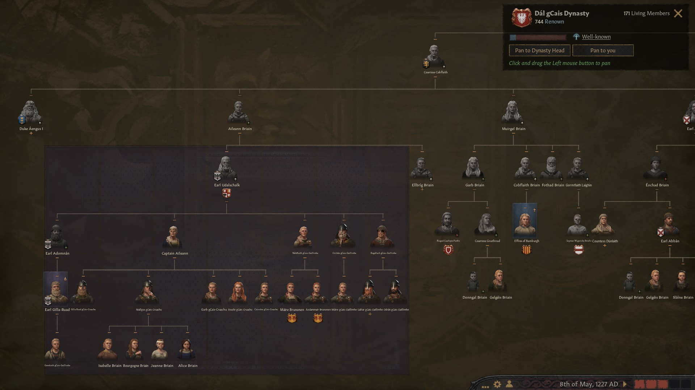

### High Queen Slaine of Ireland, 1227

For the most part, the reign of **[Caindalban II](https://drive.google.com/file/d/1OYmCfAW94AgdpTOPaNEoLrXPtYutIJCH/view?usp=sharing)** didn't bring about any territorial changes. Any further expansion would have meant to challenge England or Scotland, while being always under the risk that the Pope would be involved and a Crusade would be declared. Therefore, even while having an erudition focus, Caindalban II's main legacy was the thorough economical development of Ireland, which his successors would know to appreciate. However, its 40-years reign was also a reign of chances not exploited, as he died having accumulated heaps of prestige and piety that he could not spend. 

During his time he was very controversial. He disinherited all of his three sons **Caindelban, Flaitheman** and **Loeguire,** born by his first wife **Constance** of the house **Normandie-Bedford**, because he was unimpressed by their skills. He had the idea that his successor would need a lot of time to implement thorough reforms, and therefore he picked his daughter **[Slaine nic Caindelban](https://drive.google.com/file/d/1IpUliNrFb0HpVpZQcsu6ipMcj4GClxkv/view?usp=sharing)** as only successor, who had been born by his second wife, **Queen Maer of Ireland.** When he died in 1227, she was only 14. The older daughter **Gomflaith** would be the next heir in line, followed by her children.

In 1227 **Slaine nic Caindelban** inherited the whole of Ireland, as single heir. Just as her father, she held the titles of **Queen and Ireland and Wales, Petty Queen of Munster and Leinster, Earl of Thomond, Ormond, Desmond, Leinster and Ossory**. Her vassals were:

- Slaine's second cousin **[Duke Aengus II mac Finneacht of Meath](https://drive.google.com/file/d/1e9q6aAzQXoN7qmvKX9evkZBHlz7_lBXk/view?usp=sharing)**
- Slaine's secound cousin **[Duke Bhatair mac Ciar of Ulster](https://drive.google.com/file/d/1JOssOALdJIfD3mPeSR7UOeMhVcYiOOK3/view?usp=sharing)*

- Slaine's cousin **[Duke Cu-Bretan mac Dinertach of Connacht](https://drive.google.com/file/d/16dYCy79O53YhATRlpSwiJ46SWGg_rcR1/view?usp=sharing)**
- Slaine's second cousin **[Earl Farannan mac Ciar of Ennis](https://drive.google.com/file/d/1IURSTxAaf9BqWZlS_E0P1_qY-1Ml7rGZ/view?usp=sharing)**

For whatever reason, in 1220 Caindelban II had decided to assign Wales to **[King Senchan mac Somhairle of Wales ](https://drive.google.com/file/d/15My05tZc73OZLLKh9KFUnZSJh82XZLs3/view?usp=sharing)**from the house **gCais-Tegeingl,** Slaine's second cousin late **[Somhairle mag Aengus Briain](https://drive.google.com/file/d/1G7pZ6tXl36e0sRftg2KsaRaavdLrS7Rt/view?usp=sharing)'s** son. King Senchan owned the titles to **King of Wales, Petty King of Gwynedd** and **Earl of Perfeddwlad.** As vassal he had 

- Slaine's cousin **[Lathir nic Faealan](https://drive.google.com/file/d/1GaMrW-GKOsKKgyEL5X9HEHMS2e3S2_I-/view?usp=sharing)**'s daughter **[Duchess Gwerfyl ferch Meilys of Powys](https://drive.google.com/file/d/1TevEJgFGB50l0c_Pe23OmYK1qMj_kctN/view?usp=sharing)** from the house **Ynys Cybi,** 
- Slaine's late cousin **[Lady Aine ferch Sithmaith](https://drive.google.com/file/d/1VZfz32SithW8yaBqGGOFo5BLrJVjyBlt/view?usp=sharing)'**s grandson **[Lord Sion ab Augustin of Eryri](https://drive.google.com/file/d/1GOPSTdKQ5K1QPtHjYi_jizxWlqCZujtx/view?usp=sharing)** from the house **Ruairc** 
- Slaine's late cousin **[Lady Aine ferch Sithmaith](https://drive.google.com/file/d/1VZfz32SithW8yaBqGGOFo5BLrJVjyBlt/view?usp=sharing)'**s son **[Lord Talorc ab Aine of Ynys Mon](https://drive.google.com/file/d/1rWbokSmwEQuLaouEFVbPWa9SpNu90VI6/view?usp=sharing)** from the house **Ruairc**

Senchan had married his cousin **[Queen Sorcha ferch Finneacht of Wales](https://drive.google.com/file/d/1Ya5zAit9OGE6RLTIpd93zQakCx4Z1yv5/view?usp=sharing),** who was Slaine's second cousin **[Duke Rian ab Aengus of Meath](https://drive.google.com/file/d/1D7nah49jkysaXf4x4spOgox1PlvRBCDw/view?usp=sharing)'s** daughter. Regrettably, they had [20 common ancestors](https://drive.google.com/file/d/1xNZ0EH6jJRHVvT7AweFbJEoGH7Hh2dNg/view?usp=sharing), worse than half-siblings, and all of their four children had the trait "inbred".

Slaine's secound cousin [Duke Aengus II mac Finneacht of Meath](https://drive.google.com/file/d/1e9q6aAzQXoN7qmvKX9evkZBHlz7_lBXk/view?usp=sharing), **Duke of Meath** and **Earl of Dubhlinn and Ceredigion,** from the house **LLewellyn,** had as a vassal Slaine's second cousin **[Eochad mag Abban Briain](https://drive.google.com/file/d/1FEShTuR67K1dMky61gZfbfG1_suG-7Ez/view?usp=sharing)**'s son **[Earl Abban mag Eochad of Athlone](https://drive.google.com/file/d/1pTKoA4mNhZm7Oze4MzV688hotECAkx4r/view?usp=sharing).** Aengus II was married with **Duchess Joan of Meath,** head of the house of **Normandie,** and had two sons.

Slaine's secound cousin [Duke Bhatair mac Ciar of Ulster](https://drive.google.com/file/d/1JOssOALdJIfD3mPeSR7UOeMhVcYiOOK3/view?usp=sharing) wa**s Duke of Ulster** and **Earl of Ulster** and **Oriel.** As a vassal, he had **[Earl Abel mac Gormflaith of Ailech](https://drive.google.com/file/d/1HuynI7sPLFhrs8ZeZbsKIiBPj7cplQgv/view?usp=sharing),** Slaine's nephew. Bhatair was widower - he had been married to his cousin **[Duchess Muirenn nic Gilla-Ruad of Ulster](https://drive.google.com/file/d/11WtexW2D7kK6_LSFyb1GUjQfkLAgRWb0/view?usp=sharing).** That had been risky, considering that the marriage had [16 common ancestors](https://drive.google.com/file/d/1a3lF6ul2BDiVxSR49VlQgsxFoSykgDoI/view?usp=sharing)

Slaine's cousin [Duke Cu-Bretan mac Dinertach of Connacht](https://drive.google.com/file/d/16dYCy79O53YhATRlpSwiJ46SWGg_rcR1/view?usp=sharing), leader of the house **Got,** who had stayed catholic, was **Duke of Connacht** and **Earl of Mayo.** His vassals were:

- Slaine's second cousins' late [Adomnan mac Maire gCais-Gaillimhe](https://drive.google.com/file/d/1mleQ0G7lTwzQ68IrBZc6ObucYDfS0Sax/view?usp=sharing) and **[Conchenn nic Gilla-Ruad gCais-Cruachu](https://drive.google.com/file/d/1DxfyUsdvH8ka7hHn-tjUd5ynYBS8GMKo/view?usp=sharing)**'s son [Earl Gilla-Ruad mac Conchenn of Ui Mhaine](https://drive.google.com/file/d/1hvU9m_54cRRb3swRHYCYG0i9Der2Yjph/view?usp=sharing) from the house **gCais-Gaillimhe**
-  **[Earl Eonagan mag Elbrig of Breifne](https://drive.google.com/file/d/1E-W1hJhI_BnEa2xh40uUQAfxpDDVBzY0/view?usp=sharing)** from the house **gCais-Inis,** son of Slaine's second cousin's late **[Ellbrig nic Aileann Briain](https://drive.google.com/file/d/1sRPntvwSg4IMFiaZnN0LEvX2skR5NDs8/view?usp=sharing)** and late **[Earl Ailpin mac Mael-Muire](https://drive.google.com/file/d/1gBZ3IudhuzW7pUluXllOsZZxbtFFXOej/view?usp=sharing),** whose both grandfathers were cousins of Slaine's great-grandfather **Faelan****.** He was married to **Duchess Ida** from the house **Savoie** and had three sons.

Slaine had a half-sister, **Sorcha MacMarthoc**, who was an unrecognized bastard Caindalban had had with **Princess Marthoc of Scotland**. As the adultery become common knowledge, Princess Marthoc was imprisoned and ended up dying of her wounds. Slaine was betrothed to **Arthen ap Krzeslaw of** **Ilawa.** She ended up being zealous, which would mean addition penalties towards other religions.

Slain did not manage to be liked by any vassals, but first and foremost she was hated by her catholic cousin Duke Cu Bretan mac Dinertach of Connacht. Moreover, apart from her living mother and siblings, also everybody in her family disliked her, especially her nephews, whose ambitions had been cut short by Caindelban II's choices, and obviously because of the society's male preference. As if this wasn't enough, she was being bullied by her nephew **[Labraid mac Gormflaith](https://drive.google.com/file/d/1dLteWKh8d2qNJdGwuCy8A1nlJB9VVJD2/view?usp=sharing)**'s ugly and equally zealous daughter **Euginia nic Labraid .**

Slaine's siblings had a lot of children. **Caindelban** ( III ) had died of heart failure, but his wife **Sifflaed Sigericdohtor Dunkeld Wolverhampton** had born quite a few children. So had **[Gormflaith](https://drive.google.com/file/d/172I0JI7bIzSrP2d-pUrWyVCq7TOrnJz6/view?usp=sharing)** with **[Mathieu de Mousson](https://drive.google.com/file/d/1_pjHZPrYXV9Ow_NIpSMm3wWPVGpTHKgR/view?usp=sharing), Flaithemain** with **Berchte Iwosdatter Pernstein** and **[Loeguire](https://drive.google.com/file/d/1Tyi_75sY1YGSpGD1YsbHH4UHeREen9fM/view?usp=sharing)** with Sorcha's sister **[Morien nic Finneacht Llewellyn](https://drive.google.com/file/d/1fnXu0l6N7OXeLDeMLXrsLvty6xbhFD3b/view?usp=sharing)** **(** a marriage with 10 common ancestors, but the many children turned out ok**).**

Here an overview of the expansion of the dynasty.

> 