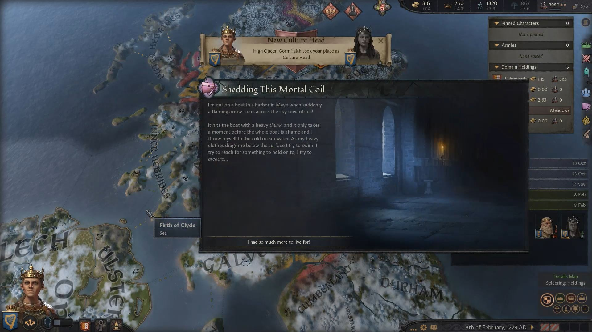
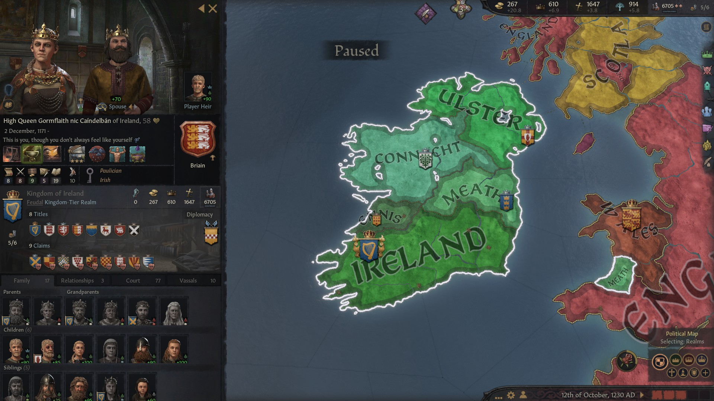
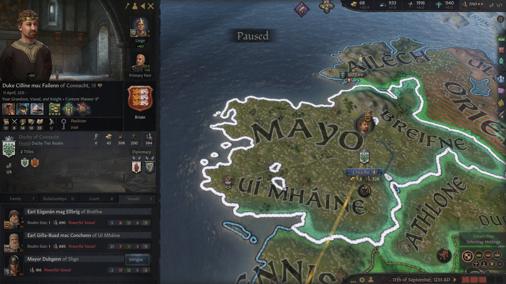

### High Queen Gormflaith nic Caindelban of Ireland, 1249

**[Slaine nic Caindelban](../p/slaine_nic_caindelban_1212.md)**'s reign was tormented and short. The problems that she had the face were many and seemed unmanageable. She could not fill the council with people she trusted and vassals were about to start a revolt, that it would be difficult to put down. Courtiers didn't like that as well and this may have turned out to be her demise.

On the 8th of February 1229, she was victim of an assassination - her ship was sunk while in a harbor in Mayo. The responsibles of this attack were never found. 

Immediately, her sister **[Gormflaith nic Caindelban](../p/gormflaith_nic_caindelban_1171.md)** took over. She had not been taken into great consideration by her father **[Caindalban II mac Caindelban](../p/caindalban_ii_mac_caindalban.md)**, but she was actually the most talented among his children, and mature enough to face the music. Well supplemented by her second husband **[Mathieu of Mousson](../p/mathieu_de_mousson_1187.md)** and her council, her reign would turn out to be effective. Most of her living children were from her first husband **[Starkad Ulfsson Slatte](https://drive.google.com/file/d/1DsbVa-JVK9LYJqgrEicDKsQeDu8MQPzQ/view?usp=sharing)**.

For the death of her sister she blamed her double cousin **[Duke Cu-Bretan mac Dinertach of Connacht](https://drive.google.com/file/d/16dYCy79O53YhATRlpSwiJ46SWGg_rcR1/view?usp=sharing),** who had exactly the same set of grandparents as she**.** Whether she was right or wrong, that was a threat that had to be dealt with, as in Connacht they were trying to revert part of the realm to the Catholic faith. After a short war, Cu-Bretan was imprisoned and executed in 1232, giving the queen Gormflaith the trait kinslayer, which ironically is a sin for the Paulician faith. She put her grandson **[Duke Cilline mac Failenn of Connacht](https://drive.google.com/file/d/1g5tDw_xM4b0xl65cfhkVyf94aeFAc2NO/view?usp=sharing)** at the place of her executed cousin.

Queen Gobflaith wanted to concentrate on stabilizing the realm. She also managed to marry some of his children off for favourable alliances, such as the one with Duke Robert I of Lancaster**,** as her son [**Prince** ](https://drive.google.com/file/d/1jGaCtZ2hynlKxUSV4fwaz96R5to8Kos4/view?usp=sharing)**[Cuan mac Gormflaith](https://drive.google.com/file/d/1jGaCtZ2hynlKxUSV4fwaz96R5to8Kos4/view?usp=sharing)** had married [**Mahaut of Hwicce**,](https://drive.google.com/file/d/1o8tEfDe4Z_ZXgWfriwh7yzWoMeIxUIpI/view?usp=sharing) the duke's daughter. There were alliances also with the Duchy of Meath, as her brother **[Prince Loeguire mac Caindelban](https://drive.google.com/file/d/1Tyi_75sY1YGSpGD1YsbHH4UHeREen9fM/view?usp=sharing)** was married with Meath ruler [Duke Aengus II mac Finneacht](https://drive.google.com/file/d/1e9q6aAzQXoN7qmvKX9evkZBHlz7_lBXk/view?usp=sharing)'s sister **[Morien nic Finneacht LLewellyn](https://drive.google.com/file/d/1fnXu0l6N7OXeLDeMLXrsLvty6xbhFD3b/view?usp=sharing).** And of course, her grandson ruled **Connacht.**

In 1236, Gobflaith started a a holy war against England to reconquer **Deheubarth.** England had been weakened by several internecine wars and that is why she saw the opportunity. In this period there would be several parallel wars involving England and Ireland. Gobflaith would also support the Duke of Lancaster with his claim on the Duchy of Mercia, defend the Duke of Strathclyde against an alliance of Albany and England, and see Powys conquered by Herfordshire.

By 1245, a first round of wars was over. While the brother of Wales had lost Powys, Queen Gobflaith had managed to press her claim for Deheubarth.

In 1247, the small scottish enclave of Brycheniog was conquered as well. In 1249, in another swift holy war with England, Powys was conquered as well. So in 1249, the Kingdom of Wales and Ireland together held the territories that belonged to them.

In 1249, [High Queen Gormflaith nic Caindelban](https://drive.google.com/file/d/172I0JI7bIzSrP2d-pUrWyVCq7TOrnJz6/view?usp=sharing) held the titles of **Kingdom of Ireland, Petty Kingdom of Munster, Leinster** and **Powys,** and **Earldom of Thomond, Ormond, Desmond, Leinster, Ossory, Ferlix and Penllyn.**

Her vassals were:

- **[Duke Canannan mac Fiachnae of Ulster](https://drive.google.com/file/d/1PBZlinhuTIIuisZh22OnUrwDg3EXzRvW/view?usp=sharing),** whose grandfather late **[Duke Bhatair mac Ciar of Ulster](https://drive.google.com/file/d/1JOssOALdJIfD3mPeSR7UOeMhVcYiOOK3/view?usp=sharing)** was Gormflaith's second cousin.
- **[Duke Rian II mag Aengus of Maeth](https://drive.google.com/file/d/11fiACKciVJ824ZO12O1KgGmItI0Pl1pJ/view?usp=sharing),** from the house **LLewellyn,** whose father late **[Duke Aengus II mac Finneacht](https://drive.google.com/file/d/1e9q6aAzQXoN7qmvKX9evkZBHlz7_lBXk/view?usp=sharing)** was Gormflaith's second cousin 
- **[Duke Flaithgus mac Cuan of Deheubarth](https://drive.google.com/file/d/1XybeSFM9xtahYVPH2qQvn0844huGBJMM/view?usp=sharing),** Gormflaith's grandson
- **[Duke Cilline mac Failenn of Connacht](https://drive.google.com/file/d/1g5tDw_xM4b0xl65cfhkVyf94aeFAc2NO/view?usp=sharing)****,** Gormflaith's grandson
- **[Earl Faelchu mac Farannan of Ennis](https://drive.google.com/file/d/1Po69nnAOD1_DTDa5bT1NHSm45CU-8q4U/view?usp=sharing),** whose father late **[Earl Farannan mac Ciar](https://drive.google.com/file/d/1IURSTxAaf9BqWZlS_E0P1_qY-1Ml7rGZ/view?usp=sharing)** was Gormflaith's second cousin 

**[King Senchan mac Somhairle of Wales](https://drive.google.com/file/d/15My05tZc73OZLLKh9KFUnZSJh82XZLs3/view?usp=sharing)** was still in charge of a rump state of Wales, but luckily had changed wife. **[Queen Sorcha ferch Finneacht ](https://drive.google.com/file/d/1Ya5zAit9OGE6RLTIpd93zQakCx4Z1yv5/view?usp=sharing)**had died in 1235 as well as all the inbred children. The wife was now Queen Gyda Snorrisdatter and they had now healthy children. He was **King of Wales, Petty King of Gwynedd** and **Earl of Perfeddwlad.** His vassals were
- Gormflaith's late cousin **[Lady Aine ferch Sithmaith](https://drive.google.com/file/d/1VZfz32SithW8yaBqGGOFo5BLrJVjyBlt/view?usp=sharing)'s** son **[Lord Talorc ab Aine of Ynys Mon](https://drive.google.com/file/d/1rWbokSmwEQuLaouEFVbPWa9SpNu90VI6/view?usp=sharing)** from the house Ruairc**, Lord of Eryri** (inherited from the nephew **Sion ab Augustin** died in misterious circumstances) and **Ynys Mon**
- Gormflaith's late cousin **[Lathir nic Faealan](https://drive.google.com/file/d/1GaMrW-GKOsKKgyEL5X9HEHMS2e3S2_I-/view?usp=sharing)'s** greatson **[Lord Cuhelyn ap Gwerfyl of Meryonnydd](https://drive.google.com/file/d/1J_E3Qq0CtVtDbzPq0yfrHZFg86q8W7Dj/view?usp=sharing)**

[Duke Canannan mac Fiachnae of Ulster](https://drive.google.com/file/d/1PBZlinhuTIIuisZh22OnUrwDg3EXzRvW/view?usp=sharing) was holding the titles of **King of Ulster**, **Earl of Ulster** and **Ailech** (revoked from **[Prince Abel mac Gormflaith of Ireland](https://drive.google.com/file/d/1HuynI7sPLFhrs8ZeZbsKIiBPj7cplQgv/view?usp=sharing)** in 1244). 

His vassal was **[King Aed mac Muirenn of Scotland](https://drive.google.com/file/d/15ocOLNT53j3mLXVlVf9diYDdLTe4bRWf/view?usp=sharing)**, **Earl of Oriel,** whose wife was **Queen Mariota II of Scotland** and was holding the titles of **Kingdom of Scotland, Petty Kingdom of Moray, Earldom of Morray** and **Earldom of Caithness.** His father was late **[Duke Bhatair mac Ciar of Ulster](https://drive.google.com/file/d/1JOssOALdJIfD3mPeSR7UOeMhVcYiOOK3/view?usp=sharing),** Gormflaith's second cousin, who had been second in the line of heritage of Ulster after his nephew Canannan had got the lion's share.

[Duke Rian II mag Aengus of Maeth](https://drive.google.com/file/d/11fiACKciVJ824ZO12O1KgGmItI0Pl1pJ/view?usp=sharing) held the titles of **Duke of Meath** and **Earl of Ceredigion and Dubhlinn.** His only vassal was **[Countess Gelgeis nic Gnathnad of Athlone](https://drive.google.com/file/d/136RhCgdi5VC4iOUdL079GIUgP8yV_QhQ/view?usp=sharing),** born from the marriage between **[Earl Abban mag Eochad of Athlone](https://drive.google.com/file/d/1pTKoA4mNhZm7Oze4MzV688hotECAkx4r/view?usp=sharing)** and **[Countess Gnathnad nic Garb of Athlone](https://drive.google.com/file/d/1Iiq8WQdQX8CopJOxd1GK9Rh7AkOX4thq/view?usp=sharing),** a very [inbred marriage](https://drive.google.com/file/d/1Z-jA0pGaKnSorsTJ71tgqQCbmS4y_xhz/view?usp=sharing) with 20 common ancestors, who had already produced a very inbred brother. Gelgeis's grandfather **[Eochad mag Abban Briain](https://drive.google.com/file/d/1FEShTuR67K1dMky61gZfbfG1_suG-7Ez/view?usp=sharing)**' was Gormflaith's second cousin.

Duke Flaithgus mac Cuan of Deheubarth held the titles of **Duchy of Deheubarth, Lordship of Morgannwg, Sir Gaerfyrddin** and **Dyfed.** His notable vassals were 

- **[Lord Lugaid mac Cacht of Gwent](https://drive.google.com/file/d/1rCPfBFcF-bWmLuYzzIlSwupRfO7L0h6g/view?usp=sharing),** Gormflaith's niece [**Cacht nic Morien Briain**](https://drive.google.com/file/d/11cKgrocuVhdtmQebpxwOg5HFeb6avLVA/view?usp=sharing)'s son
- **[Lord Aindle mac Cuan of Brycheniog](https://drive.google.com/file/d/1ZL4eoseuVqbbHfo9-9W7UoHR8axBzy1d/view?usp=sharing),** Gormflaith's grandson

Duke Cilline mac Failenn of Connacht had the titles of **Duke of Connacht** and **Earl of Mayo.** His notable vassals were:

-  **[Earl Eonagan mag Elbrig of Breifne](https://drive.google.com/file/d/1E-W1hJhI_BnEa2xh40uUQAfxpDDVBzY0/view?usp=sharing)** from the house **gCais-Inis,** son of Gormflaith's second cousins' late **[Ellbrib nic Aileann Briain](https://drive.google.com/file/d/1Z7HcJg5O9_npQcoZcs1Krpu6HA7K4Wx8/view?usp=sharing)** and late **[Earl Ailpin mac Mael-Muire](https://drive.google.com/file/d/1gBZ3IudhuzW7pUluXllOsZZxbtFFXOej/view?usp=sharing),** whose both grandfathers were cousins of Gormflaith's great-grandfather **Faelan****.** 
- **[Countess Gormlaith nic Dunlaith of Ui Mhaine](https://drive.google.com/file/d/19rY1aoNXglCF6li2asNSuElQL7JBasDo/view?usp=sharing),** whose grandparents [**Eochad mag Abban Briain**,](https://drive.google.com/file/d/1FEShTuR67K1dMky61gZfbfG1_suG-7Ez/view?usp=sharing) [**Earl Adomnan mac Maire**](https://drive.google.com/file/d/1mleQ0G7lTwzQ68IrBZc6ObucYDfS0Sax/view?usp=sharing) and [**Conchenn nic Gilla Ruad gCais-Cruachu**](https://drive.google.com/file/d/1DxfyUsdvH8ka7hHn-tjUd5ynYBS8GMKo/view?usp=sharing) were Gormflaith's second cousins.

Gormflaith had lost her three younger children to various circumstances. Of the three that were left, **Labraid, Abel** and **Failenn**, she favoured Abel, who had somewhat better skills (14 3 3 5 26) than his drunkard brother Labraid (7 7 6 8 9).

Here are some dinasty trees:

