During the last years of her reign, **[Gormflaith nic Caindelban](../p/gormflaith_nic_caindelban_1171.md)** tried to find a way to avoid splitting the realm on her death. As things were standing, with maxim crown authority, she could pick an heir, but she could not avoid a split. [Abel mac Gormflaith](../p/abel_mac_gormflaith_1190.md) would get Ireland, Munster and the Counties in Wales, but his brother **[Labraid mac Gormflaith](../p/labraid_mac_gormflaith_1188.md)** would still get Leinster

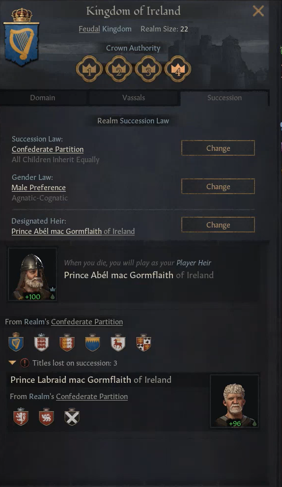

Gormflaith ended up disinheriting Labraid, and giving him as consolation the **Earldom of Ferlix**. He granted her grandson [Duke Flaithgus mac Cuan of Deheubarth](../p/flaithgus_mac_cuan_1236.md) independence, but this wasn't enough to remove him from the inheritance line. In hindsight, she might have changed the succession law of the **Duchy of Leinster** into feudal succession, and that would have achieved the result she was hoping for. 

Gormflaith ended up passing the house seniority succession law, and by sheer luck her son Abel was first in the line of succession. That happened in the nick of time, as Gormflaith passed away in 1253, at the age of 81. Her son Abel succeeded her, already being 62 years old.  

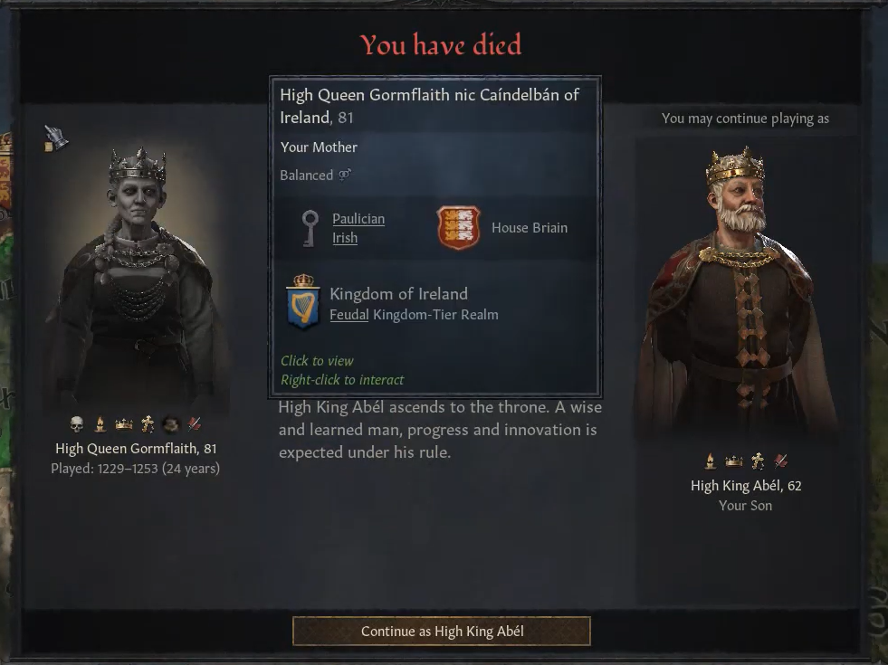

During the first months [Abel](..p/abel_mac_gormflaith_1190.md) had to deal with internal issues, such as unhappy vassals. He helped his ally [Petty King Flaithgus mac Cuan of Dehuerbarth](../p/flaithgus_mac_cuan_1236.md)  defend against an attack from Gloucestershire for the **Lordship of Morgannwg**.

Abel is considered one of our greatest kings and mainly for two reasons. First, because of his war against England. The Kingdom of England had been severely weakened by continuous internal infighting, so that by 1258 they could field just 5000 men. Abel seized the opportunity and declared an holy war for the Kingdom. This was the war of his life and he called all possible house and dynasty members to war.

With such a formidable coalition, the war was over by 1260 - England was conquered and became part of Ireland. The next issue would be to assign the newly conquered territories to loyal and solid vassals - which was easier said than done. Moreover, an outrageous peasant revolt broke in England - King Abel, however, managed to put it down by 1261

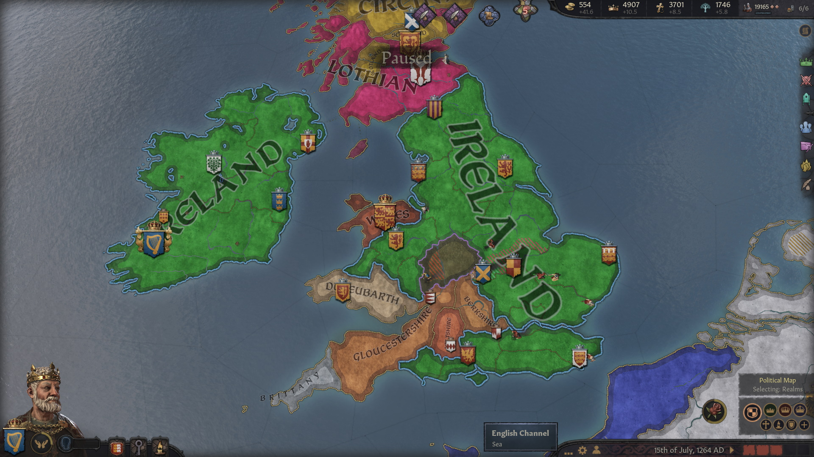

In 1241, Abel was holding the titles of **King of Ireland, Petty KIng of Munster, Leinster, Earl of Thomond, Ormond, Desmond., Leinnster, Ossory and Middlesex**,  and had following vassals... 

- Abel's nephew **[Duke Cilinne mac Failenn of Connacht](../p/cilline_mac_failenn_1215.md).**
- Abel's cousin [Duke Lorcan mac Morien of Wessex](../p/lorcan_mac_morien_1204.md) and player heir, according to house seniority succession law
- Abel's third cousin [**Duke Rian II mag Aengus of Meath**](../p/rian_ii_mag_aengus_1208.md)
- Abel's second cousin [Aed mac Muirenn](../p/aed_mac_muirenn_1209.md)'s son [Duke Cainchomrac mac Tailefhlaith of Kent](../p/cainchomrac_tailefhlaith_1231.md)
- Abel's third cousin [**Earl Faelchu mac Farannan of Ennis**](../p/faelchu_mac_farannan_1212.md)
- Abel's third cousin **[Duke Bhatair mac Sioban of York](../p/bhatair_mac_sioban_1236.md)**
- Abel's cousin [Mauda nic Morien](../p/mauda_nic_morien_1199.md)'s son [Duke Eochucan mac Mauda of Lancaster](../p/eochucan_mac_mauda_1234.md)
- Abel's second cousin [Harold Mael-Ciarainson](../p/harald_mael-ciarainson_1176.md)'s grand-son [**Duke Thurcytel Saeberston of Mercia**](../p/thurcytel_saebertson_1228.md)
- Abel's nephew [Duke Liam II of Northumbria](../p/liam_ii_1214.md)'s son **[Duke Ewan of East Anglia](../p/ewan_1232.md)**
- Abel's nephew [Duke Liam II of Northumbria](../p/liam_ii_1214.md)
- Abel's third cousin [Duke Niallan mac Farannan of Powys](../p/niallan_mac_farannan_1217.md)
- Abel's nephew  [Duke Buaidbeo mac Cuan of Essex](../p/buaidbeo_mac_cuan_1247.md)
- Abel's second cousin [Laidine mac Narbflaith](../p/laidine_mac_narbflaith_1200.md)'s son [Duke Natfraich mag Aine of Ulster](../p/natfraich_mag_aine_1224.md)

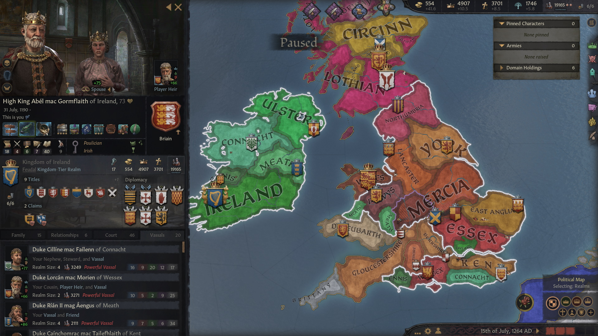

Abel's nephew [Petty King Flaithgus mac Cuan of Dehuerbarth](../p/flaithgus_mac_cuan_1236.md) ruled was **King of Dehuerbarth, Earl of Morgannwg, Sir Gaerfyrddin, Dyfed** and had following vassals:

- Abel's cousin [Cacht nic Morien](../p/cacht_nic_morien_1201.md)'s daughter [Lady Cairech nic Lugaid](../p/cairech_nic_lugaid_1250.md) of **Gwent**
- Abel's nephew [Lord Aindle mac Cuan of **Brycheniog**](../p/aindle_mac_cuan_1242.md)

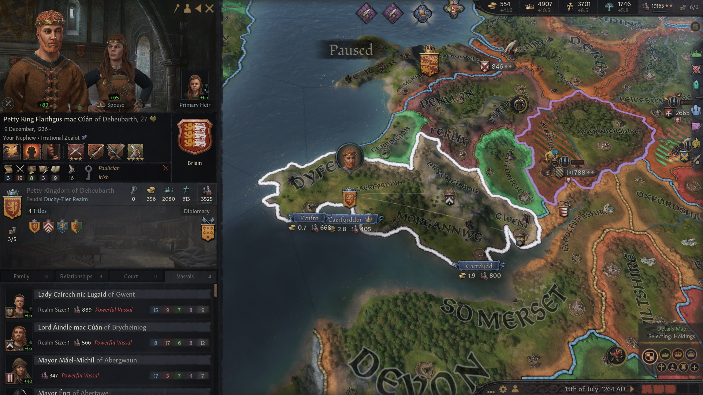

Abel's third cousin [Senchan mac Somhairle](../p/senchan_mac_somhairle_1188.md)'s son [King Taithlech mac Senchan of Wales](../p/taithlech_mac_senchan_1243.md) was **King of Wales, Gwynedd and Earl of Perfeddwlad** and had following vassals:

- Abel's second cousin **[Lord Talorc ab Aine of Ynys Mon](../p/talorc_ab_aine_1200.md)** was **Lord of Ynys Mon and Eryri**
- Abel's second cousin **[Lady Gwerfyl ferch Meilys](../p/gwerfyl_ferch_meilys_1180.md)**  's son **Lord Lles ap Madrun of Merrionnydd**

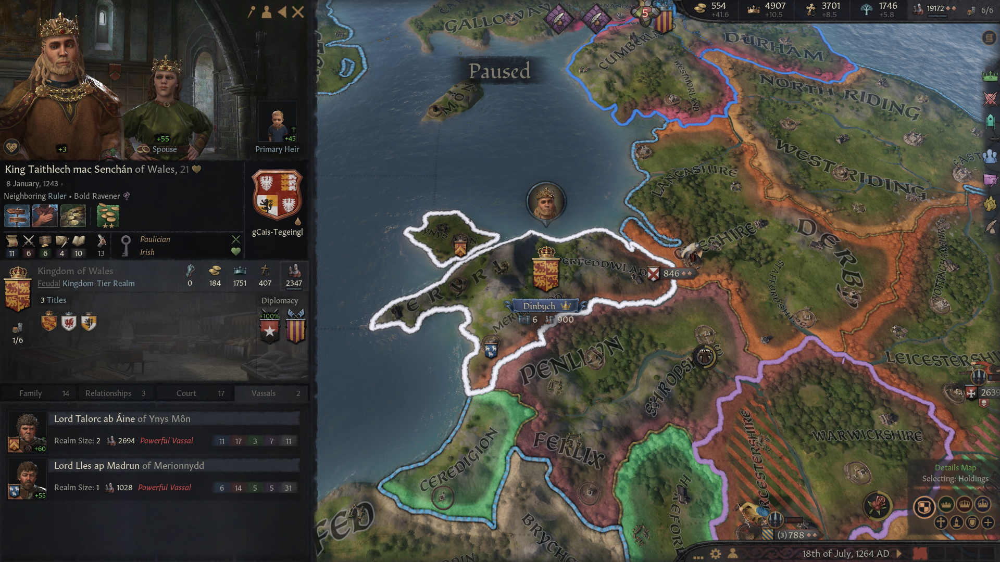

[Duke Cilinne mac Failenn of Connacht](../p/cilline_mac_failenn_1215.md) was **Duke of Connacht and Earl of May, Sussex **. His vassals were 

- **[Countess Gormlaith nic Dunlaith](../p/gormlaith_nic_dunlaith_1214.md) ** of Ui Mhaine, whose both parents were Abel's third cousins
- Abel's third cousin **[Earl Ailpin mac Sinech of Breifne](../p/ailpin_mac_sinech_1257.md)**

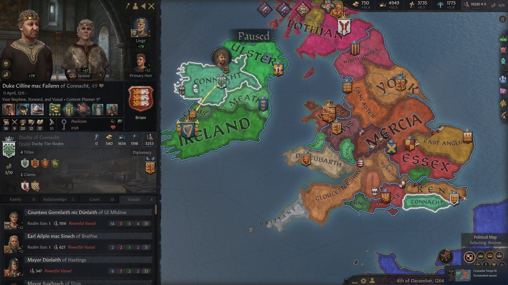

 **[Duke Lorcan mac Morien of Wessex](../p/lorcan_mac_morien_1204.md)** was **Duke of Wessex and Earl of Wight and Hampshire**

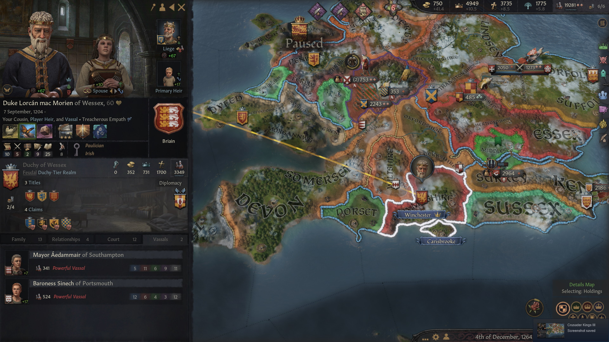

[**Duke Rian II mag Aengus of Meath**](../p/rian_ii_mag_aengus_1208.md) was **Duke of Meath, Earl of Ceredigion, Dubhlinn and Herefordshire**. His vassal was [Countess Gelgeis nic Gnathnad of Athlone](../p/gelgeis_nic_gnathnad_1217.md), whose parents  **[Earl Abban mag Eochad of Athlone](../p/abban_mag_eochad_1181.md)** and **[Countess Gnathnad nic Garb of Athlone](../p/gnathnad_nic_garb_1191.md),** were Abel's third cousins

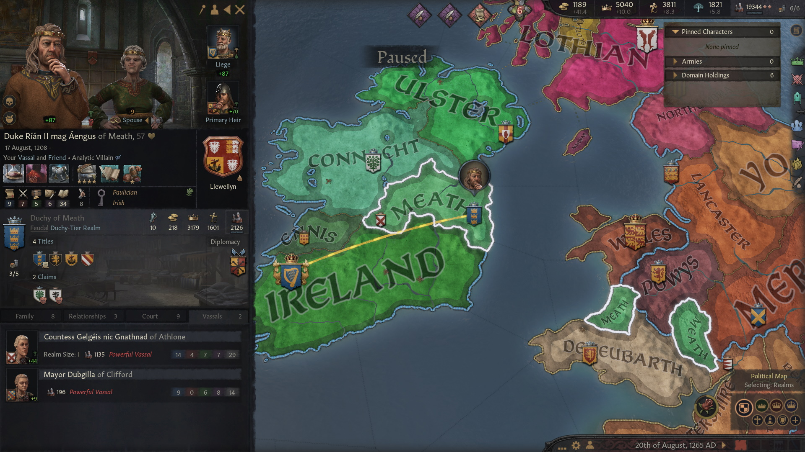

[Duke Cainchomrac mac Tailefhlaith](../p/cainchomrac_tailefhlaith_1231.md)  was **Duke of Kent and Earl of Surrey and Kent**

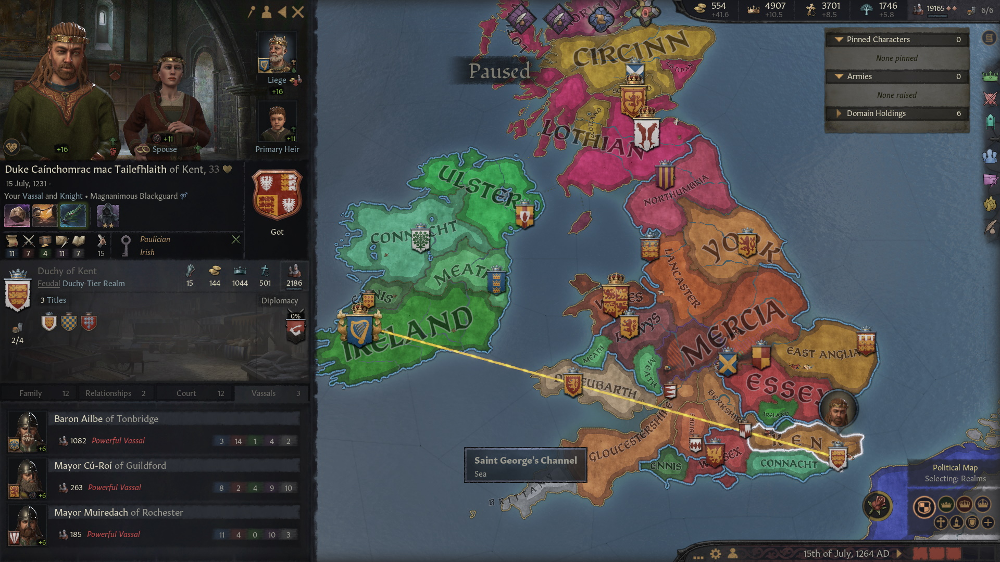

 [Earl Faelchu mac Farannan of Ennis](../p/faelchu_mac_farannan_1212.md) was **Earl of Ennis and Dorset** and had no vassals

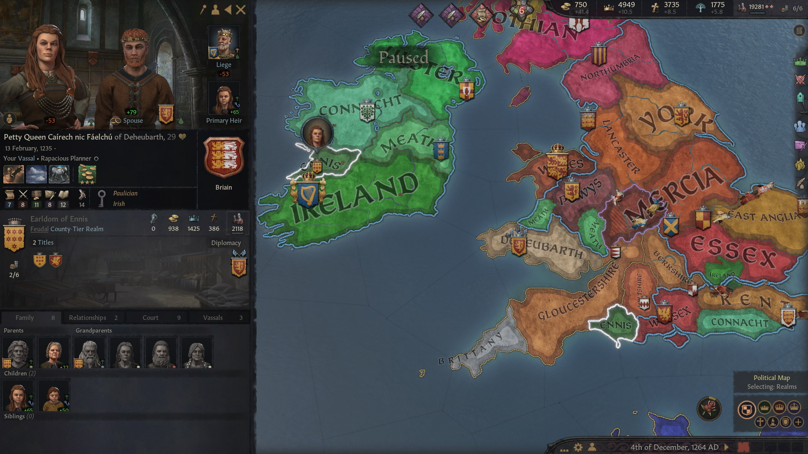

 [Duke Bhatair mac Sioban of York](../p/bhatair_mac_sioban_1236.md) was **Duke of York and Earl of the North Riding and of the West Riding**. As a vassal he had **Earl Brian of the East Riding**, a lowborn who had just founded a house, FitzPatrick 

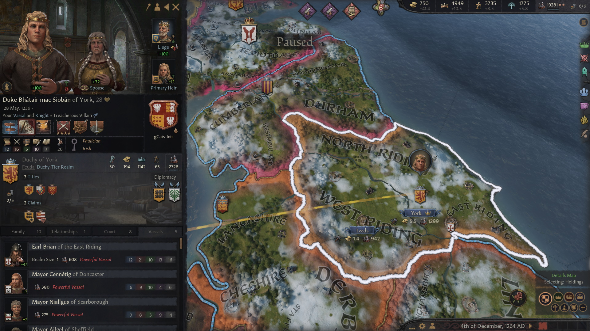

[Duke Eochucan mac Mauda of Lancaster](../p/eochucan_mac_mauda_1234.md) was **Duke of Lancaster**, and **Earl of Lancashire** and **Cheshire**. His vassal was [Earl Cuan mac Cuan of Derby](../p/cuan_mac_cuan_1245.md), Abel's nephew.

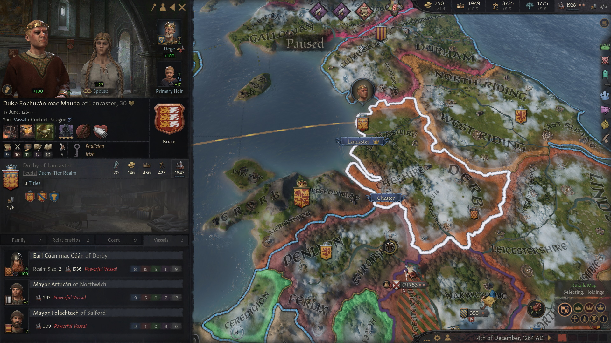

 [Duke Thurcytel Saeberston of Mercia](../p/thurcytel_saebertson_1228.md) was **Duke of Mercia**, **Earl of Northamptonshire and Lindsey**. His main vassals were

- [Earl Fuacarta mac Ben-Muman of Leicestershire](../p/fuacarta_mac_ben-muman_1212.md) and **Nottinghamshire** whose father was Abel's second cousin
- [Earl Ernan Seonaidson of Warwickshire](../p/ernad_seonaidson_1245.md) , Abel's brother [Labraid mac Gormflaith](../p/labraid_mac_gormflaith_1188.md)'s greatson

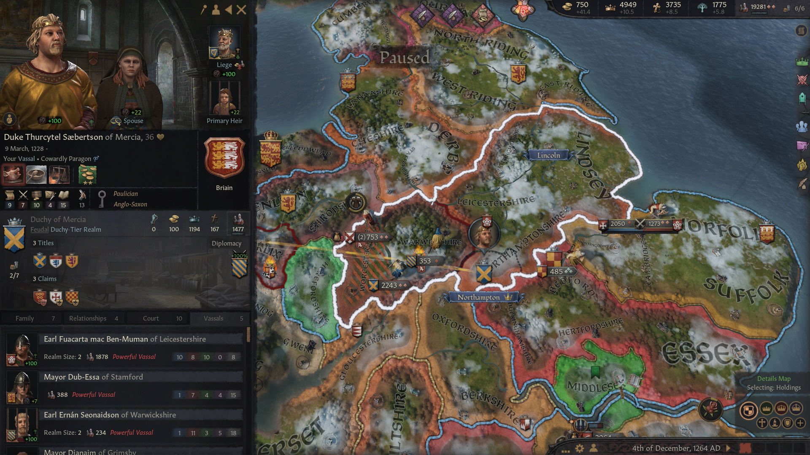

 **[Duke Ewan of East Anglia](../p/ewan_1232.md)** had the titles of **Duchy of East Anglia, Earldom of Norfolk and Suffolk**. His main vassal was **[Earl Farannan mac Slaine of Cambridgeshire](..p/farannan_mac_slaine_1239.md)**, whose father [Duke Niallan Mac Farannan of Powys](../p/niallan_mac_farannan_1217.md) was Abel's third cousin.

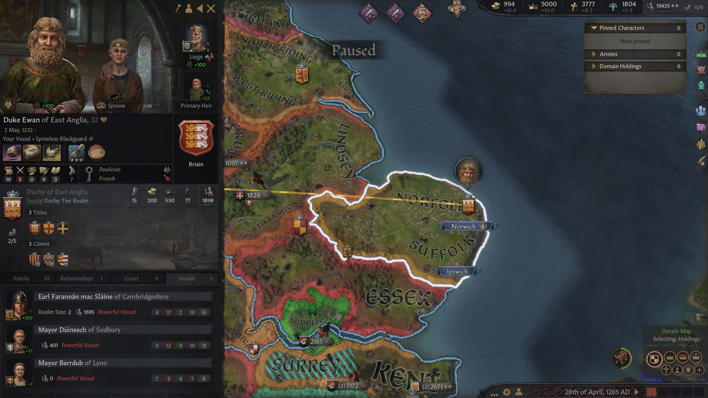

[Duke Liam II of Northumbria](../p/liam_ii_1214.md) had the titles of **Duchy of Northumbria**, **Earldom of Cumberland** and **Earldom of Westmorland**. His main vassal was [Earl Lethlobur mag Euginia of Northumberland](../p/lethlobur_mag_euginia_1241.md), Abel's brother [Labraid](../p/labraid_mac_gormflaith_1188.md)'s grandson

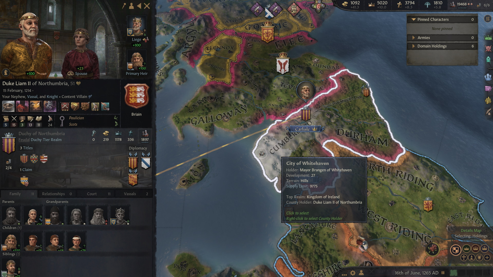

[Duke Niallan mac Farannan of Powys](../p/niallan_mac_farannan_1217.md) was **Duke of Powys**, **Lord of Penllyn** and **Shropshire**, and as a vassal he had Abel's nephew **[Cnes nic Labraid](p/cnes_nic_labraid_1207.md)**, **Lady of Ferlix**

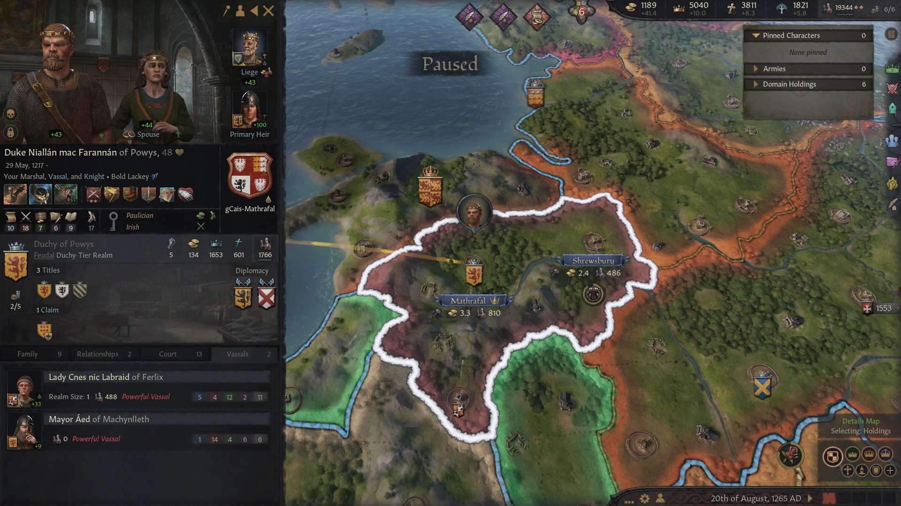

 [Duke Buaidbeo mac Cuan of Essex](../p/buaidbeo_mac_cuan_1247.md) was **Duke of Essex** and **Earl of Bedford** and had three main vassals:

- [Earl Bruatur mac Rian of Essex](../p/bruatur_mac_rian_1241.md) , who was Abel's third cousin [Duke Rian II mag Aengus of Meath](../p/rian_ii_mag_aengus_1208.md)'s son 
- [Earl Faelcar mag Ualtar of Buckinghamshire](../p/faelcar_mag_ualtar_1225.md), whose father Ualtar gCais-Gaillimhe was Abel's third cousin
- [Earl Dimmasach mag Aine of Hertfordshire](), Abel's second cousin [Laidine mac Narbflaith](../p/laidine_mac_narbflaith_1200.md)'s son

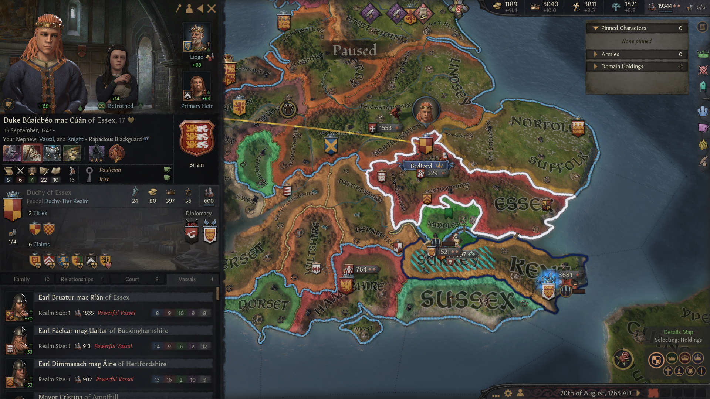

 [Duke Natfraich mag Aine of Ulster](../p/natfraich_mag_aine_1224.md) was **Duke and Earl of Ulster**. His vassals were 

- [King Aed mac Muirenn of Scotland](p/aed_mac_muirenn_1209.md), **Earl of Oriel**, Abel's second cousin [Laidine mac Narbflaith](../p/laidine_mac_narbflaith_1200.md)'s son
- [Earl Natfraich mac Morien of Ailech](../p/natfraich_mac_morien_1218.md), Abel's nephew

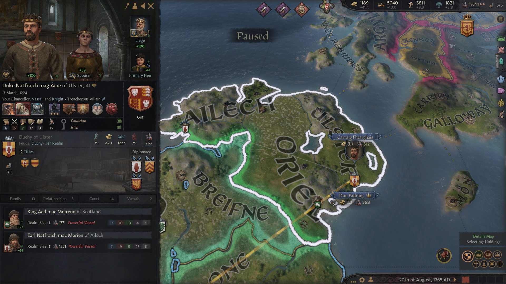