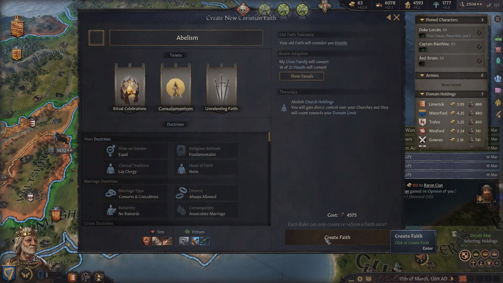
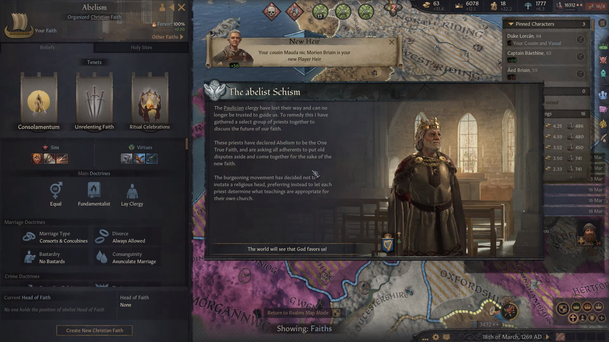
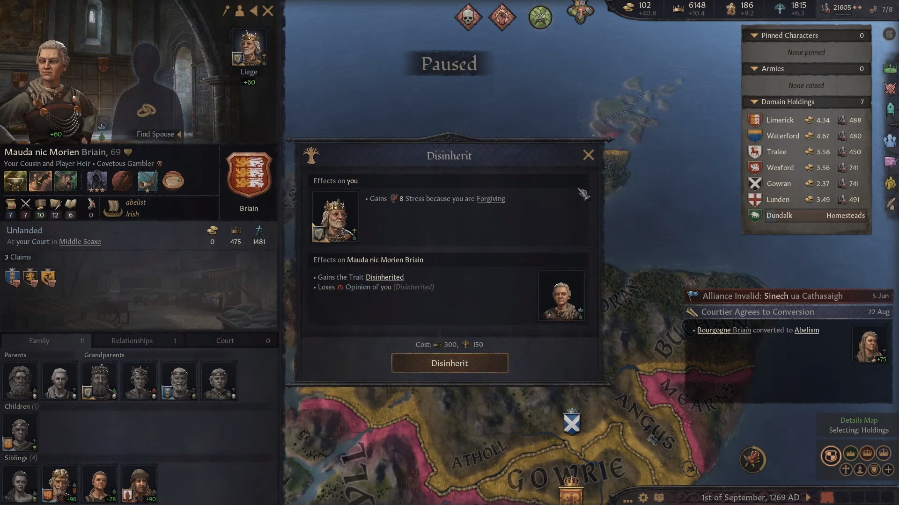
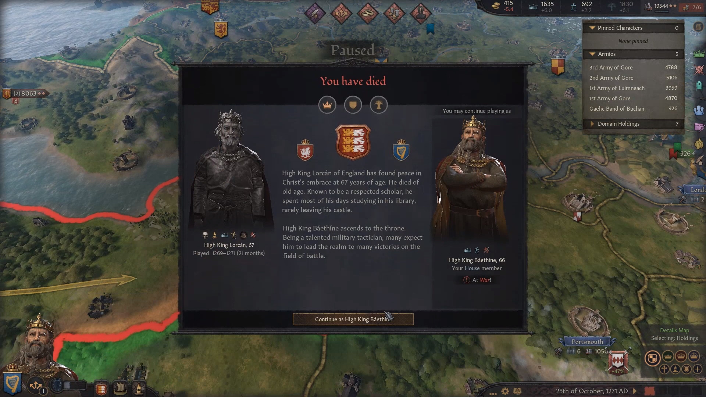
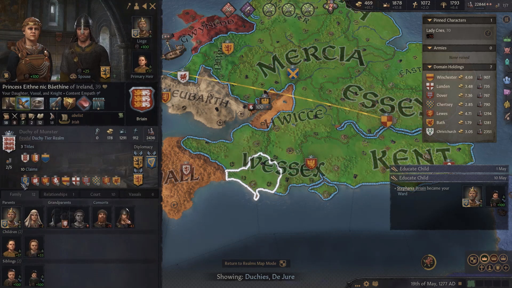
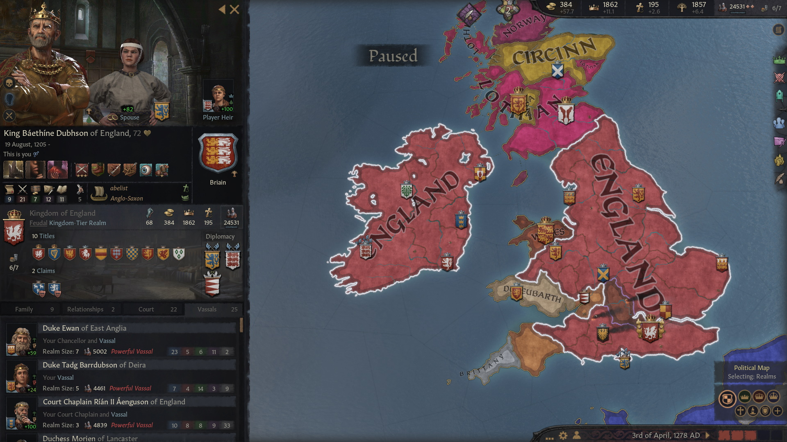
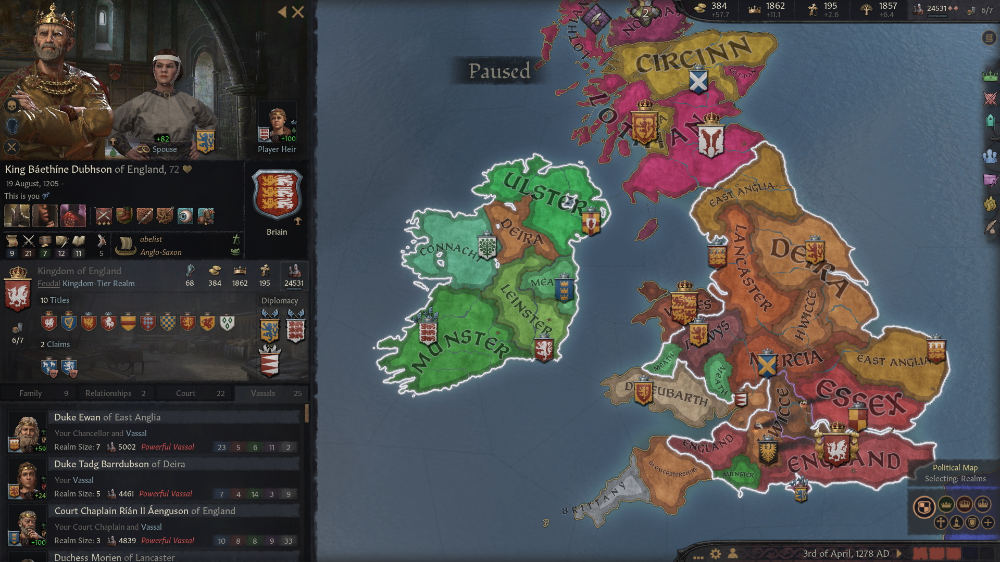

Administering such a big kingdom was a challenge for [**Abel**](../p/abel_mac_gormflaith_1190.md) . It was difficult to track was going on - deal with factions, claimants, unhappy vassals, peasant rebels, at the same time trying to prevent that a vassal would become too strong. However, no major threat appeared and the situation was easily under control. In 1267, Abel decided to adopt the Anglo-Saxon culture, along with most of his vassals.

The next priority was to unify England. Oxford and Berkshire were annexed after a short war in 1267, which wasn't trivial to win because of their powerful allies.

[Abel](../p/abel_mac_gormflaith_1190.md)'s most important legacy, though, is the religion that he founded, Abelism. Just as Paulicianism was spreading in the realm, Abel found it inadequate - he wanted a more equal, liberal and lay religion. So short before death, he spent all his piety to found a new religion, adding to it as many reforms as possible. Then the schism became official.  The next priority would be to convert everybody in the realm to Abelism

Now as a side effect, women would be in line for becoming player heirs. Abel wanted to keep the seniority succession law, as his daughters [**Gormflaith**](../p/gormflaith_abeldohtor_1211.md), [**Caintigern**](../p/caintigern_abeldohtor_1215.md) and [**Cathan**](../p/cathan_abeldohtor_1218.md) skills were underwhelming. 

He also did not trust her cousin [**Mauda nic Morien**](../p/mauda_nic_morien_1199.md) to be the new queen and disinherited her as well, ensuring the succession of his cousin [**Lorcan**](../p/lorcan_morienson_1204.md). 

In 1269, Abel died and Lorcan took his place and became King of England, and became known as [**Lorcan Morienson**](../p/lorcan_morienson_1204.md).

The change of title had the effect that there was also a transfer of court - the courtiers Abel and his predecessors had gathered were no longer accessible for Lorcan. Therefore, Lorcan hoped that he could move back to a system in which his reasonably talented children [**Morien**](../p/morien_nic_lorcan_1221.md), [Rois](../p/rois_nic_lorcan_1225.md) and [Rodan mac Narbflaith](../p/rodan_mac_narbflaith_1263.md) would inherit his titles, but he had not enough prestige and vassal relations to accomplish a change of the succession law.

In 1271 Lorcan started a war against Wiltshire, but he did not live to see the end of it. He died in the same year, after reigning for only 2 years. Modern historians consider his short administration positive, as he managed to keep the country together even after such dramatic changes. However, most people with a passing knowledge of history may not even remember his name. 

He was succeeded by King [**Baethine Dubhson**](../p/baethine_dubhson_1205.md), whose name, to be fair, is hardly more known by contemporaries. The changes he introduced were very important, though.    

[**Beathine**](../p/baethine_dubhson_1205.md) was the great-grandson of [**Aengus I mac Cobflaith**](../p/aengus_i_mac_cobflaith_1123.md), the son of Abel's third cousin [**Dubh mac Somhairle**](../p/dubh_mac_somhairle_1183.md), the great-great-great-grandson of [**High King Faelan**](p/faelan_mac_brian_1084.md) through his first daughter [**Cobflaith nic Faelan**](p/cobflaith_nic_faelan_1101.md). He still belonged to the house **Briain**

Beathine continued the unification of England, pushing into **Gloucester** and **Cornwall**. He reorganized the administration of the Duchies, not being afraid of revoking titles if necessary. He pushed forward the conversion of the realm to Abelism.
Beathine's main title, unlike Lorcan, was still King of Ireland. And unlike Lorcan, he did manage to set up a High Partition succession laws, as he thought his children [Eithne](../p/eithne_nic_baethine_1238.md), [Maccus](../p/maccus_baethineson_1273.md) and [Stephanie](../p/stephanie_baethinedohtor_1276.md) deserved the chance. His dread help sway the undecided vassals.

To simplify succession matters, Beathine switched his main title to King of England, becoming therefore [**Beathine Dubhson**](p/baethine_dubhson_1205.md). This was the extension of his realm in 1278. 

He had the titles of **King of England** and **Ireland**, **Petty King of Wessex** and **Kent**, **Earl of Hampshire, Kent, Surrey, South Seaxe, Somerset** and **Bishop of ChristChurch** (as now laymen could administer church holdings).

His vassals were

- [**Duke Ewan of East Anglia**](../p/ewan_1232.md) of the house **Adelsward**, great-grandson of [Queen Gormflaith](p/gormflaith_nic_caindelban_1171.md)
- [**Duke Tadg Barrdubson of Deira**](p/tadg_barrdubson_1257.md) of the house **Got**, great-great-great-grandson of [King Caindelban I](p/caindelban_i_mac_faelan_1114.md)
- [**Duke Rian II of Meath**](p/rian_ii_mag_aengus_1208.md) Aenguson of the house **LLewellyn**, Beathine's second cousin, who was also Court Chaplain
- [**Duchess Morien of Lancaster**](p/morien_1226.md) (1226-) of the house **gCais-Macclesfield**, great-granddaughter of [King Caindelban II](p/caindelban_ii_mac_caindelban_1147.md)
- [**Duchess Morien of Lancaster**](p/morien_1226.md) (1226-) of the house **gCais-Macclesfield**, great-granddaughter of [King Caindelban II](p/caindelban_ii_mac_caindelban_1147.md)
- [**Duke Cilline**](p/cilline_mac_failenn_1215.md) **Failennson** of **Connacht**, of the house **gCais-Sligo** grandson of [Queen Gormflaith](p/gormflaith_nic_caindelban_1171.md)
- [**Duke Niallan Mac Farannan of Powys**](p/niallan_mac_farannan_1217.md), of the house **gCais-Mathrafal**, great-great-grandson of [**HIgh King Faelan**](p/faelan_mac_brian_1084.md) 
- [**Duke Buaidbeo mac Cuan of Essex**](p/buaidbeo_mac_cuan_1247.md), of the house **Briain**, grandson of [Queen Gormflaith](p/gormflaith_nic_caindelban_1171.md)

