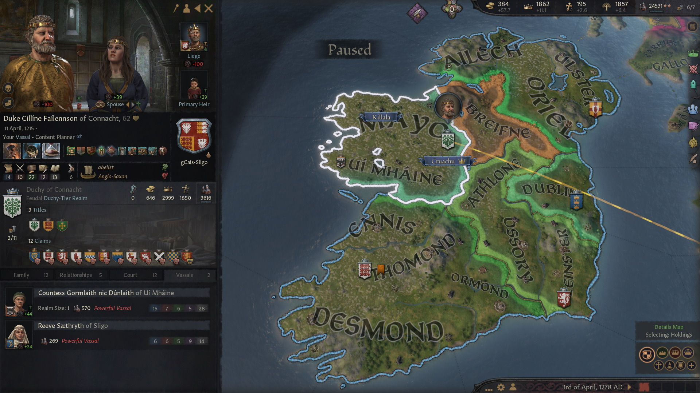

Administering such a big kingdom was a challenge for [**Abel**](../p/abel_mac_gormflaith_1190.md) . It was difficult to track was going on - deal with factions, claimants, unhappy vassals, peasant rebels, at the same time trying to prevent that a vassal would become too strong. However, no major threat appeared and the situation was easily under control. In 1267, Abel decided to adopt the Anglo-Saxon culture, along with most of his vassals.

The next priority was to unify England. Oxford and Berkshire were annexed after a short war in 1267, which wasn't trivial to win because of their powerful allies.

[Abel](../p/abel_mac_gormflaith_1190.md)'s most important legacy, though, is the religion that he founded, Abelism. Just as Paulicianism was spreading in the realm, Abel found it inadequate - he wanted a more equal, liberal and lay religion. So short before death, he spent all his piety to found a new religion, adding to it as many reforms as possible. Then the schism became official.  The next priority would be to convert everybody in the realm to Abelism

Now as a side effect, women would be in line for becoming player heirs. Abel wanted to keep the seniority succession law, as his daughters [**Gormflaith**](../p/gormflaith_abeldohtor_1211.md), [**Caintigern**](../p/caintigern_abeldohtor_1215.md) and [**Cathan**](../p/cathan_abeldohtor_1218.md) skills were underwhelming. 

He also did not trust her cousin [**Mauda nic Morien**](../p/mauda_nic_morien_1199.md) to be the new queen and disinherited her as well, ensuring the succession of his cousin [**Lorcan**](../p/lorcan_morienson_1204.md). 

In 1269, Abel died and Lorcan took his place and became King of England, and became known as [**Lorcan Morienson**](../p/lorcan_morienson_1204.md).

The change of title had the effect that there was also a transfer of court - the courtiers Abel and his predecessors had gathered were no longer accessible for Lorcan. Therefore, Lorcan hoped that he could move back to a system in which his reasonably talented children [**Morien**](../p/morien_nic_lorcan_1221.md), [Rois](../p/rois_nic_lorcan_1225.md) and [Rodan mac Narbflaith](../p/rodan_mac_narbflaith_1263.md) would inherit his titles, but he had not enough prestige and vassal relations to accomplish a change of the succession law.

In 1271 Lorcan started a war against Wiltshire, but he did not live to see the end of it. He died in the same year, after reigning for only 2 years. Modern historians consider his short administration positive, as he managed to keep the country together even after such dramatic changes. However, most people with a passing knowledge of history may not even remember his name. 

He was succeeded by King [**Baethine Dubhson**](../p/baethine_dubhson_1205.md), whose name, to be fair, is hardly more known by contemporaries. The changes he introduced were very important, though.    

[**Baethine**](../p/baethine_dubhson_1205.md) was the great-grandson of [**Aengus I mac Cobflaith**](../p/aengus_i_mac_cobflaith_1123.md), the son of Abel's third cousin [**Dubh mac Somhairle**](../p/dubh_mac_somhairle_1183.md), the great-great-great-grandson of High King [**Faelan**](../p/faelan_mac_brian_1084.md) through his first daughter [**Cobflaith nic Faelan**](../p/cobflaith_nic_faelan_1101.md). He still belonged to the house **Briain**

Baethine continued the unification of England, pushing into **Gloucester** and **Cornwall**. He reorganized the administration of the Duchies, not being afraid of revoking titles if necessary. He pushed forward the conversion of the realm to Abelism.
Baethine's main title, unlike Lorcan, was still King of Ireland. And unlike Lorcan, he did manage to set up a High Partition succession laws, as he thought his children [Eithne](../p/eithne_nic_baethine_1238.md), [Maccus](../p/maccus_baethineson_1273.md) and [Stephanie](../p/stephanie_baethinedohtor_1276.md) deserved the chance. His dread help sway the undecided vassals.

To simplify succession matters, Baethine switched his main title to King of England, becoming therefore [**Baethine Dubhson**](../p/baethine_dubhson_1205.md). This was the extension of his realm in 1278. 

He had the titles of **King of England** and **Ireland**, **Petty King of Wessex** and **Kent**, **Earl of Hampshire, Kent, Surrey, South Seaxe, Somerset** and **Bishop of ChristChurch** (as now laymen could administer church holdings).

His vassals were

- [**Duke Ewan of East Anglia**](../p/ewan_1232.md) of the house **Adelsward**, great-grandson of Queen [Gormflaith](../p/gormflaith_nic_caindelban_1171.md)
- [**Duke Tadg Barrdubson of Deira**](../p/tadg_barrdubson_1257.md) of the house **Got**, great-great-great-grandson of King [Caindelban I](../p/caindelban_i_mac_faelan_1114.md)
- Duke [**Rian II**](../p/rian_ii_mag_aengus_1208.md) Aenguson of Meath of the house **LLewellyn**, Baethine's second cousin, who was also Court Chaplain
- [**Duchess Morien of Lancaster**](../p/morien_1226.md) of the house **gCais-Macclesfield**, great-granddaughter of King [Caindelban II](../p/caindelban_ii_mac_caindelban_1147.md)
- [**Duchess Morien of Lancaster**](../p/morien_1226.md) (1226-) of the house **gCais-Macclesfield**, great-granddaughter of King [Caindelban II](../p/caindelban_ii_mac_caindelban_1147.md)
- Duke [**Cilline**](../p/cilline_mac_failenn_1215.md) **Failennson** of **Connacht**, of the house **gCais-Sligo** grandson of Queen [Gormflaith](../p/gormflaith_nic_caindelban_1171.md)
- [**Duke Niallan Mac Farannan of Powys**](../p/niallan_mac_farannan_1217.md), of the house **gCais-Mathrafal**, great-great-grandson of High King [**Faelan**](../p/faelan_mac_brian_1084.md) 
- [**Duke Buaidbeo mac Cuan of Essex**](../p/buaidbeo_mac_cuan_1247.md), of the house **Briain**, grandson of Queen [Gormflaith](../p/gormflaith_nic_caindelban_1171.md)
- [**Duke Scellan of Hwicce**](../p/scellan_1255.md), house **Briain**, great-great-great-grandson of King [Caindelban I]
- **Duke [Thurcytel](../p/thurcytel_saebertson_1228.md) Saeberston of Mercia**, house **Briain**, great-great-great-grandson of King [Caindelban I]
- [**Duchess Muirenn Gelgeisdohtor of Leinster**](../p/muirenn_gelgeisdohtor_1245.md),  house **Briain**, twice great-great-great-granddaughter of High King [**Faelan**](../p/faelan_mac_brian_1084.md) 
- Princess [**Eithne nic Baethine**](../p/eithne_nic_baethine_1238.md) of England, **Duke of Munster**,  house **Briain**, 
- [**Duke Pierre mac Muirenn of Ulster**](../p/pierre_mac_muirenn_1256.md) from the house **gCais-Macclesfield**
- **Duke [William](../p/william_1247.md) of Guoladat**  from the house **Sigurdrd-York**
- **Queen Marthe of England**, from the house **Pins**, **Earl of Wight**  

[**Duke Ewan of East Anglia**](../p/ewan_1232.md) was **Duke of East Anglia, Northumbria**,  **Earl of Norfolk, Suffolk, Cumberland** and **Bishop of Beodericsworth**. His vassals were´:

- **Earl [Lethlobur](../p/lethlobur_mag_euginia_1241.md) Euginiasson of Northumberland**, great-grandson of Queen [Gormflaith](../p/gormflaith_nic_caindelban_1171.md), **Earl of Northumberland, Durham** and **Bishop of Hexham, Hartlepool and Lindisfarne**
- **Duke [Farannan](../p/farannan_1239.md) of Munster**, house **gCais-Mathrafal**, Duke by marriage with [Eithne nic Baethine](../p/eithne_nic_baethine_1238.md), but actually having the titles of **Earl of Cambridgeshire and Huntigdonshire**, and **Bishop of Ely**. He was **High King[/Faelan](../p/faelan_mac_caindelban_1137.md)** great-great-great-grandson. 

[**Duke Tadg Barrdubson of Deira**](../p/tadg_barrdubson_1257.md) had the titles of **Duke of Deira**, **Earl of North Riding, East Riding** and **Bishop of Whitby and Cottingham**. His vassals were

- **Earl [Aed Barrdubson](../p/aed_barrdubson_1261.md) of the West Riding** of the house **Got**. He was **High King [Caindelban I](../p/caindelban_i_mac_faelan_1114.md)** great-great-great-grandson.
- [**Earl Flanchad of Lincolnshire**](../p/flanchad_1231.md), of the house **Michael**, unrelated to the **Briain**
- [**Tailefhlaith Barrdubdohtor**](../p/tailefhlaith_barrdubdohtor_1252.md) of the house **Got**, also **High King [Caindelban I](../p/caindelban_i_mac_faelan_1114.md)** great-great-great-grandson.

**Duke [Rian II](../p/rian_ii_mag_aengus_1208.md) Aenguson of Meath**, also **Court Chaplain**, was **Duke of Meath** and **Earl of Ceredigion, Dublin, Herefordshire** and **Bishop of Kildare and Wigmore**, and had no notable vassals.

[**Duchess Morien of Lancaster**](../p/morien_1226.md) was **Duchess of Lancaster** and **Countess of Lancashire, Cheshire, Westmorland** and **Bishop of Macclesfield**. She had as vassal **Earl [Cuan] of Derby**(../p/cuan_mac_cuan_1245.md), house **Briain**, who was also **Earl of Staffordshire** and **Bishop of Castleton and Wolverhampton**, and grandson of Queen [Gormflaith](../p/gormflaith_nic_caindelban_1171.md).

 **Duke [Cilline](../p/cilline_mac_failenn_1215.md) Failennson of Connacht**, also **Earl of Mayo** and **Bishop of Killala**. As a vassal he had Countess [**Gormlaith nic Dunlaith**](../p/gormlaith_nic_dunlaith_1214.md) **of Ui Mhaine**, house **gCais-Gaillimhe**, **High King [Faelan](../p/faelan_mac_caindelban_1137.md)** great-great-great-granddaughter.
 
 
 
 [**Duke Niallan Mac Farannan of Powys**](../p/niallan_mac_farannan_1217.md) was **Duke of Powys**, **Lord of Penllyn, Shropshire** and **Bishop of Westbury**. His vassal was **Lady [Cnes nic Labraid](../p/cnes_nic_labraid_1207.md) of Ferlix**, house **Briain**, grandson of Queen [Gormflaith](../p/gormflaith_nic_caindelban_1171.md).
  

[**Duke Buaidbeo mac Cuan of Essex**](../p/buaidbeo_mac_cuan_1247.md) was **Duke of Essex**, **Earl of Bedford, Middlesex** and **Bishop of Luton**. His vassals were
- [**Earl Bruatur mac Rian of Essex**](../p/bruatur_mac_rian_1241.md) , **Earl of Essex and Hertfordshire**, **Bishop of Dunmow**, from the house **Llewellyn**, **High King [Faelan](../p/faelan_mac_caindelban_1137.md)** great-great-great-grandson.
- [**Earl Faelcar mag Ualtar of Buckinghamshire**](../p/faelcar_mag_ualtar_1225.md), from the house **gCais-Gaillimhe**, **High King [Faelan](../p/faelan_mac_caindelban_1137.md)** great-great-great-granddson. 

 [**Duke Scellan of Hwicce**](../p/scellan_1255.md) was **Duke of Hwicce**, **Earl of Leicestershire, Nottinghamshire, Wiltshire** and **Bishop of Sherwood**. His main vassal was **Earl David of Berkshire**, from the house **Clare**, who was also **Earl of Oxfordshire** and **Bishop of Abingdon**, and had a very distant relationship with the **Briain** house on the mother side.
 
 
 
**Duke [Thurcytel](../p/thurcytel_saebertson_1228.md) Saeberston of Mercia** was also **Earl of Northamptonshire, Warwickshire** and **Bishop of Peterborough and Coventry**.  His vassal was **Earl [Ernad Seonaidson](../p/ernad_seonaidson_1245.md) of Worcestershire**, also Court Chaplain of Mercia, great-grandson of Queen [Gormflaith](../p/gormflaith_nic_caindelban_1171.md).

 
 
 [**Duchess Muirenn Gelgeisdohtor of Leinster**](../p/muirenn_gelgeisdohtor_1245.md),  house **Briain**, was also **Earl of Athlone and Leinster**. Her notable vassal was her brother **[Ultan mac Gelgeis](../p/ultan_mac_gelgeis_1249.md)**, **Earl of Ossory** and also twice great-great-great-grandson of High King [**Faelan**](../p/faelan_mac_brian_1084.md)  
 
 
 
 Princess [**Eithne nic Baethine**](../p/eithne_nic_baethine_1238.md) had the titles of **Duchess of Munster**, **Countess of Tholmond and Ormond**, and as avass. Her main vassals were:
 
 - **Petty Queen [Cairech nic Faelchu](../p/cairech_nic_faelchu_1235.md) of Deheubarth**, wife of **Duke [Flaithgus mac Cuan](../p/flaithgus_mac_cuan_1236.md) of Deheubarth**, who was also **Countess of Ennis, Dorset** and **Bishop of Shaftesbury**, great-great-great-grandson of High King [**Faelan**](../p/faelan_mac_brian_1084.md), but in the house Brian because of **Earl [Cathnio mac Cathan](../p/cathnio_mac_cathan_1108.md) of Ennis**.
 -  [Glenn mac Mael-Ruanaid](../p/glenn_mac_mael-ruanaid_1242.md), **Earl of Desmond** and **Bishop of Kinsale**, also **Court Chaplain of Munster**. He was Baethine's cousin  **Mormaer Mael-Runaid**'s son 
 
 
 
 [**Duke Pierre mac Muirenn of Ulster**](../p/pierre_mac_muirenn_1256.md), also **Earl of Ulster** and **Bishop of Slemish**, was the great-great-grandson of  King [Caindelban II](../p/caindelban_ii_mac_caindelban_1147.md),  His vassals were:
 
 - **Earl [Natfraich mac Morien](../p/natfraich_mac_morien_1218.md) of Ailech**, grandson of  King [Caindelban I](../p/caindelban_i_mac_faelan_1114.md)
 - **Earl [Humbert mac Muirenn](../p/humbert_mac_muirenn_1258.md) of Oriel**, of the house **gCais-Macclesfield**, brother of  [**Duke Pierre**](../p/pierre_mac_muirenn_1256.md) and therefore also the great-great-grandson of  King [Caindelban II](../p/caindelban_ii_mac_caindelban_1147.md).
 
 
 
 **Duke [William](../p/william_1247.md) of Guoladat** was here pretty peculiar. He was **Duke of Guoladat**, and also **Earl of Kintus, Ter and East Kiilt** and had no notable vassals. He had inherited Guodalat from his father **Duke Thomas of Deira and Guodalat**. he had no relation to the **Dal gCais** dynasty.
 
 
 
 The independent Kingdom of Deheubarth was ruled by **Petty King [Flaithgus mac Cuan](../p/flaithgus_mac_cuan_1236.md) of Deheubarth** of the house **Briain**,  grandson of Queen [Gormflaith](../p/gormflaith_nic_caindelban_1171.md).
  He was also **Lord of Morgannwg, Sir Gaerfyrddin, Dyfed** and **Bishop of Caerffili and Tyddewi**.  His main vassals were:
 
 - **Lady [Cairech nic Lugaid](../p/cairech_nic_lugaid_1250.md) of Gwent**, great-great-granddaughter of King [Caindelban I mac Faelan](../p/caindelban_i_mac_faelan_1114.md)  and of [Rian I ab Aengus](../p/rian_i_ab_aengus_1144.md) 
 - Lady [Etain nig Aindle](../p/etain_nig_aindle_1267.md) of Brycheiniog, great-granddaughter of Queen [Gormflaith](../p/gormflaith_nic_caindelban_1171.md)
 
 
 
 The independent Kingdom of Wales was ruled by **[Taithlech mac Senchan](../p/taithlech_mac_senchan_1243.md)** of the house **gCais-Tegeingl**, [Baethine Dubhson](../p/baethine_dubhson_1205.md)'s second cousin over [Aengus I mac Cobflaith](../p/aengus_i_mac_cobflaith_1123.md). He was also **Petty King of Gwynedd** and **Earl of Perfeddwlad**. His main vassals were:
 
- **Lord [Clydog ap Talorc](../p/clydog_ap_talorc_1227.md) of Ynys Mon and Eryri**, great-great-grandson of King [Caindelban I mac Faelan](p/caindelban_i_mac_faelan_1114.md) 
- **Lady [Hywela ferch LLes](../p/hywela_ferch_lles_1242.md) of Merionnydd**, of the house **Ynys Cybi**

 