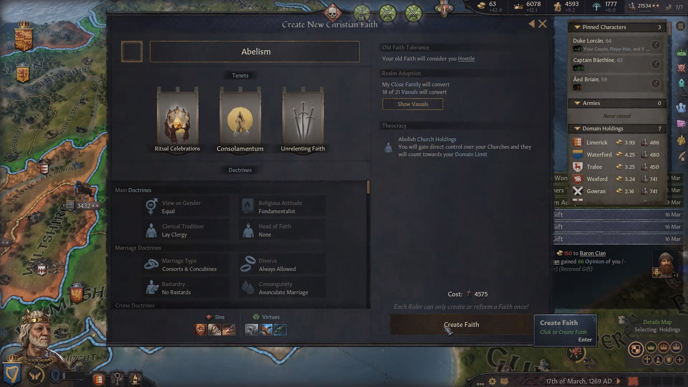
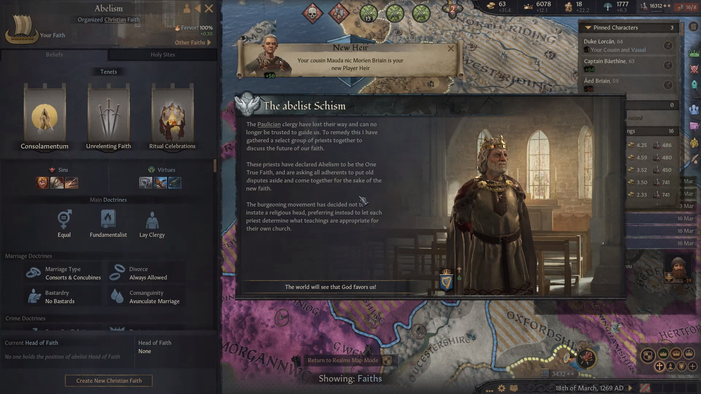
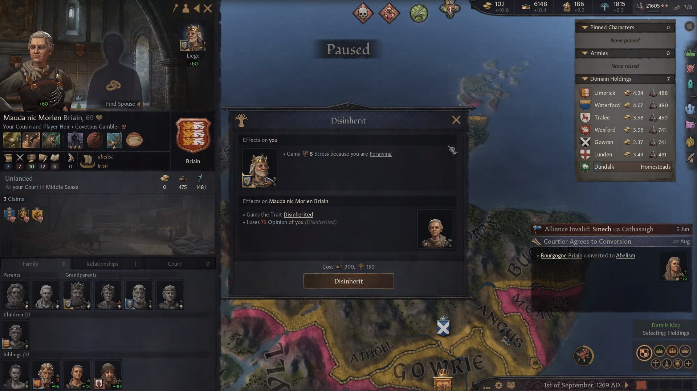
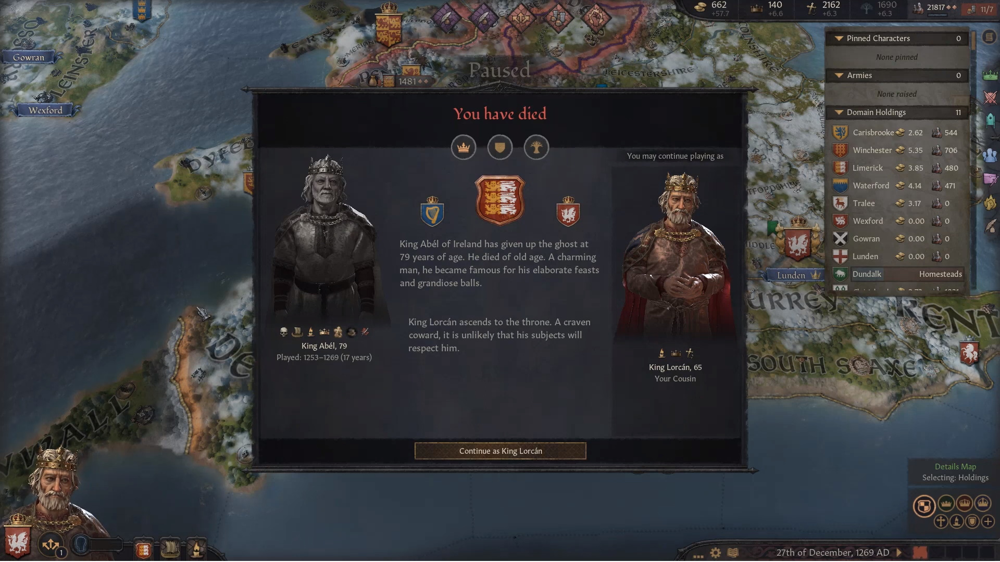
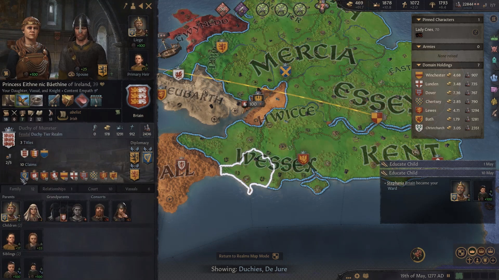
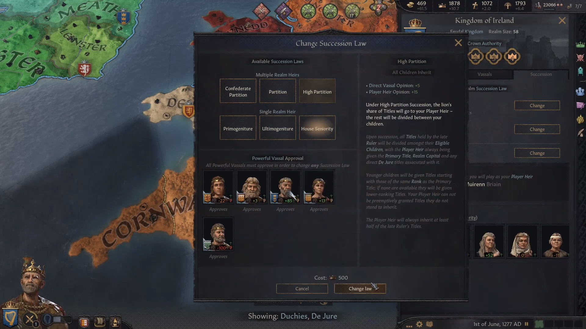
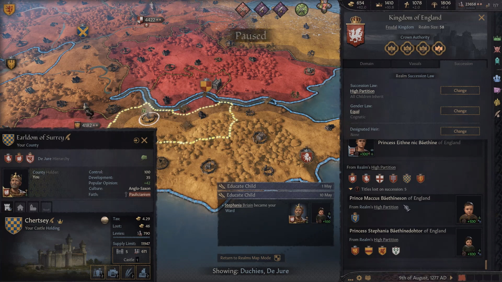

Administering such a big kingdom was a challenge for Abel. It was difficult to track was going on - deal with factions, claimants, unhappy vassals, peasant rebels, at the same time trying to prevent that a vassal would become too strong. However, no major threat appeared and the situation was easily under control. In 1267, Abel decided to adopt the Anglo-Saxon culture, along with most of his vassals.

The next priority was to unify England. Oxford and Berkshire were annexed after a short war in 1267, which wasn't trivial to win because of their powerful allies.

Abel's most important legacy, though, is the religion that he founded, Abelism. Just as Paulicianism was spreading in the realm, Abel found it inadequate - he wanted a more equal, liberal and lay religion. So short before death, he spent all his piety to reform it as much as possible
Abel's most important legacy, though, is the religion that he founded, Abelism. Just as Paulicianism was spreading in the realm, Abel found it inadequate - he wanted a more equal, liberal and lay religion. So short before death, he spent all his piety to reform it as much as possible
Abel's most important legacy, though, is the religion that he founded, Abelism. Just as Paulicianism was spreading in the realm, Abel found it inadequate - he wanted a more equal, liberal and lay religion. So short before death, he spent all his piety to reform it as much as possible

Now as a side effect, women would be in line for becoming player heirs. Abel wanted to keep the seniority succession law, as his daughters were underwhelming. The schism became official. 

The next priority would be to convert everybody to Abelism, and ensure a passage of power . Abel did not trust her cousin Mauda nic Morien to be the new queen and disinherit, ensuring the succession of Lorcan mac Morien. That came at a cost, of course.

In 1269, Abel died and Lorcan took his place and became King of England, in what seemed a difficult change.

The change of title had the effect that there was also a transfer of court - the courtiers Abel and his predecessors had gathered were no longer accessible for Lorcan.

In 1271 he started a war against Wiltshire, but he did not live to see the end of it. He died in the same year, after reigning for only 2 years. Modern historians consider his short administration positive, as he managed to keep the country together even after such dramatic changes. However, most people with a passing knowledge of history may not even remember his name. 

He was succeeded by Beathine, whose name, as a matter of fact,  instead is hardly more known.   

Beathine continued the campaigns to unify England, pushing into Gloucester and Cornwall. He reorganized the administration of Duchy, not being afraid of revoking titles if necessary. He continued the conversion to Abelism, which was going smoothly.
Beathine, unlike Lorcan, went back to being King of Ireland. After experiencing the disadvanges of the seniority succession law, he looked at his children and at his daughter Eithne in particular, and thought that he could restore a normal inheritance succession law. His dread was enough to sway also disapproving vassals.

They were back to have to deal with the well-known problem - how to distribute titles ? Feudal laws would have been helpful, if he had known how to use them. However, he did find a good solution on how to divide the realm among his three children, after setting England as the main title.

Baethine died in 1281, after reigning for 10 years. Historians do not spend much analyzing the events of his tenure, apart from setting the stage for the following rulers, starting from the Queen Eithne. Now this is a name everyone with a glimpse of culture would know.

