 Queen [Eithne](../p/eithne_nic_baethine_1238.md) was a definite change of pace from previous rulers, as she specialized in diplomacy - the first one in our history. 
 She found a reign who had been split between her and her siblings [Maccus](../p/maccus_baethineson_1273.md), who got the title of King of reland, and [Stephania](../p/stephania_baethinedohtor_1276.md), who ruled in Wessex, while herself got the title of Quenn of England and Duchess of Kent. 
 Her first priority was to restore Essex to the Kingdom of England, as for being part of Meath they had ended up being part of Ireland. 
 
 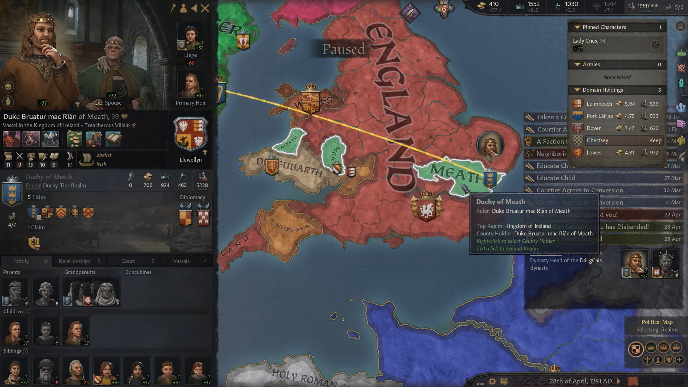

 The resulting de jure war, declared in 1281, was not eaz at all, becuase of the toughness of the Irish and their powerful ally from the continent, Duke Koenraad II of Tyrol. In 1283, however, the war was over, and the Earldom of Essex and Hertfordshire were assigned to Duchess Mael-Muire.
 
 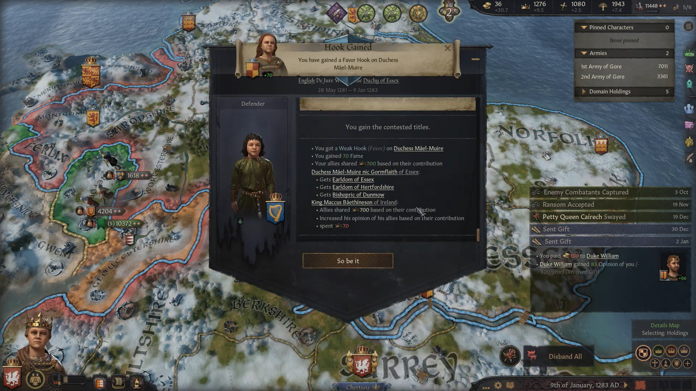
 
 Then Queen Eithne moved on to conclude the conquest of England. In 1284 she declared on Gloucestershire, and afer an easy stomp the Earldom of Gloucestershire bcame part of England.
 
 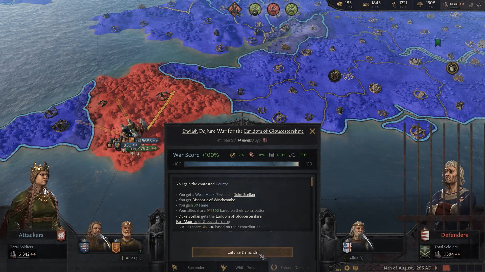
  
  By 1285, most of the realm had converted to Abelism 
  
 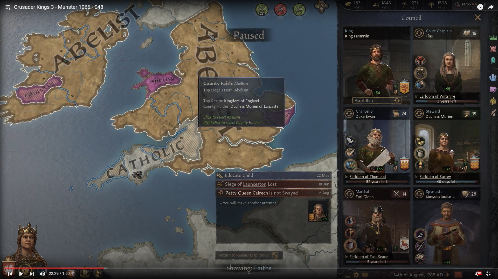
 
 In 1287, Eithnie declared on Lothian, after creating a claim on the province of Dunbar. The war was over in 1289 and Queen Eithnie added the Earldom of Dunbar to her domain. 
 
 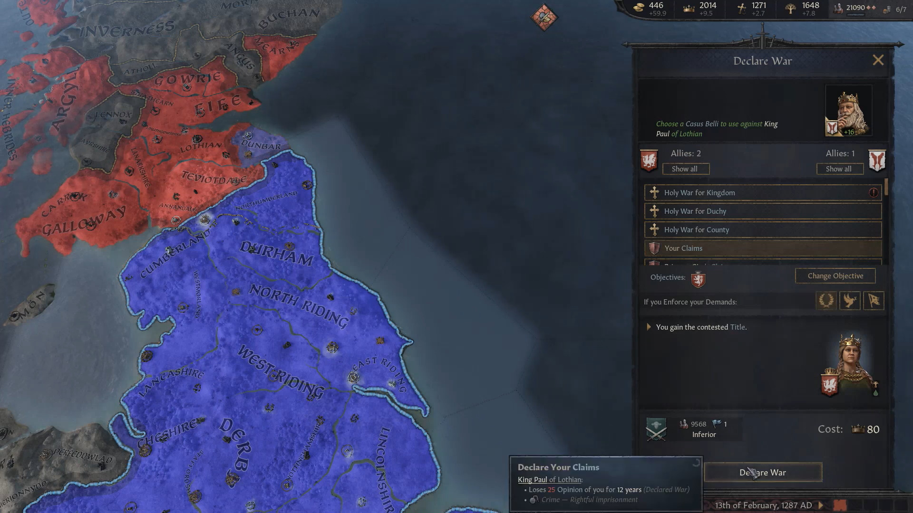
 
Next in line was the conquest of Devon, which happened after a couple of short wars in 1290-1291

 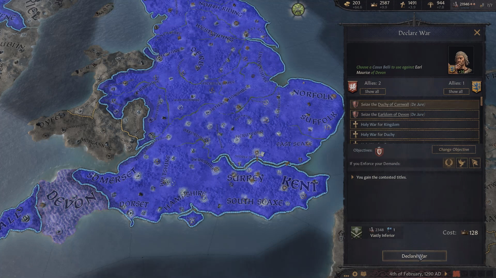
 
 In 1294,  Queen [Eithne](../p/eithne_nic_baethine_1238.md) had the titles of **Kingdom of England**, **Petty Kingdom of Munster** and **Kent**, **Earldom of Thomond, Ormond, Kent, Surrey, South Seaxe, Leicestershire** and **Dunbar**.
 
 Her vassals were:
 
 - [**Duke Scellan of Hwicce**](../p/scellan_1255.md), house **Briain**, great-great-great-grandson of King [Caindelban I]
 - [**Duke Tadg Barrdubson of Deira**](../p/tadg_barrdubson_1257.md) of the house **Got**, great-great-great-grandson of King [Caindelban I](../p/caindelban_i_mac_faelan_1114.md)
 - **Duke [Farannan](../p/farannan_1239.md) of Powys**, house **gCais-Mathrafal**, also **King of England** being  Queen [Eithne](../p/eithne_nic_baethine_1238.md)'s husband
 - [**Duchess Morien of Lancaster**](../p/morien_1226.md) of the house **gCais-Macclesfield**, great-granddaughter of King [Caindelban II](../p/caindelban_ii_mac_caindelban_1147.md)
 - [**Duke Ewan of East Anglia**](../p/ewan_1232.md) of the house **Adelsward**, great-grandson of Queen [Gormflaith](../p/gormflaith_nic_caindelban_1171.md)
 - **Duchess [Mael-Muire Gormflaithdohtor](../p/mael-muire_gormflaithdohtor_1268.md) of East Seaxe**, great-granddaughter of **Queen Gormflaith**, from the house **hEochadha**
 - Eithne's half sister **Princess [Stephania Baethinedohtor](../p/stephania_baethinedohtor_1276.md) of England**, **Duchess of Wessex**
 - **Petty Queen [Cairech nic Faelchu](../p/cairech_nic_faelchu_1235.md) of Deheubarth**, actually **Countess of Ennis**
 - [**Duchess Ylva Drifadohtor of Mercia**](../p/ylva_drifadohtor_1261.md) from the house **Hagallin**, daughter of **Duke [Thurcytel](../p/thurcytel_saebertson_1228.md) Saeberston** from the house **Chester**, in the dynasty **Dal-gCais**, who regrettably married matrilineally with another house
 - **[Glenn mac Mael-Ruanaid](../p/glenn_mac_mael-ruanaid_1242.md)**, **Earl of Desmond**,  King [Baethine Dubhson](../p/baethine_dubhson_1205.md)'s cousin  **Mormaer Mael-Runaid**'s son 
 - **Duke [William](../p/william_1247.md) of Guoladat** from the house **Sigurdr-York** 
 - **Duchess [Cathan Cathandohtor](../p/cathan_cathandohtor_1247.md) of Cornwall**, granddaughter of [King Abel mac Gormflaith](../p/abel_mac_gormflaith_1190.md)
 
 
 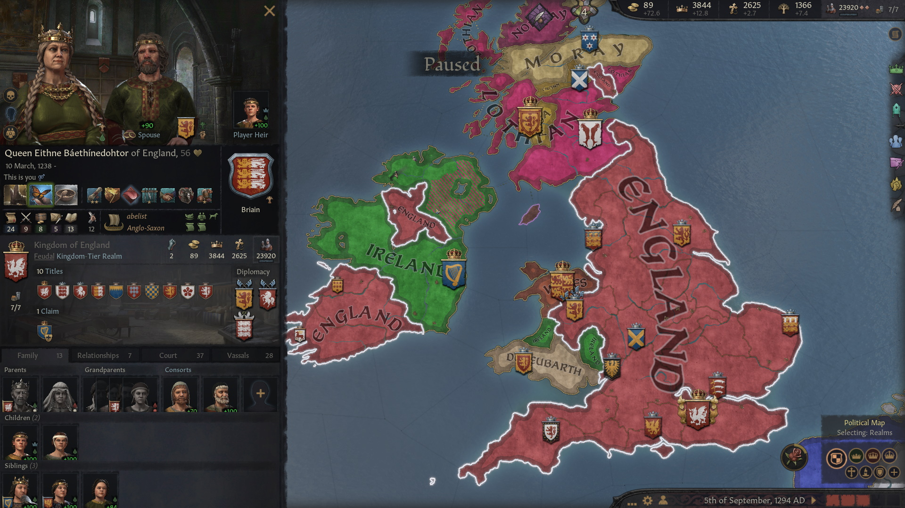
 
 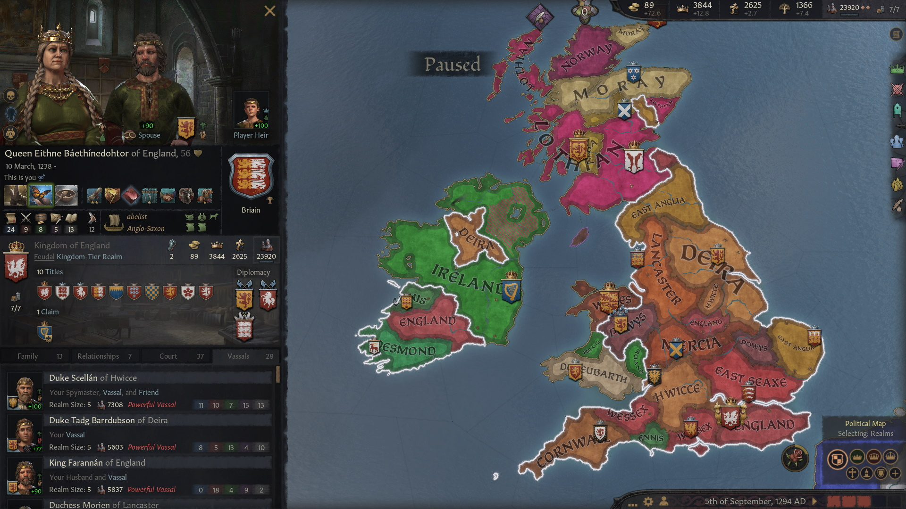
 
 Still independent was a rump state of Ireland ruled by Eithne's brother **King [Maccus Baethineson](../p/maccus_baethineson_1273.md)**, who was **King of Ireland**, **Earl of Dublin** and **Bishop of Kildare**. His vassals were
 
 - **Duke [Beorhtric Muirennson](../p/beorhtric_muirennson_1265.md) of Leinster**, also **Earl of Athlone and Leinster**, great-great-grandson of **Queen [Gormflaith nic Caindelban](../p/gormflaith_nic_caindelban_1171.md)**. His main vassal was **Earl [Ultan mac Gelgeis](../p/ultan_mac_gelgeis_1249.md) of Ossory**
 - **Countess [Wulfwynn Riandohtor](../p/wulfwynn_riandohtor_1273.md) (1273-) of Herefordshire**, from the house **Llewellyn**, [Queen Eithne nic Baethine](../p/eithne_nic_baethine_1238.md)'s third cousin
 - **Duchess [Cristina nic Cristina](../p/cristina_nic_cristina_1277.md) of Connacht**, also **Countess of Mayo**, from the house **Gcais-Macclesfield**,  great-great-granddaughter of **Queen [Gormflaith nic Caindelban](../p/gormflaith_nic_caindelban_1171.md)**. Her main vassal was **[Gormlaith nic Gormlaith](../p/gormlaith_nic_gormlaith_1231.md)**, **Countess of Ui-Mhaine** and Court Chaplain, from the house **gCais-Gaillimhe**
 - **Duchess [Muirenne nic Pierre](../p/muirenne_nic_pierre_1275.md) of Ulster** from the house **gCais-Macclesfield**
 - **Lady [Catriona nic Bruatur](../p/catriona_nic_bruatur_1261.md) of Ceredigion**, from the house **Llewellyn**, whose father  [**Bruatur mac Rian**](../p/bruatur_mac_rian_1241.md) was [Queen Eithne nic Baethine](../p/eithne_nic_baethine_1238.md)'s third cousin
 
 
 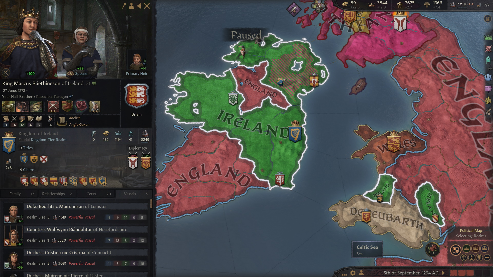
 
 Also independent was **Deheubarth**, ruled by  **Petty King [Flaithgus mac Cuan](../p/flaithgus_mac_cuan_1236.md) of Deheubarth**,of the house **Briain**,  grandson of Queen [Gormflaith](../p/gormflaith_nic_caindelban_1171.md). He was also **Lord of Morgannwg, Sir Gaerfyrddin, Dyfed**. His main vassals were:
 
 - **Lady [Cairech nic Lugaid](../p/cairech_nic_lugaid_1250.md) of Gwent**, great-great-granddaughter of King [Caindelban I mac Faelan](../p/caindelban_i_mac_faelan_1114.md)  and of [Rian I ab Aengus](../p/rian_i_ab_aengus_1144.md) 
 - **Lord [Coilboth mag Etain](../p/coilboth_mag_etain_1287.md) of Brycheiniog**. grandson of **King [Lorcan Morienson](../p/lorcan_morienson_1204.md)**
 
 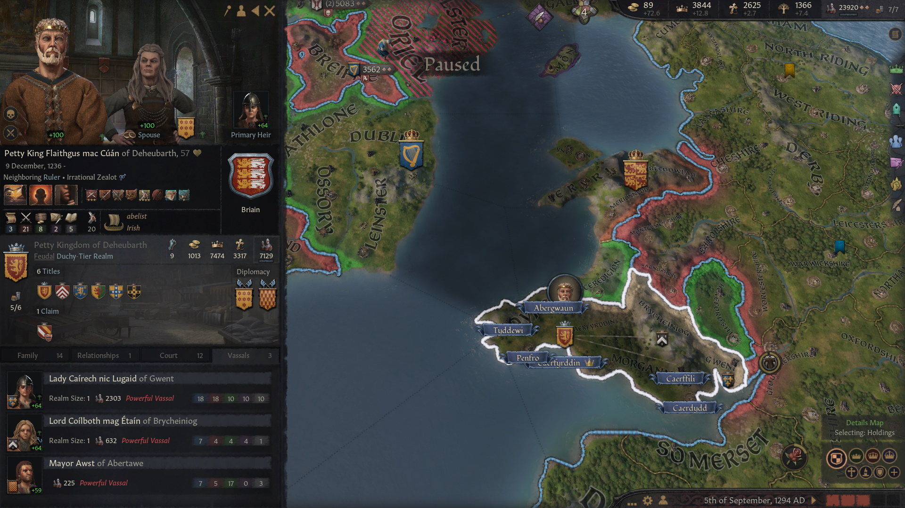
  
  Also independent, but less friendly was the rump state of **Wales**, still ruled by **[Taithlech mac Senchan](../p/taithlech_mac_senchan_1243.md)** of the house **gCais-Tegeingl**, [Baethine Dubhson](../p/baethine_dubhson_1205.md)'s second cousin. His vassals were still
  
- **Lord [Clydog ap Talorc](../p/clydog_ap_talorc_1227.md) of Ynys Mon and Eryri**, great-great-grandson of King [Caindelban I mac Faelan](../p/caindelban_i_mac_faelan_1114.md) 
- **Lady [Hywela ferch LLes](../p/hywela_ferch_lles_1242.md) of Merionnydd**, of the house **Ynys Cybi**

 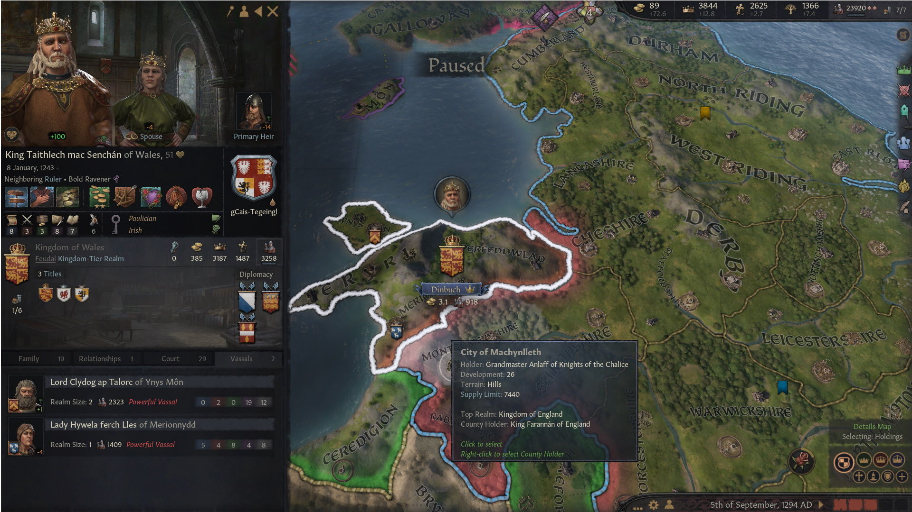
   As to Queen Eithnie's direct vassals, [**Duke Scellan of Hwicce**](../p/scellan_1255.md) was **Duke of Hwicce**, **Earl of Nottinghamshire, Wiltshire and Gloucestershire**. His main vassals was **Court Chaplain [Sybilla](../p/sybilla_1248.md) of Hwicce**, also **Countess of Berkshire and Oxfordshire**, of the house **Clare**, daughter of **Earl [David](../p/david_1231.md) of Berkshire**. 

  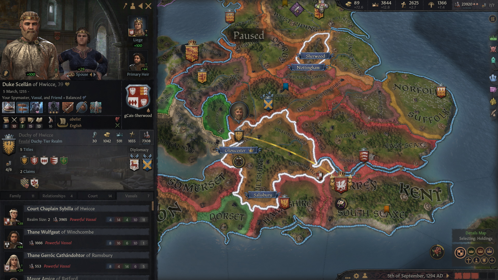
  
[**Duke Tadg Barrdubson of Deira**](../p/tadg_barrdubson_1257.md) of the house **Got** was **Duke of Deira**, **Earl of North Riding, East Riding**. He had following vassals:

- **Earl [Aed Barrdubson](../p/aed_barrdubson_1261.md) of the West Riding** of the house **Got**
- [**Earl Flanchad of Lincolnshire**](../p/flanchad_1231.md), of the house **Michael**
- **Countess [Tailefhlaith Barrdubdohtor**](../p/tailefhlaith_barrdubdohtor_1252.md)** of the house **Got**, of **Breifne**

 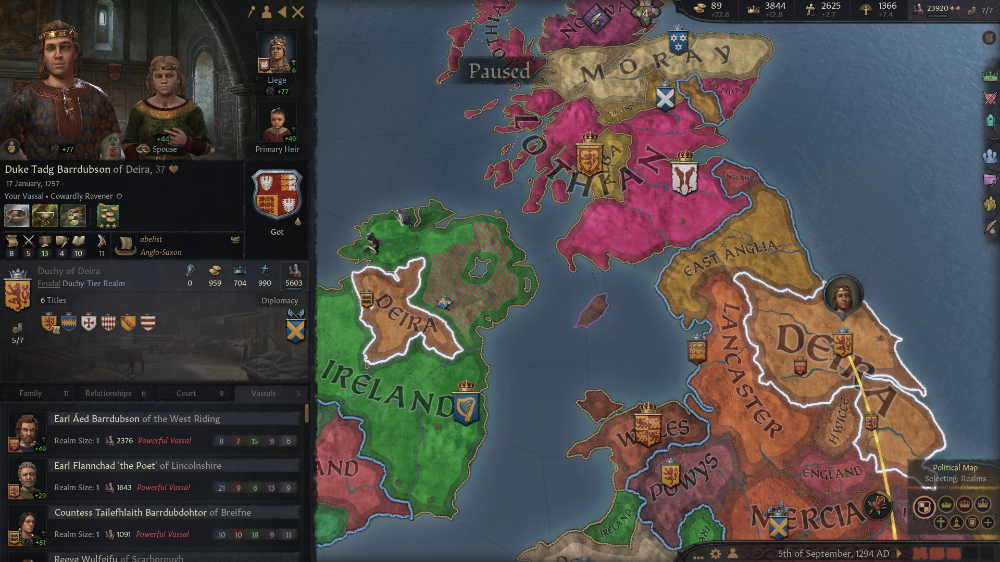
 
**Duke [Farannan](../p/farannan_1239.md) of Powys**, house **gCais-Mathrafal**, also **Lord of Cambridgeshire, Huntingdonshire, Montgomeryshire, Shropshire** and **Radnorshire**, having just barons and mayors as vassals
 
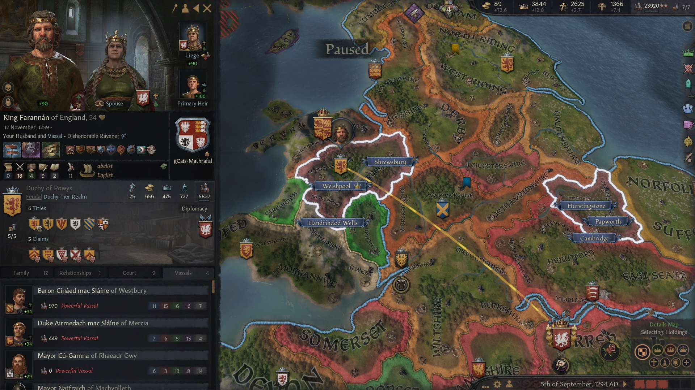
  
[**Duchess Morien of Lancaster**](../p/morien_1226.md) of the house **gCais-Macclesfield** was **Duchess of Lancaster** and **Countess of Lancashire, Cheshire, Westmorland**. Her main vassal was **Earl [Cuan](../p/cuan_mac_cuan_1245.md) of Derby**, house **Briain**, who was also **Earl of Staffordshire**

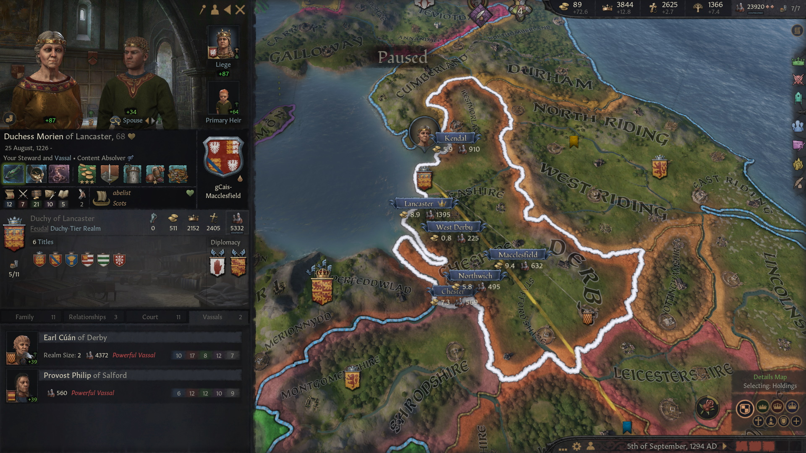

[**Duke Ewan of East Anglia**](../p/ewan_1232.md) of the house **Adelsward** was **Duke of East Anglia and Northumbria**, **Earl of Norflok, Suffolk and Cumberland**. His main vassal was **Earl [Lethlobur](../p/lethlobur_mag_euginia_1241.md) Euginiasson of Northumberland**, **Earl of Northumberland and Durham**.

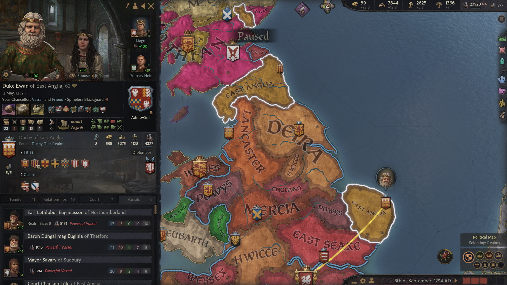 

Eithne's half sister **Princess [Stephania Baethinedohtor](../p/stephania_baethinedohtor_1276.md) of England** was **Duchess of Wessex** and **Earl of Hampshire, Somerset and Wight** and had no notable vassals.

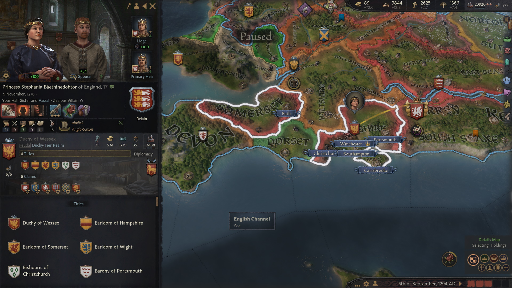 

- **Petty Queen [Cairech nic Faelchu](../p/cairech_nic_faelchu_1235.md) of Deheubarth** was actually **Countess of Ennis and Dorset**

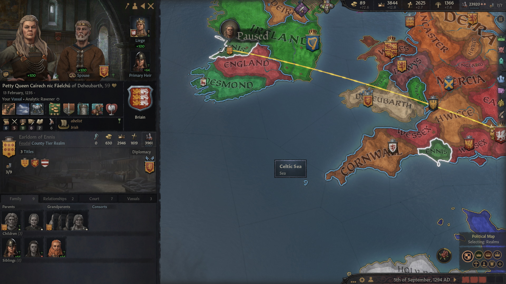 

[**Duchess Ylva Drifadohtor of Mercia**](../p/ylva_drifadohtor_1261.md) from the house **Hagallin** was **Duchess of Mercia** and **Countess of Northamptonshire and Warwickshire**. Her main vassal war **Earl [Ernad Seonaidson](../p/ernad_seonaidson_1245.md) of Worcestershire**, also Court Chaplain of Mercia,

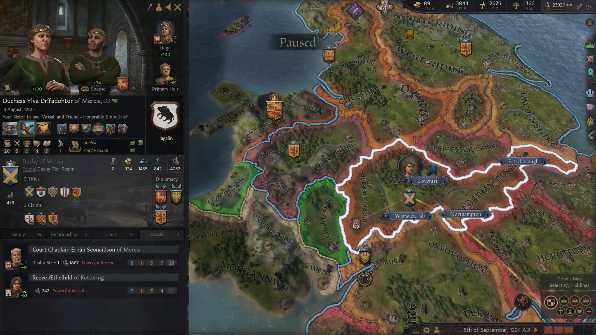 

**Duke [William](../p/william_1247.md) of Guoladat** from the house **Sigurdr-York** was still  **Duke of Guoladat**, and also **Earl of Kintus, Ter and East Kiilt** with no notable vassals

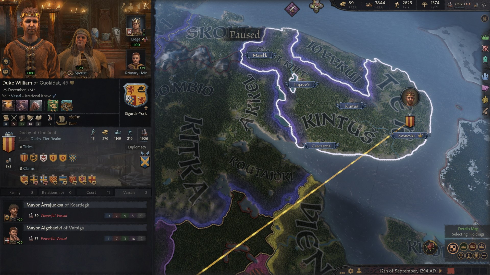 

 **Duchess [Cathan Cathandohtor](../p/cathan_cathandohtor_1247.md)  of Cornwall**, also **Countess of Devon**, from the house **Briain**, had as a main vassal **Earl Cinhoedl ab Sulian of Cornwall** from the house **Normandie-Tintagel** and no relation with the **Dal-gCais** dynasty.

 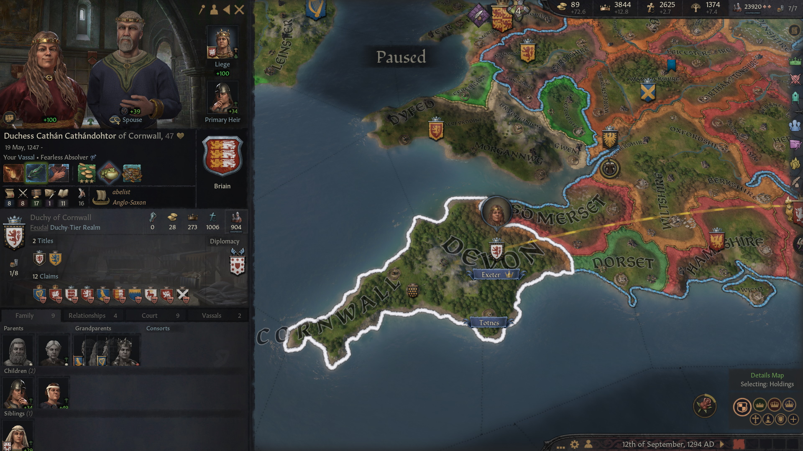 

As for succession, [Queen Eithne nic Baethine](../p/eithne_nic_baethine_1238.md) had two daughters, both somewhat underwhelming: **[Der-Lugdach](../p/der-lugdach_1266.md)**, married with **Duke Landolf of Westfalen** and at his court, and the still unlanded **[Slaine](../p/slaine_eithnedohtor_1268.md)**. Both belonged to the house **gCais-Mathrafal**, from her father [Farannan](../p/farannan_1239.md), as the marriage had been patrilineal.

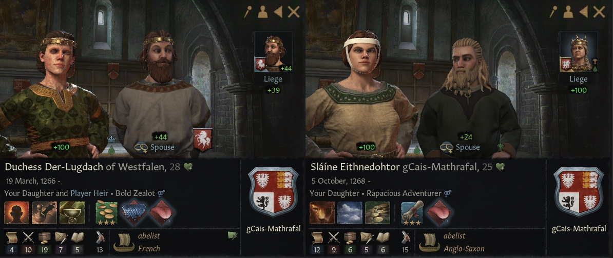 

