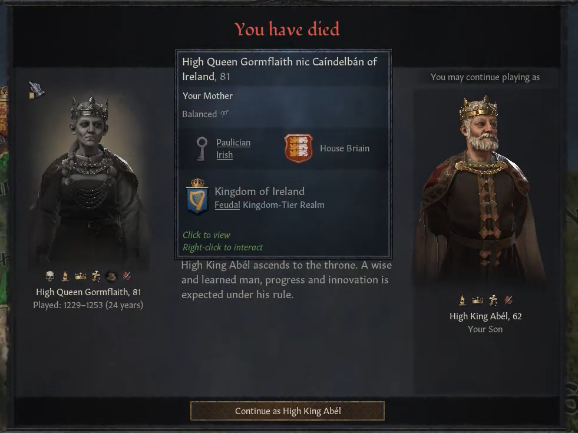

During the last years of her reign, **[Gormflaith nic Caindelban](../p/gormflaith_nic_caindelban_1171.md)** tried to find a way to avoid splitting the realm on her death. As things were standing, with maxim crown authority, she could pick an heir, but she could not avoid a split. [Abel mac Gormflaith](../p/abel_mac_gormflaith_1190.md) would get Ireland, Munster and the Counties in Wales, but his brother **[Labraid mac Gormflaith](../p/labraid_mac_gormflaith_1188.md)** would still get Leinster

After much swaying, Gormflaith got "High Partition" approved, but this did not solve any problem - the partition would happen in the same way. As she did not like her son Labraid, she disinherited him, but this did not solve the issue, as her grandson [Duke Flaithgus mac Cuan of Deheubarth](../p/flaithgus_mac_cuan_1236.md) took his place as a second heir. Gormflaith gave Labraid the **Earldom of Ferlix** as a consolation.

Gormflaith granted then her grandson Flaithgus independence, to get him out of the way - he became the **Petty King of Deheubarth**, to get him out of the way. Even after that, Flaithgus would inherit Leinster after her death. In hindsight, she might have changed the succession law of the **Duchy of Leinster** into feudal succession, and that would have achieved the result she was hoping for. Regrettably, she wasn't aware or did not understand such an option. 

Anyway, her grandson could not veto reforms any longer, so that Gormflaith ended up passing the house seniority succession law, and by sheer luck her son Abel was first in the line of succession. That happened in the nick of time, as Gormflaith passed away in 1253, at the age of 81. Her son Abel succeeded her, already being 62 years old.  

During the first months [Abel](..p/abel_mac_gormflaith_1190.md) had to deal with internal issues, such as unhappy vassals. He helped his ally [Petty King Flaithgus mac Cuan of Dehuerbarth](../p/flaithgus_mac_cuan_1236.md)  defend against an attack from Gloucestershire for the **Lordship of Morgannwg**.

Abel is considered one of our greatest kings and mainly for two reasons. First, because of his war against England. The Kingdom of England had been severely weakened by continuous internal infighting, so that by 1258 they could field just 5000 men. Abel seized the opportunity and declared an holy war for the Kingdom. This was the war of his life and he called all possible house and dinasty members to war: 

From the house:  Lord Aindle mac Cuan of Brycheniog, Petty King Flaithgus mac Cuan of Deheubarth, Ladi Cairech nic Lugiad of Gwent and Earl Male-Ruanaid of Angus . Petty King Muiredach MacFlaitheman of Moray,  and Earl Male-Ruanaid of Angus would not answer the call  at first, but then joined after conversion. From the dinasty Lord Talorc ab Aine of Ynys Mon, King Taithlech mac Senchan of Wales and Captain Niallgus mag Aileann of Band of Kerns joined as well.  The Knights of the Chalice from the holy order were invited as well. Later on he house member  Mormaer Nechtan mac Muiredach of Atholl joined as well.

With such a formidable coalition, the war was over by 1260 - England was conquered and became part of Ireland. The next issue would be to assign the newly conquered territories to loyal and solid vassals - which is easier said than done. Moreover, an outrageous peasant revolt broke in England - King Abel, however, managed to put it down by 1261

He had also to monitor who would succeed him, as the  house seniority succession law was showing its flaws. After discarding infirm family members, the heir became Abel's cousin [Lorcan mac Morien](../p/lorcan_mac_morien_1204.md), unimpressive but still somewhat reasonable. However, after being restored in the inheritance line, Abel's brother [Labraid mac Gormflaith](../p/labraid_mac_gormflaith_1188.md) became the new player heir.  After the brothe's death, he disinherited Lorcan as well and Baethin mac Dubh Briain was picked as next heir.

In 1261, Abel was holding the titles of .... and had following vassals... 

However

REFERENCES

E36: Canannan: (to exxecute or not )

Duke Niallan

Failenn nic Gormflaith (sister, non beleiver)

39:28 joins holy war for the lordship of Morgannwg 

Earl Natfraich of Athlone, Dueke Natfraich mag Aine of Ulster

56:06 King Taitlech mac Senchan of Wales

1:24:20 Saebert  Haroldson Briain

Lorcan mac Morien Briain,  

 Labraid mac Gormflaith

1:37:53 - Labraid dies

Sebert disinherited 1:38_58

Baethine mac Dubh Briain