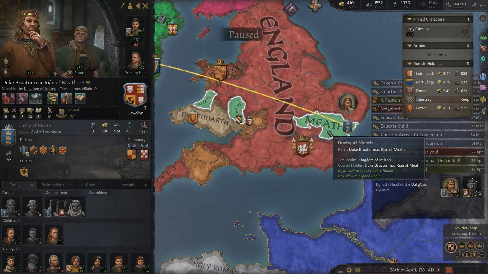
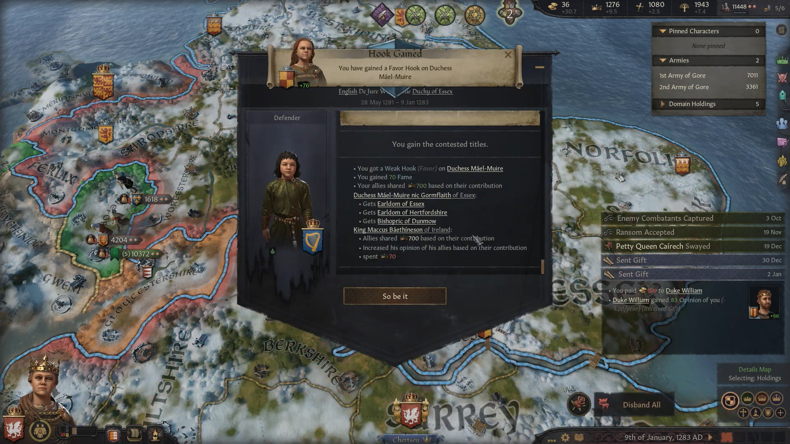
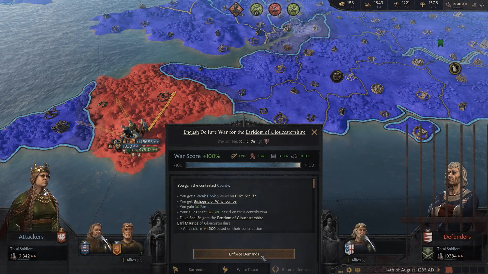
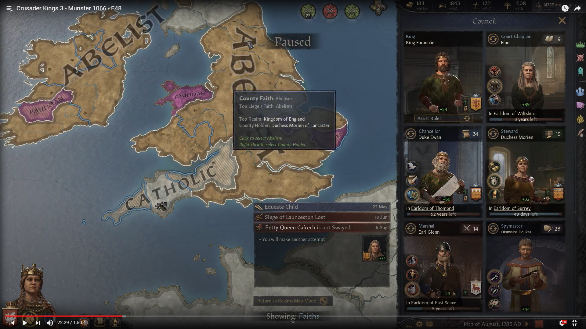
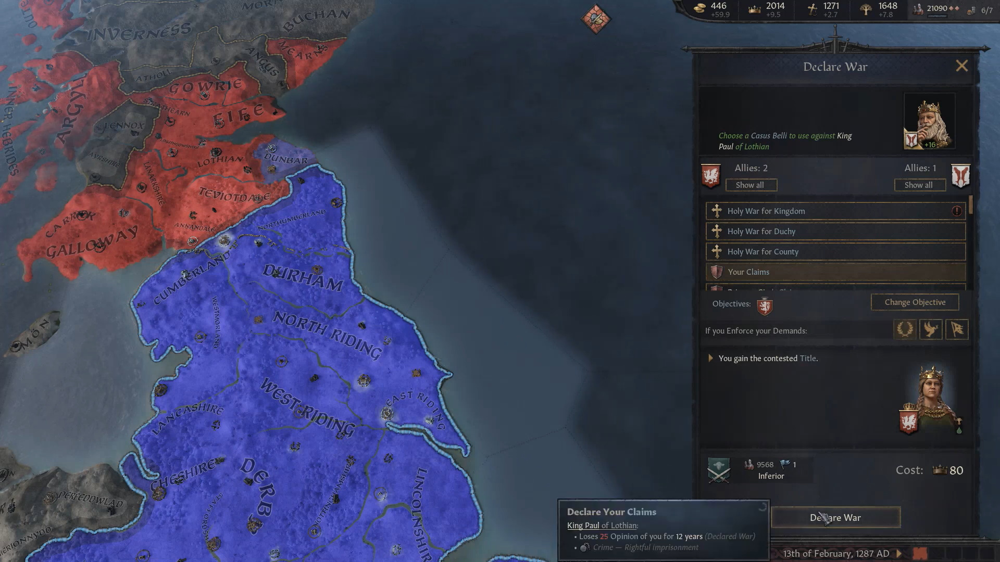

 Queen [Eithne](../p/eithne_nic_baethine_1238.md) was a definite change of pace from previous rulers, as she specialized in diplomacy - the first one in our history. 
 She found a reign who had been split between her and her siblings [Maccus](../p/maccus_baethineson_1273.md), who got the title of King of reland, and [Stephanie](../p/stephanie_baethinedohtor_1276.md), who ruled in Wessex, while herself got the title of Quenn of England and Duchess of Kent. 
 Her first priority was to restore Essex to the Kingdom of England, as for being part of Meath they had ended up being part of Ireland. 
 
 

 The resulting de jure war, declared in 1281, was not eaz at all, becuase of the toughness of the Irish and their powerful ally from the continent, Duke Koenraad II of Tyrol. In 1283, however, the war was over, and the Earldom of Essex and Hertfordshire were assigned to Duchess Mael-Muire.
 
 
 
 Then Eithne moved on to conclude the conquest of England. In 1284 she declared on Gloucestershire, and afer an easy stomp the Earldom of Gloucestershire bcame part of England.
 
 
  
  By 1285, most of the realm had converted to Abelism 
  
 
 
 In 1287, Eithnie declared on Lothian, after creating a claim on the province of Dunbar. 
 
 
 
 E48 - 01:23:41
