It was expected, but still it was a shock when it came around. In September 1294, the Pope declared a crusade for the reconquest of England from the Abelist heretics.

 

Now, however, things could go the other way. **Queen  [Eithne](../p/eithne_nic_baethine_1238.md) of England** used the time it was left until the crusade to bring Wales into the Abelist fold. In April 1295, **Gwynedd** had been reconquered from **King [Taithlech mac Senchan](../p/taithlech_mac_senchan_1243.md)** and rulers were replaced with faithful Abelists.

 

Right after that, in July 1295, there was also a major setback for the Abelist coalition. **Queen  [Eithne](../p/eithne_nic_baethine_1238.md)**'s brother, **King [Maccus](../p/maccus_baethineson_1273.md) of Ireland**, lost a holy war against the **Kingdom of Lothian**, which grabbed **the Duchy of Ulster**.

By 1296, the crusade was in full swing. The Catholic infidels had managed to gather over 110k troops, while Abelists forces were little more than 70k soldiers. However, Abelists had the advantage of defending an island against separate armies that would end up fighting separateley, and an overall better command.  

More often than not, Abelists may have been somewhat outnumbered, but still got a lot of advantages, being able to fight as defenders against badly supplied troops, who might even have just disembarked. Such was the case in the battle in Dover. 

Other major engagements were fought in Tonbridge.

By March 1298, after a couple of other major engagements, Catholic forces had been grounded down to 48k soldiers, against 80k Abelist troops. There didn't seem to be any doubt as to who would win eventually.

Anoher major decisive battle was fought and won by Abelists in Norwich in July 1298.

Inevitably, after a few other battles, the soldiers of St' George had to concede defeat. England and the Abelist faith had won their first crusade ! 

In the following years Queen Eithnie dealt with the consequences of the crusade. A good side effect were the many prisoners that she could ransom, force-convert and/or recruit. 
One might think that she would be satisfied with her accomplishments. However, in 1299 she got wind that the Abelist faith was spreading among people in France and on the continent. This is something that could not be ignored.

Therefore, in May 1300, **Queen Eithnie** declared a holy war for the **Kingdom of France** on **King Guillaume III**.  

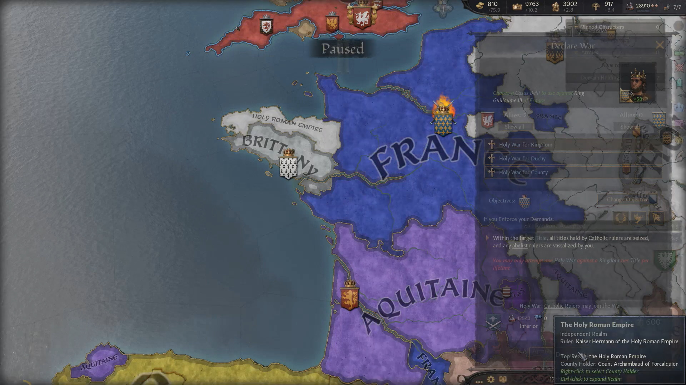

In December 1302, finally, **King Guillaume III** surrendered. Queen Eithne spent a lot of time to decide how to split the new realm among her vassals - she was done around January 1304.
In 1305, there was a huge Catholic uprising in France, fielding over 74000 troops. Luckily, they were separated and disorganized, so that Queen Eithnie could get the better of them. 
After that victory, in June 1306, Queen Eithnie took the title of Queen of France as her primary title.

In January 1308, she declared war on the kingdom of Aquitaine over the Duchy of Aquitaine itself. The war took one year to win and it was over by January 1309.

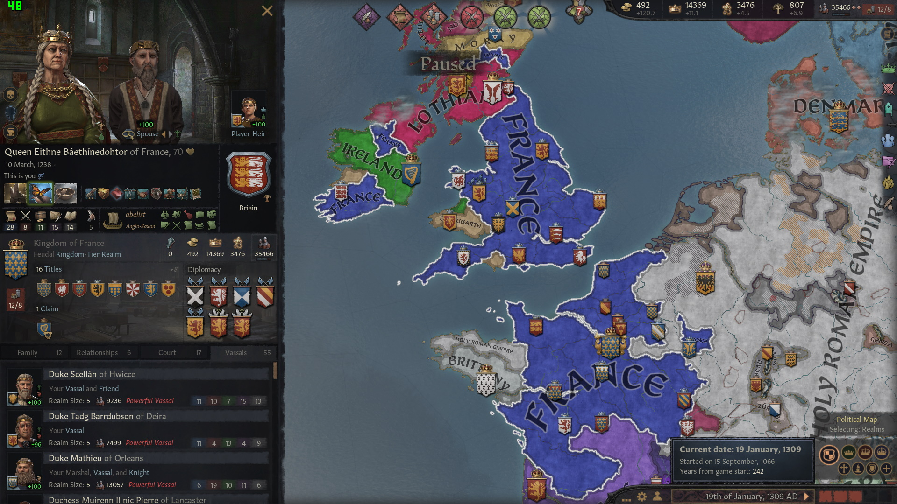 

Therefore in January 1309, Queen Eithne had the title of **Queen of France, England**, **Petty Queen of Flanders and Valois**, and **Earl of Ile doe France, Brie Francaise, Beaumont, Boulogne, Lille, Yperen, Brugge, Aunis, Angouleme, Perigord, Limousing and Saintonge** - although she would have to give up a few to come back into the domain limit.

Her vassals were:

- [**Duke Scellan of Hwicce**](../p/scellan_1255.md), house **Briain**, great-great-great-grandson of King [Caindelban I]
- [**Duke Tadg Barrdubson of Deira**](../p/tadg_barrdubson_1257.md) of the house **Got**, great-great-great-grandson of King [Caindelban I](../p/caindelban_i_mac_faelan_1114.md)
- **Duke [Mathieu](../p/mathieu_1220.md) of Orleans**, of the house **Antoing**, unrelated to any Briain
- **Duchess [Muirenn II nic Pierre](../p/muirenn_ii_nic_pierre_1275.md) of Lancaster**, a descendant of **High King Caindelban I**
- **Duchess [Mael-Muire Gormflaithdohtor](../p/mael-muire_gormflaithdohtor_1268.md) of East Seaxe**, great-granddaughter of **Queen Gormflaith**
- **Duchess [Ermessinde](../p/ermessinde_1264.md) of East Anglia**, great-granddaughter of **Queen Gormflaith**
- **Duchess [Slaine Eithnedohtor](../p/slaine_eithnedohtor_1268.md) of Powys**, **Queen Eithnie**'s daughter
- **Duchess [Gruoch nic Glenn](../p/gruoch_nic_glenn_1273.md) of Munster**, great-great-granddaughter of **King Caindelban I**
- [**Duchess Ylva Drifadohtor of Mercia**](../p/ylva_drifadohtor_1261.md) from the house **Hagallin**
- **Duke [Hlothere Muirennson](../p/hlothere_muirennson_1278.md) of Kent** of the house **Kiil**, great-great-grandson of **Queen Gormflaith**
- **Duke [Eadbald Mael-Muireson](../p/eadbald_mael-muireson_1286.md) of Poitou**, of the house 
 **hEochadha**, great-great-grandson of **Queen Gormflaith**
- **Duke [Brian Airmedachson](../p/brian_airmedachson_1281.md) of Burgundy**, of the house **gCais-Mathrafal**, a descendant of **King Faelan**
- **Duke [Inwaer Stephaniason](../p/inwaer_stephaniason_1295.md) of Wessex**, of the house **Briain**, **Queen Eithnie**'s nephew
- **Duke of [Wulfgar](../p/wulfgar_1282.md) of Berry**, of the house **Randolph**
- **Duchess [Alienora](../p/alienora_1275.md) of Normandy** from the house **Corbeil**
- **Duchess [Cathan Cathandohtor](../p/cathan_cathandohtor_1247.md) of Gwynedd**
- **Duke [William](../p/william_1247.md) of Guoladat** from the house **Sigurdr-York** 
- **Duke [Fuacarta](../p/fuacarta_1283.md) of Anjou** from the house **gCais-Sherwood**
- **Duke of [Sverrir Drifason](../p/sverrir_drifason_1272.md) of Champagne**, from the house **Hagalin**
- **Duke of [Natfraich](../p/natfraich_1280.md) of Bar**, from the house **Cathasaigh**
- **Count [Seoan](../p/seoan_1261.md) of Guines**, from the house **Guines**
- **Count [Gerroc Airmedachdohtor](../p/gerroc_airmedachdohtor_1289.md) of Clermont**, **gCais-Mathrafal**
- **Count [Coblaith nic Cairech](../p/coblaith_nic_cairech_1277.md) of Vermandois**, **gCais-Trefynwy**
- **Duke [Erc mac Cathan](../p/erc_mac_cathan_1264.md) of Cornwall**, **Briain**
- **Countess [Morag](../p/morag_1274.md) of Dunbar** of the house **Briain**
- **Earl [Cenwulf](../p/cenwulf_1309.md) of Valois** of the house **Senlis**

 

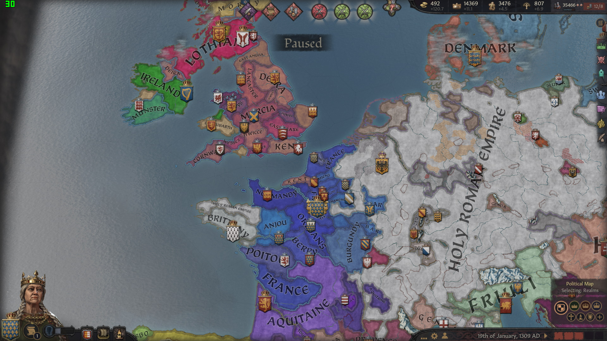 

**Deheubarth** was still independent and ruled by **Petty Queen [Mauda nic Cairech](../p/mauda_nic_cairech_1255.md) of Deheubarth**. She was **Queen of Deheubarth**, **Lady pf Ennis, Morgannwg, Sir Gaerfyrddin**.

- **Duke [Muirchertach mac Cairech](../p/muirchertach_mac_cairech_1272.md) of Gwynedd**, actually **Earl of Dorset and Dyfed**, **Briain**
- **Lady [Cairech nic Lugaid](../p/cairech_nic_lugaid_1250.md) of Gwent**, **Briain**
- **Lord [Coilboth mag Etain](../p/coilboth_mag_etain_1287.md) of Brycheiniog**. **Briain**

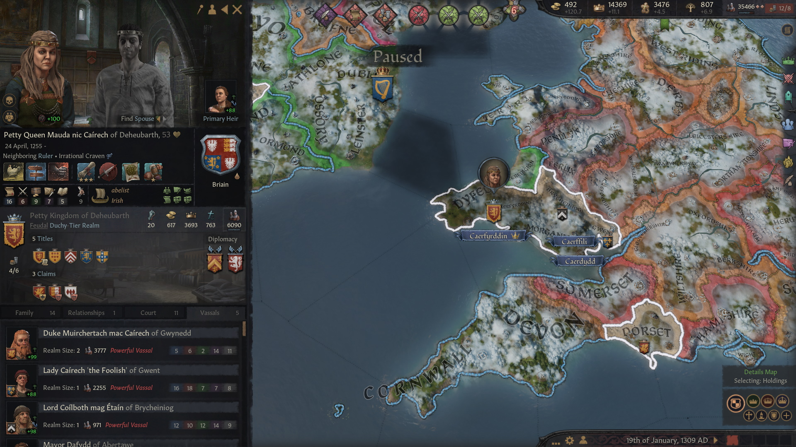 

[**Duke Scellan of Hwicce**](../p/scellan_1255.md) was **Duke of Hwicce**, **Earl of Nottinghamshire, Wiltshire and Gloucestershire**. His main vassals were 
- **Court Chaplain [Sybilla](../p/sybilla_1248.md) of Hwicce**, also **Countess of Berkshire and Oxfordshire**, of the house **Clare** 

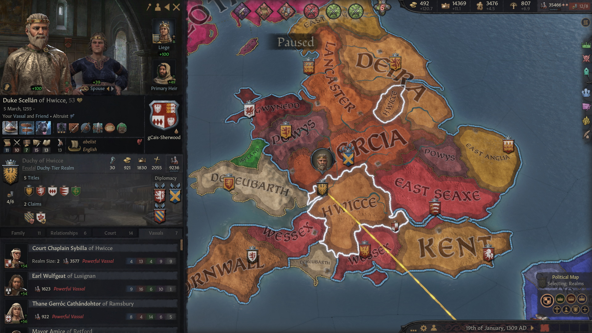 

  
[**Duke Tadg Barrdubson of Deira**](../p/tadg_barrdubson_1257.md) of the house **Got** was **Duke of Deira**, **Earl of North Riding, East Riding, West Riding**. He had following vassals:

- **Earl [Cynehelm Ben-Uladson](../p/cynehelm_ben-uladson_1270.md) of Lindsey**, **Briain**
- **Countess [Tailefhlaith Barrdubdohtor**](../p/tailefhlaith_barrdubdohtor_1252.md)** of the house **Got**, of **Breifne**

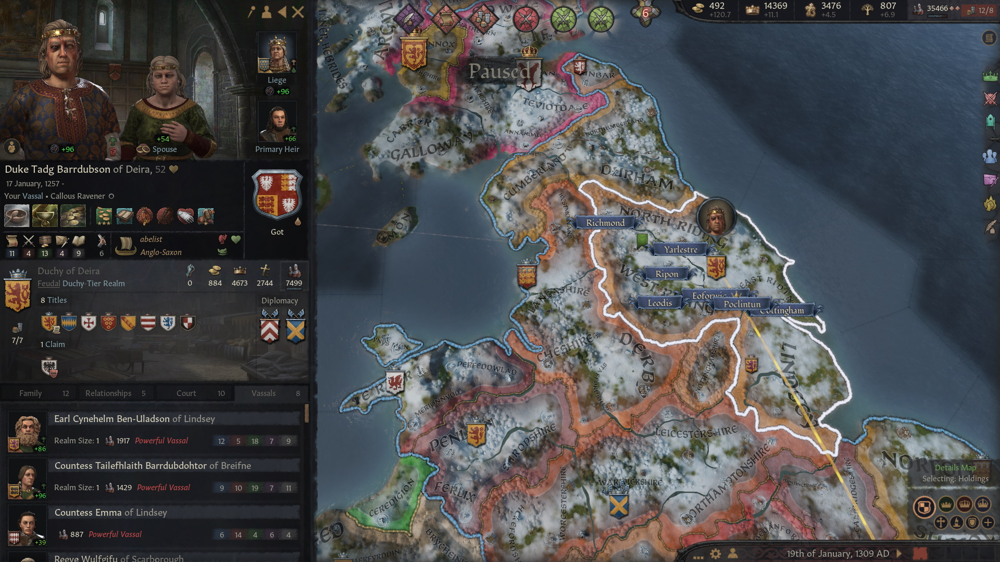 

**Duke [Mathieu](../p/mathieu_1220.md) of Orleans** was **Duke of Orleans** and **Count of Orleans, Sancerre, Montargis, Vendome**. His vassal was:
 
- **Countess [Ben-Mide](../p/ben-mide_1282.md) of Chartres** 

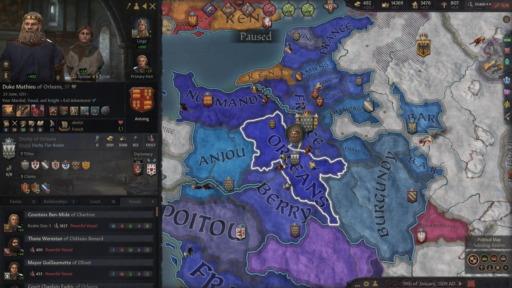 

**Duchess [Muirenn II nic Pierre](../p/muirenn_ii_nic_pierre_1275.md) of Lancaster**, **Duchess of Lancaster**, **Earl of Lancashire, Cheshire**, had following vassals:

- **Earl [Cuan](../p/cuan_mac_cuan_1245.md) of Derby**, house **Briain**, who was also **Earl of Staffordshire**
- **[Earl Humbert](../p/humbert_mac_muirenn_1258) of Westmorland**, house **Cathasaigh**, who was also **Earl of Staffordshire**

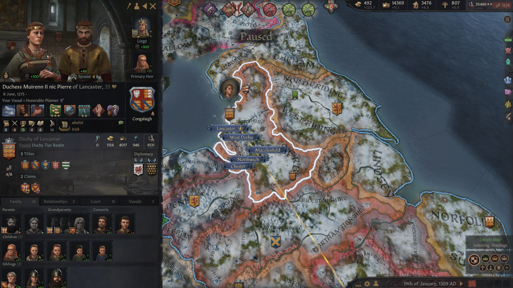 

- **Duchess [Mael-Muire Gormflaithdohtor](../p/mael-muire_gormflaithdohtor_1268.md) of East Seaxe**, was also **Countess of Bedanford, Middle Seaxe, East Seaxe, Herutford**. Her main vassal was
- **Earl [Aethelberht Tailefhlaithson](../p/aethelberht_tailefhlaithson_1274.md) of Buccingahamm**, house **Got**

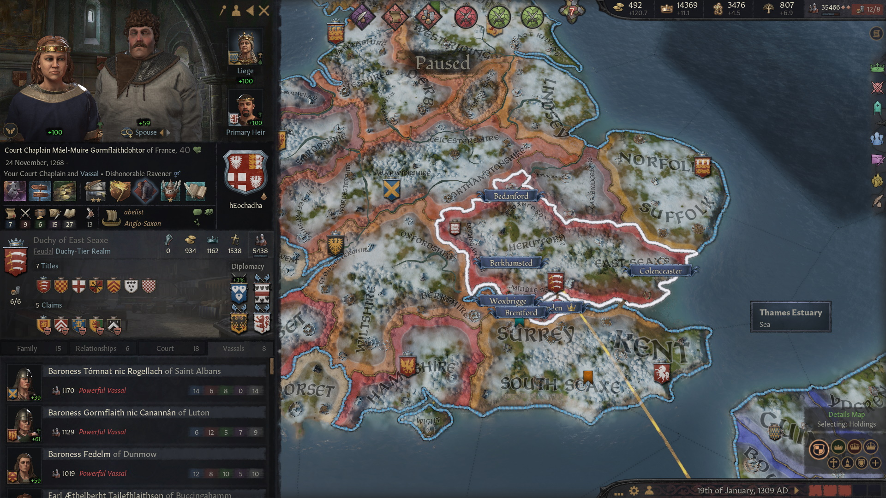 

**Duchess [Ermessinde](../p/ermessinde_1264.md) of East Anglia**, also **Duchess of Northumbria**, **Countess of Norfolk, Suffolk, Cumberland**. Her vassals were:

- **Earl [Eysteinn Lethlobursson](../p/eysteinn_lethlobursson_1271.md) of Northumberland and Durham**, from the house **Braghde**
- **Earl [Kjartan](../p/kjartan_1274.md) of Angus**, from the house **Braghde**

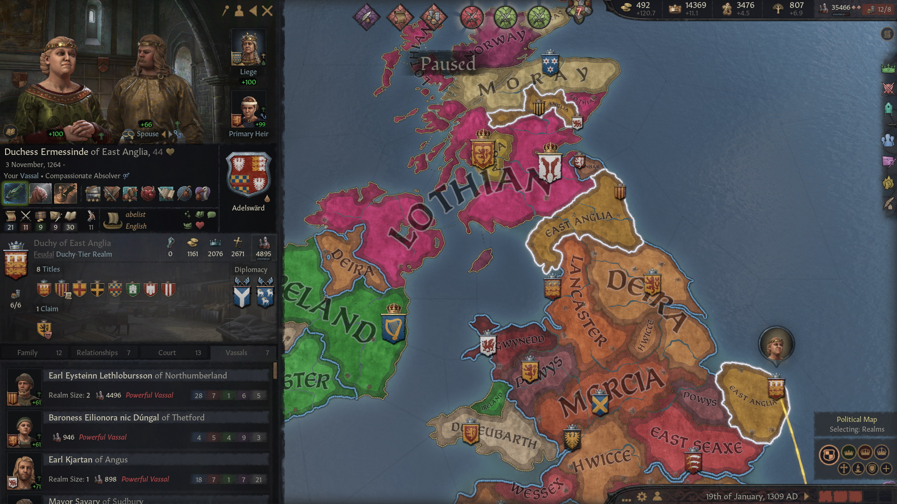

**Duchess [Slaine Eithnedohtor](../p/slaine_eithnedohtor_1268.md) of Powys** was also **Lady of Cambridgeshire, Huntingdonshire, Penllyn, Shropshire and Ferlix** and had no notable vassals.

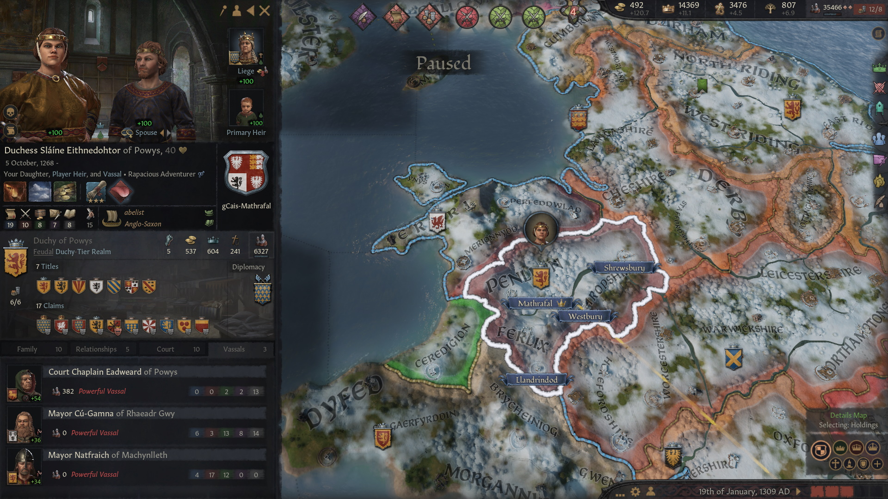

**Duchess [Gruoch nic Glenn](../p/gruoch_nic_glenn_1273.md) of Munster** was also **Countess of Desmond, Thomond, Ormond**.

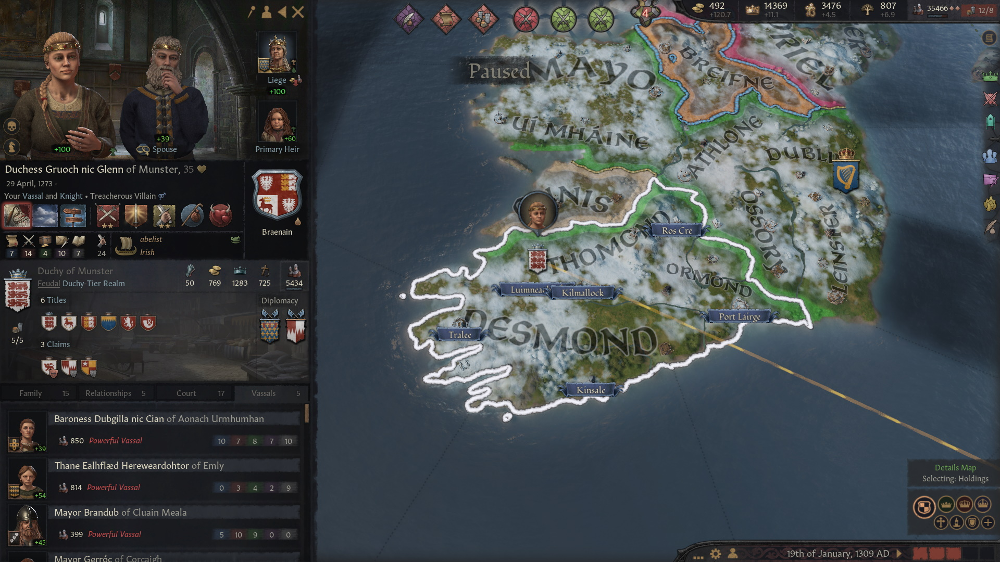

[**Duchess Ylva Drifadohtor of Mercia**](../p/ylva_drifadohtor_1261.md) was also **Countess of Northamptonshire, Warwickshire, Leicestershire**. Her main vassals were 
- **Countess [Aethelburg Giseledohtor](../p/aethelburg_giseledohtor_1283.md) of Worcestershire**
- **Earl [Coscrach Wulfwynnson](../p/coscrach_wulfwynnson_1290.md) of Herefordshire** from the house **Llewellyn**

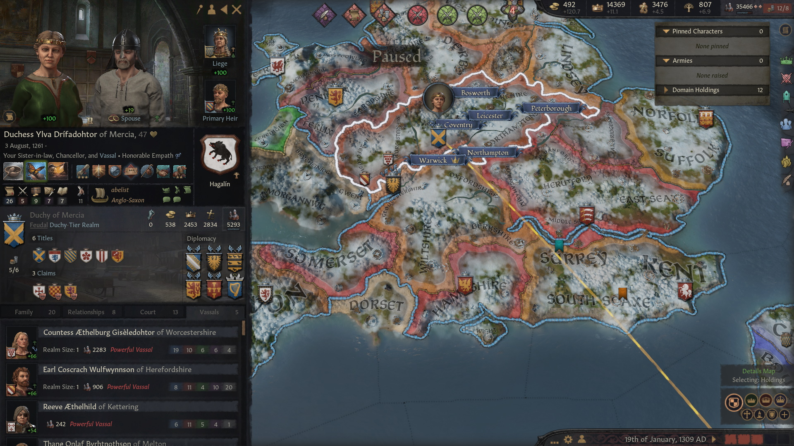 

**Duke [Hlothere Muirennson](../p/hlothere_muirennson_1278.md) of Kent** was also **Earl of Eu, Kent, Surrey**. His main vassal was 
- **Countess [Wulfgifu Ermessindedohtor](../p/wulfgifu_ermessindedohtor_1282.md) of South Seaxe**

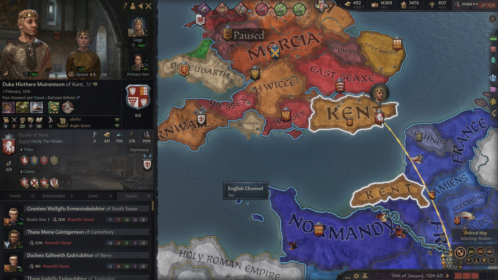 

**Duke [Eadbald Mael-Muireson](../p/eadbald_mael-muireson_1286.md) of Poitou** was also **Earl of Montaigu, Thouars and Poitiers**. His main vassal was 

- **Countess [Beorhtwynn](../p/beorhtwynn_1265.md) of Lusignan**, from the house **Dall**

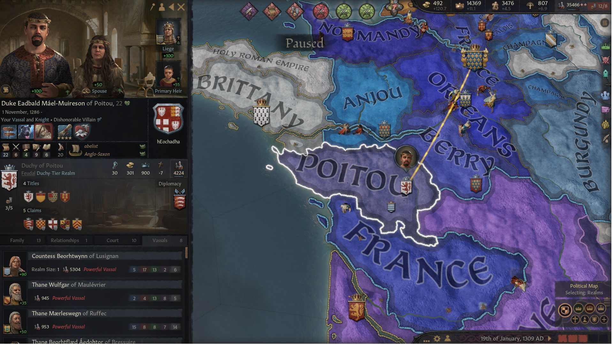 

**Duke [Brian Airmedachson](../p/brian_airmedachson_1281.md) of Burgundy**, also **Earl of Tonnerrois, Troyes, Auxerre and Dijon**, had following vassals.

- **Countess [Eithne Slainedohtor](../p/eithne_slainedohtor_1285.md) of Chalon**, **gCais-Mathrafal**, daughter of Duchess [Slaine Eithnedohtor](../p/slaine_eithnedohtor_1268.md)
- **Earl [Aelfstan Aedson](../p/aelfstan_aedson_1279.md) of Macon**, **Got**, a descendant of **King Caindelban I**
- **Countess [Aelfthryth](../p/aelfthryth_1275.md) of Nevers**, **Hayles** 
- **Countess [Wulfrun](../p/wulfrun_1282.md)) of Avalosi**, **Pudsey** 

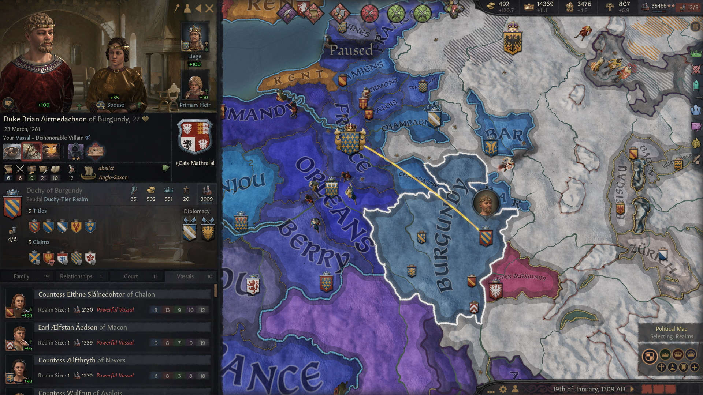

**Duke [Inwaer Stephaniason](../p/inwaer_stephaniason_1295.md) of Wessex** was also **Earl of Hampshire, Somerset**. His main vassal was his brother **Earl [Scule Stephaniason](../p/scule_stephaniason_1302.md) of Wight** 
 
 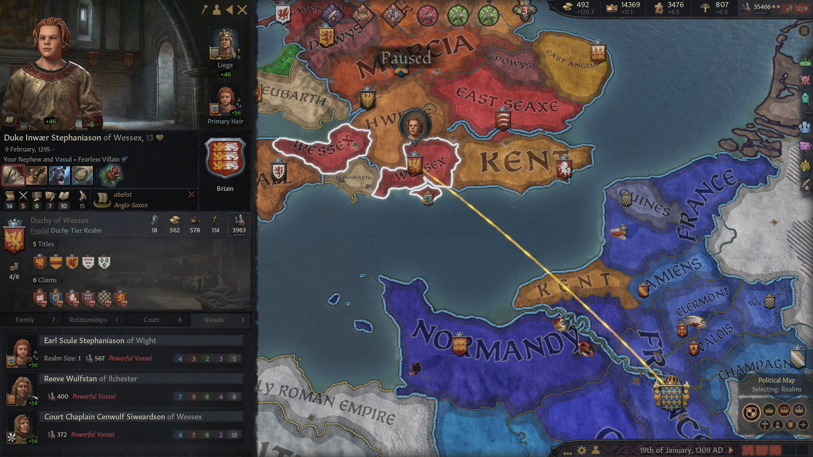

**Duke [Wulfgar](../p/wulfgar_1282.md) of Berry** was also **Earl of Blois, Berry**. His notable vassal was **Count [Comgan mag Aine](../p/comgan_mag_aine_1302.md) of Issoudun** from the house **gCais-Berkhamsted**, a descendant of **King Faelan**