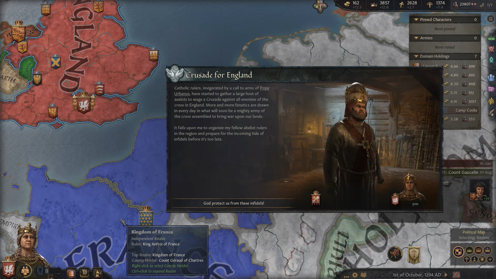
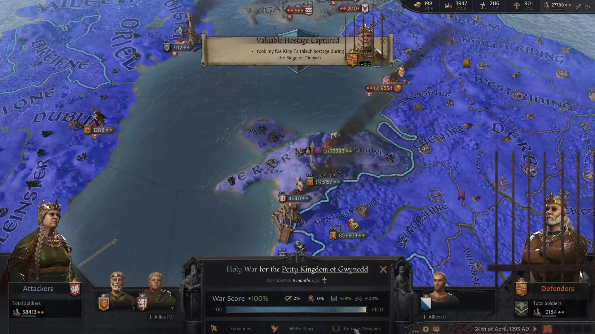
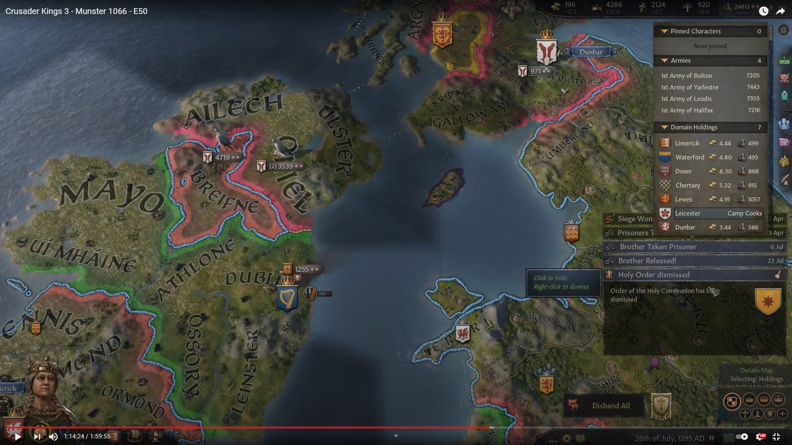
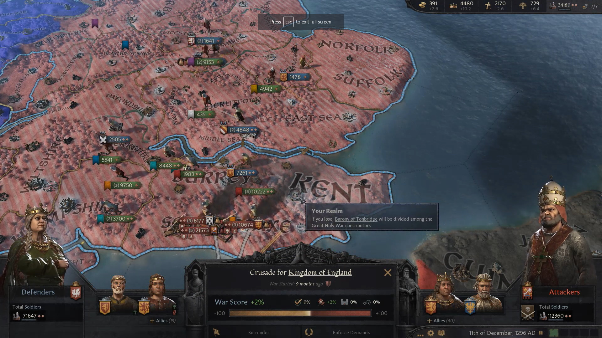
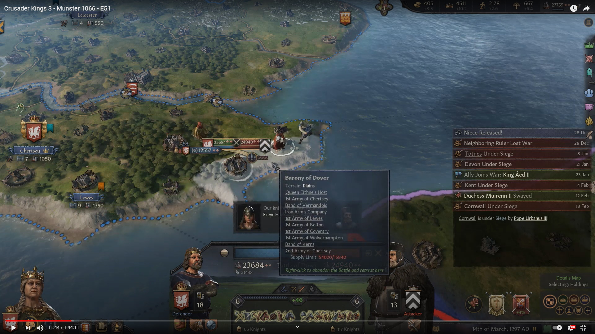
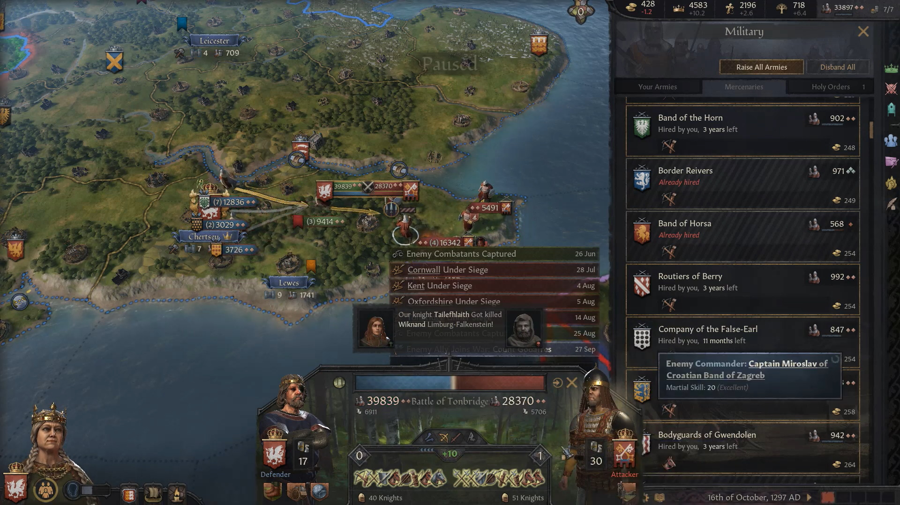
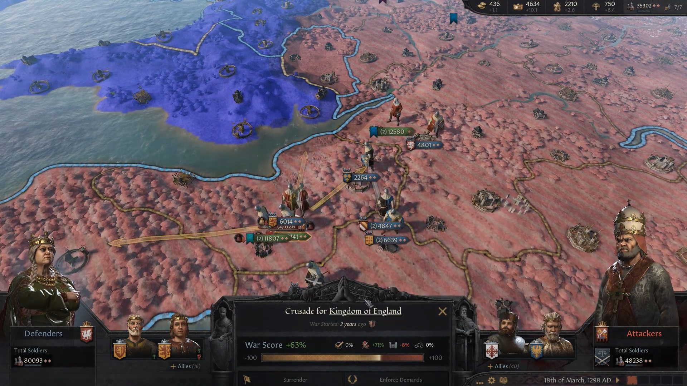
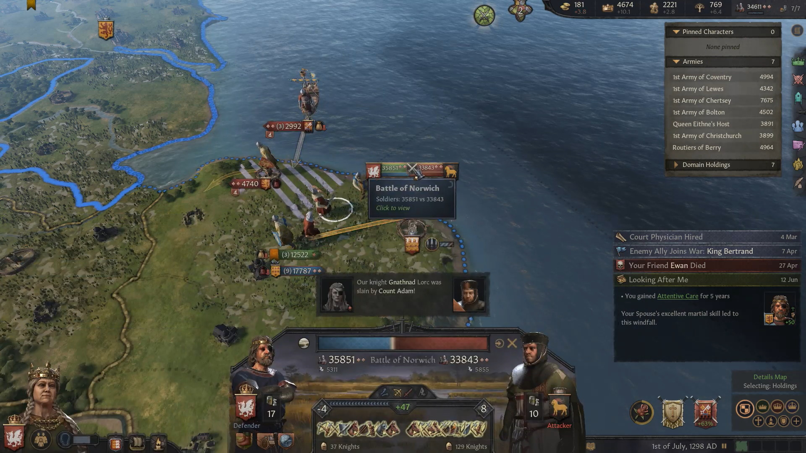
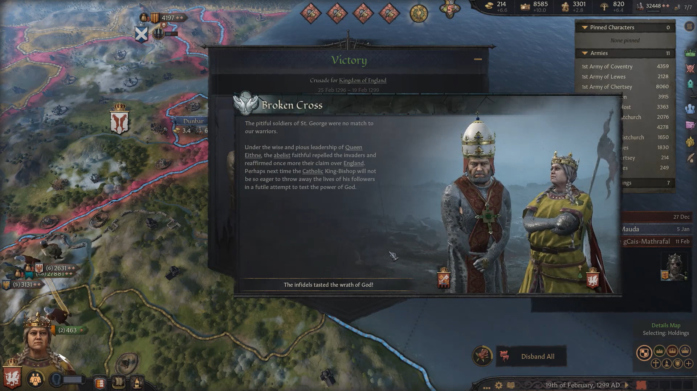
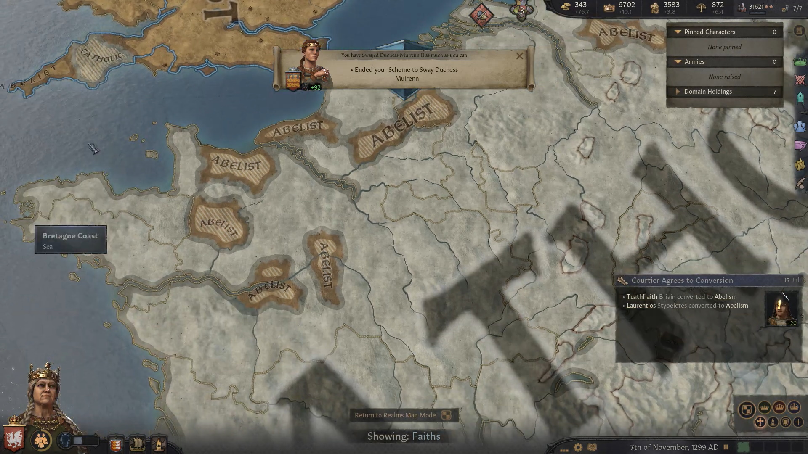

It was expected, but still it was a shock when it came around. In September 1294, the Pope declared a crusade for the reconquest of England from the Abelist heretics.

 

Now, however, things could go the other way. **Queen  [Eithne](../p/eithne_nic_baethine_1238.md) of England** used the time it was left until the crusade to bring Wales into the Abelist fold. In April 1295, **Gwynedd** had been reconquered from **King [Taithlech mac Senchan](../p/taithlech_mac_senchan_1243.md)** and rulers were replaced with faithful Abelists.

 

Right after that, in July 1295, there was also a major setback for the Abelist coalition. **Queen  [Eithne](../p/eithne_nic_baethine_1238.md)**'s brother, **King [Maccus](../p/maccus_baethineson_1273.md) of Ireland**, lost a holy war against the **Kingdom of Lothian**, which grabbed **the Duchy of Ulster**.

By 1296, the crusade was in full swing. The Catholic infidels had managed to gather over 110k troops, while Abelists forces were little more than 70k soldiers. However, Abelists had the advantage of defending an island against separate armies that would end up fighting separateley, and an overall better command.  

More often than not, Abelists may have been somewhat outnumbered, but still got a lot of advantages, being able to fight as defenders against badly supplied troops, who might even have just disembarked. Such was the case in the battle in Dover. 

Other major engagements were fought in Tonbridge.

By March 1298, after a couple of other major engagements, Catholic forces had been grounded down to 48k soldiers, against 80k Abelist troops. There didn't seem to be any doubt as to who would win eventually.

Anoher major decisive battle was fought and won by Abelists in Norwich in July 1298.

Inevitably, after a few other battles, the soldiers of St' George had to concede defeat. England and the Abelist faith had won their first crusade ! 

In the following years Queen Eithnie dealt with the consequences of the crusade. A good side effect were the many prisoners that she could ransom, force-convert and/or recruit. 
One might think that she would be satisfied with her accomplishments. However, in 1299 she got wind that the Abelist faith was spreading among people in France and on the continent. This is something that could not be ignored.

