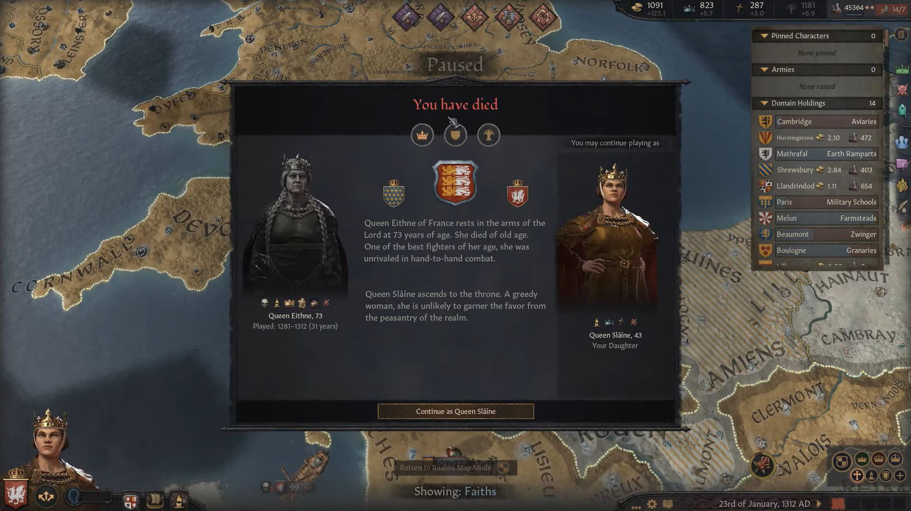
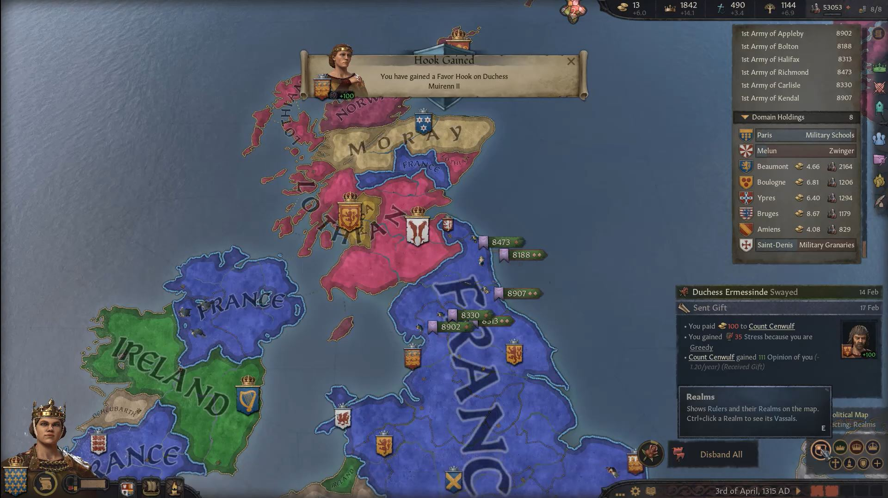
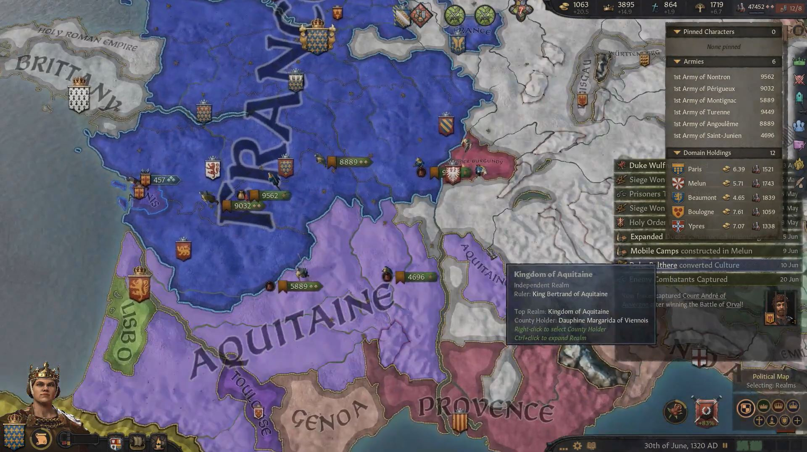
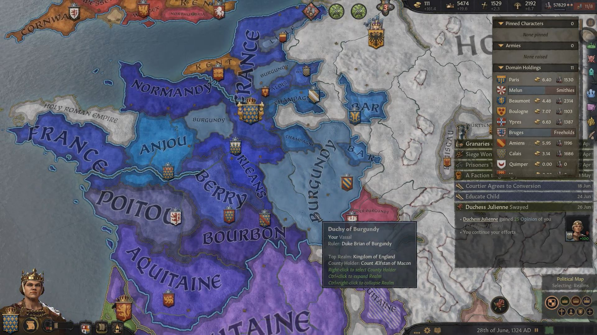

**Queen [Eithne](../p/eithne_nic_baethine_1238.md) of England** was busy consolidating her reign until 1312, when she suddenly died and was succeed by her daughter **Queen [Slaine](../p/slaine_eithnedohtor_1268.md)**.

 

 During her first years she was busy reorganizing her reign, to make sure she didn't have adminisration penalties.

In 1313, however, she declared war to **King Hamish of Lothian** over **Duchess Muirenn II**'s claim to the **Petty Kingdom of Ulster**. After her victory in 1315, Ulster became part of France.

In 1317, Queen Slaine declared a religious war on **King Bertrand of Aquitaine** over the **Duchy of Bourbon**. By 1320, the Aquitanian armies were defeated and Bourbon became part of France.

In 1322, **Queen Slaine** was called to war by her independent ally **Duke Udo of Friuli** over the **Grand City of Veneto**. It was't a war that required much support from France, therefore in 1323 she declared a holy war to **Queen Glouimed verch Treveur of Brittany** over her **Petty Kingdom of Brittany**. By 1324, France had won the war and acquired those territories as well.

Shortly after that, **Slaine** was able to declare herself **Empress of France**. In 1325, she was able to recover the **Earldom of Gwent** for her vassal **Countess Cobflaith** from **Petty Queen Selblaith nic Mauda of Deheubarth**. Then, in 1326, a holy war against **King Bertrand of Aquitaine** over the **Duchy of Auvergne** was declared , which was concluded with a victory in 1328.

