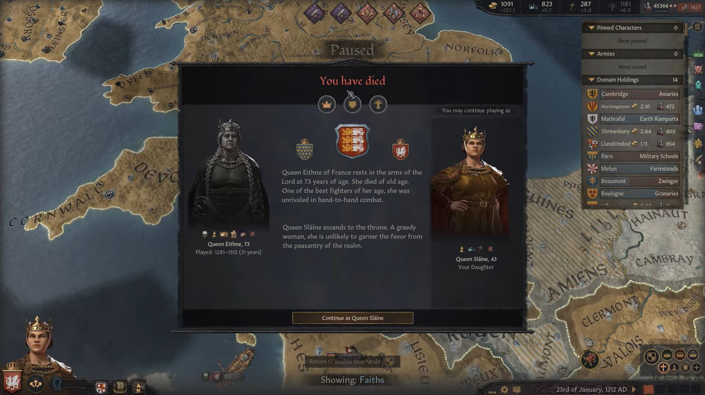
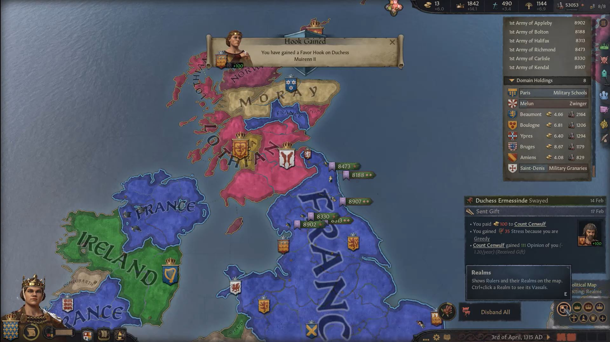
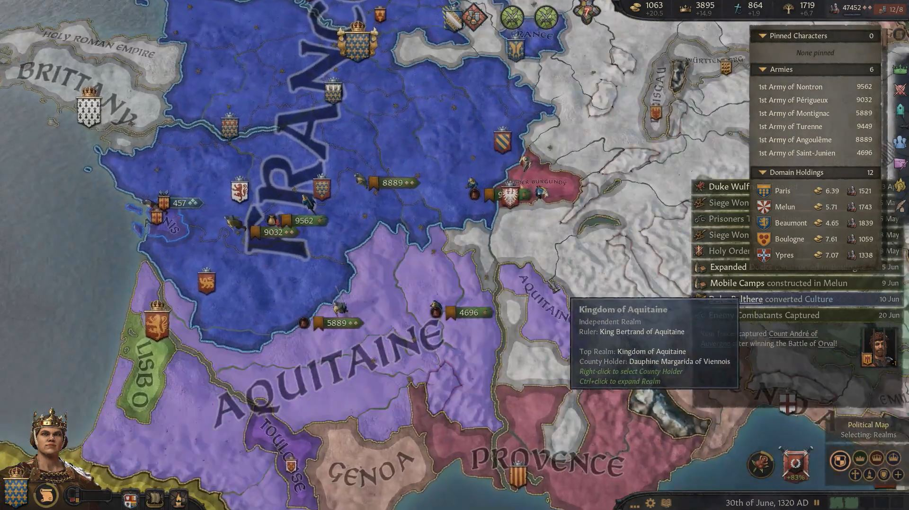
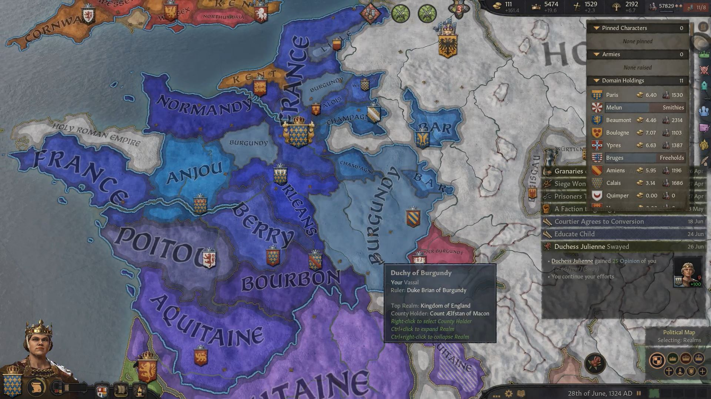
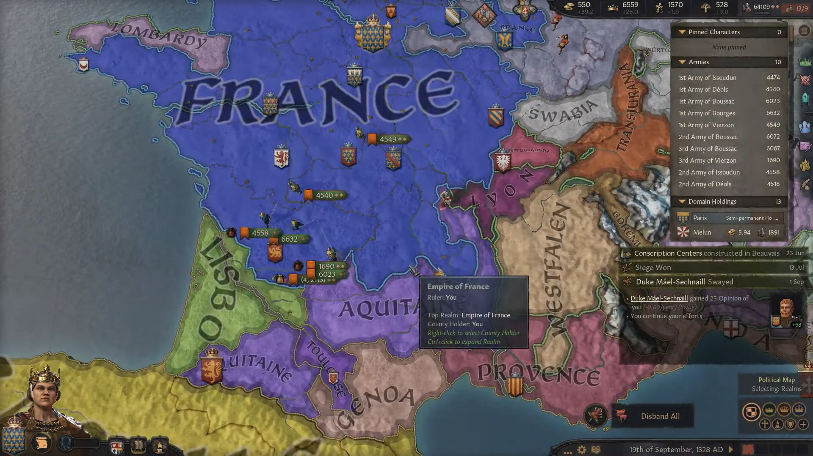
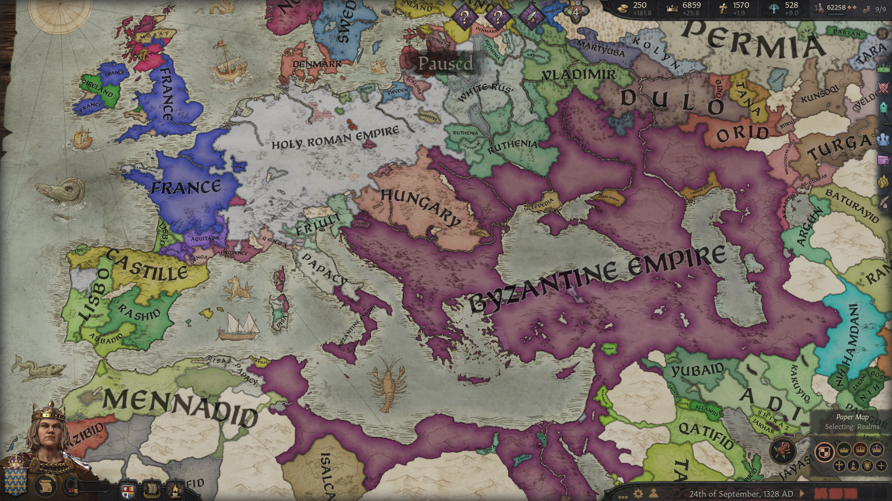
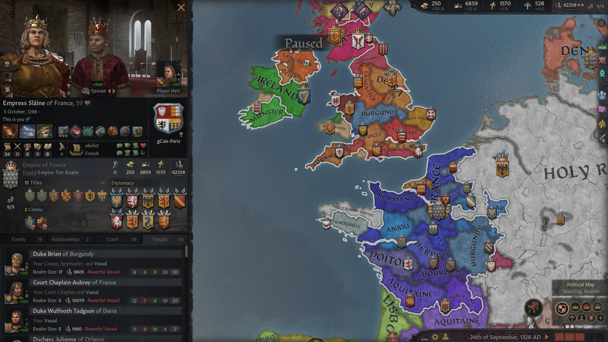

**Queen [Eithne](../p/eithne_nic_baethine_1238.md) of England** was busy consolidating her reign until 1312, when she suddenly died and was succeed by her daughter **Queen [Slaine](../p/slaine_eithnedohtor_1268.md)**.

 

 During her first years she was busy reorganizing her reign, to make sure she didn't have adminisration penalties.

In 1313, however, she declared war to **King Hamish of Lothian** over **Duchess Muirenn II**'s claim to the **Petty Kingdom of Ulster**. After her victory in 1315, Ulster became part of France.

In 1317, Queen Slaine declared a religious war on **King Bertrand of Aquitaine** over the **Duchy of Bourbon**. By 1320, the Aquitanian armies were defeated and Bourbon became part of France.

In 1322, **Queen Slaine** was called to war by her independent ally **Duke Udo of Friuli** over the **Grand City of Veneto**. It was't a war that required much support from France, therefore in 1323 she declared a holy war to **Queen Glouimed verch Treveur of Brittany** over her **Petty Kingdom of Brittany**. By 1324, France had won the war and acquired those territories as well.

Shortly after that, d**Slaine** was able to declare herself **Empress of France**. In 1325, she was able to recover the **Earldom of Gwent** for her vassal **Countess Cobflaith** from **Petty Queen Selblaith nic Mauda of Deheubarth**. Then, in 1326, a holy war against **King Bertrand of Aquitaine** over the **Duchy of Auvergne** was declared , which was concluded with a victory in 1328.

In September 1328, the **Empire of France** was one of the most powerful realms in Europe.

 **Empress  [Slaine](../p/slaine_eithnedohtor_1268.md)** from the house **gCais-Paris** was **Queen of France, England, Wales**; **Duchess of Valois** and **Flanders**; **Countess of Ile de France, Brie Francaise, Beaumont, Boulogne, Yperen, Brugge, Amiens, Guines** and **Bishop of Beauvais**. 

Her main vassals were:

* her cousin and spymaster **[Duke Brian of Burgundy](../p/brian_airmedachson_1281.md)** of **gCais-Mathrafal**
* her court chaplain **[Duke Aubrey of Hwicce](../p/aubrey_1274.md)**, son of **[Duke Scellan](../p/scellan_1255.md)**, a descendant of **[King Caindelban I](../p/caindelban_i_mac_faelan_1114.md)** through his daughter **[Aibilin](../p/aibilin_mac_caindelban_1135)**, from the house **gCais-Sherwood**
* **[Duke Wulfnoth Tadgson of Deira](../p/wulfnoth_tagdson_1290.md)**, son of **[Duke Tagd](../p/tadg_barrdubson_1257.md)**, a descendant of **[King Caindelban I](../p/caindelban_i_mac_faelan_1114.md)** 's son **[Prince Dinertach](../p/dinertach_mac_caindelban_1141.md)**, from the house **Got**
* **[Duchess Julienne of Orleans](../p/julienne_1268.md)** from the house **Antoing**, daughter of **[Duke Mathieu](../p/mathieu_1251.md)**
* **[Duchess Gruoch nic Glenn of Munster](../p/gruoch_nic_glenn_1273.md)**, a descendant of **[King Caindelban II](../p/caindelban_ii_mac_caindelban_1147.md)**
* Duke Mael-Sechnaill of Lancaster, a son of **[Duchess Muirenn II](../p/muirenn_ii_nic_pierre_1275.md)**
* Duchess Alienora of Normandy
* Duchess Mael-Muire Gormflaithdohtor of East Seaxe
* Duke Hlothere Muirennson of Kent
* Duke Fuacarta of Anjou
* Duke Eadbald of Poitou
* Duke Beorhtnoth Wihtburhson of Northumbria
* Duke Wulfgar of Berry
* Duke Inwaer Stephaniason of Wessex
* Duke Balthere of Champagne
* Duke Cathassach of Aquitaine
* Duchess Cathan ferch Cathan of Gwynedd
* Duchess Aelfthryth of Bourbon
* Duke Natfraich of Bar
* Duchess Ceolflaed Wihtburhdohtor of East Anglia
* Countess Aethelflaed of Cornouaille
* Countess Coblaith of Vermandois
* Earl Copsige of Lille
* Duchess Ealhswith ferch Mawd of Powys
* Duke Alan of Guoladat
* Duke Erc mac Cathan of Cornwall
* Duchess Morag of Hwicce
* Earl Cenwulf Cenwulfson of Valois 
* Duchess Coblaith of Auvergne 

 
