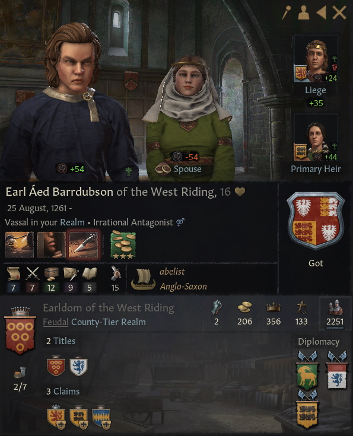

# Earl Aed Barrdubson of West Riding, 1261-, Got

## FAMILY TREE
```
Earl Aed Barrdubson of West Riding, 1261-, Got 
    Thane Cainchomrac, 1231-     
        Aed Got, 1202-1263
            Dimmasach Got, 1173-1243
                Prince Dinertach, 1141-1210
                Hawise Normandie-Bedford, 1141-1213
            Narbflaith Briain, 1173-1242
                Aed Briain, 1142-1207
                Ciar gCais-Cruachu, 1148-1222
        Tailefhlaith Got, 1207-1273
            Flann Got, 1188-1252
                Cu-Bretan Got, 1161-1232
                Duchess Ida, 1162-1230
            Rois gCais-Gabhran, 1188-1255
                Finnacan gCais-Gabhran, 1161-1244
                Velasquita de Niebla, 1160-1224
    Duchess Barrdub, 1228-1270
        Earl Eoganan, 1193-1260
            Earl Ailpin, 1158-1222
                Earl Cormac, 1133-1197
                Countess Mael-Muire, 1125-1195
            Ellbrig Briain, 1155-1223
                Earl Aelfmaer, 1128-1167
                Aileann Briain, 1128-1184
        Countess Sioban, 1191-1255
            Briccene gCais-Padraig, 1158-1209
                Duke Conmal, 1122-1188
                Duchess Prawst, 1117-1188
            Muirenn gCais-Cruachu, 1159-1215
                Gilla-Ruad gCais-Cruachu, 1142-1204
                Sybilla de Beaumont, 1130-1203 
```

# REFERENCES

## ANCESTORS
* [Earl Cormac mac Bruatur of Breifne, 1133-1197, gCais-Inis](cormac_mac_bruatur_1133.md)
* [Duke Conmal mac Faelan of Ulster, 1122-1188, Briain](conmal_mac_faelan_1122.md)
* [Prince Finnacan mac Caindelban of Ireland, 1161-1224, gCais-Gabhran](finnacan_mac_caindelban_1161.md)
* [Earl Ailpin mac Mael-Muire of Briefne, 1158-1222, gCais-Inis](ailpin_mac_mael-muire_1158.md)
* [Ellbrig nig Aileann, 1155-1223, Briain](ellbrig_nig_aileann_1155.md)
* [Cu-Bretan mac Dinertach, 1161-1232, Got](cu-bretan_mac_dinertach_1161.md)
* [Aed mac Narbflaith, 1202-1263, Got](aed_mac_narbflaith_1202.md)
* [Dimmasach mac Dinertach, 1173-1243, Got](dimmasach_mac_dinertach_1173.md)
* [Ciar nic Fiachnae, 1148-1222, gCais-Cruachu](ciar_nic_fiachnae_1148.md)
* [Gilla-Ruad mac Fiachnae, 1142-1204, gCais-Cruachu](gilla-ruad_mac_fiachnae_1142.md)
* [Aed mag Ite, 1142-1207, Briain](aed_mag_ite_1142.md)
* [Prince Dinertach mac Caindelban of Ireland, 1141-1210, Briain](dinertach_mac_caindelban_1141.md)
* [Countess Mael-Muire nig Ailpin of Briefne, 1125-1195, gCais-Fathain](mael-muire_nig_ailpin_1125.md)
* [Earl Aelfmaer mag Osraed of Ui Mhaine, 1128-1167, Hayles](aelfmaer_mag_osraed_1128.md)
* [Briccene mac Conmal, 1158-1209, gCais-Padraig](briccene_mac_conmal_1158.md)
* [Aileann nic Cobflaith, 1128-1184, Briain](aileann_nic_cobflaith_1128.md)

## DESCENDANTS

## RELATIVES

##### END RELATIVES 
## HISTORY
* [1278.md](../h/1278.md)

#### END REFERENCES

# PORTRAITS

## 1278


#### END PORTRAITS

