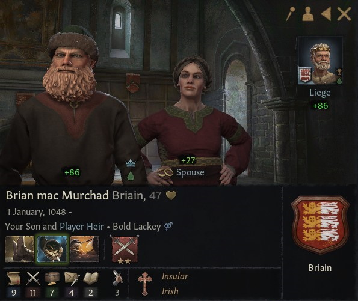
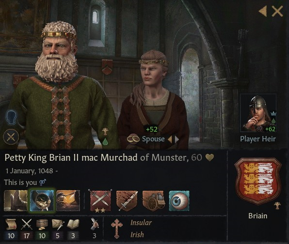

# Brian mac Murchad Briain

### 1095

## LIFE

01.01.1048-

## HOUSE

Briain

## DINASTY

Briain

## TITLES 

- Petty Kingdom of Munster (24.06.1095 - inherited)
- Earldom of Thomond (24.06.1095- inherited)
- Earldom of Ennis (24.06.1095 - inherited)
- Earldom of Ossory (24.06.1095 - inherited)
- Petty Kingdom of Ulster (03.12.1098 - conquered by claimant)

## VASSALS

- Earl Olav mac Ragnvald of Ormond (30.09.1079 - inherited )
- Earl Flaitherbach mac Domnall of Oriel (11.03.1098 - inherited)
- Earl Donnchad mac Murchad of Ailech (24.06.1095 - revoked)
- Earl Aed mac Domnall of Breifne (11.03.1098 - inherited)
- Earl Enguerrand mac Murchad of Enis (24.06.1095 - inherited)

## GRANDPARENTS

- Donnchad mac Brian Briain
- ?
- ?
- ?

## SPOUSES

- Hunydd ferch Bleddyn Mathrafal
- Fine
- Lasairfiona
- Dub-Dil

## CHILDREN

- Cathan nic Brian Briain
- Faelan mac Brian Briain
- Lasairfiona mac Brian Briain
- Sean mac Brian Briain

## OTHER PHOTOS

### 1108

