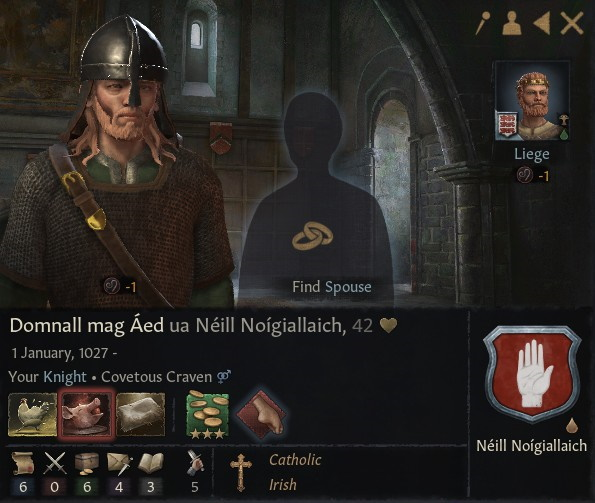
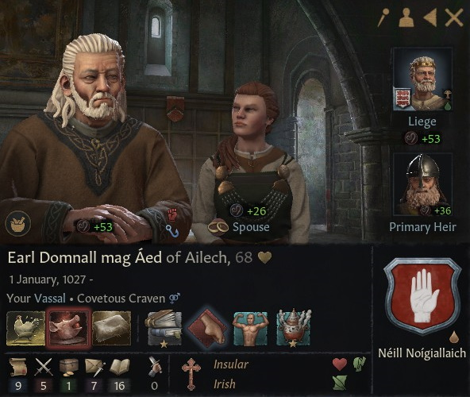

# Earl Domnall mag Aed of Ailech

## LIFE

01.01.1027-

## HOUSE

Neill Noigiallaich		

## DINASTY

Cetchathach

## TITLES 

- Earldom of Ailech (9.8.1074- conquered by claimant)
- Earldom of Oriel (10.1.1077 - conquered by claimant)
- Earldom of Breifne (28.8.1090 - conquered by claimant)

## PARENTS

- Earl Aed mac Flaithbertach of Oriel
- ?

## GRANDPARENTS

- Earl Flaithbertach mac Muirchertach of Oriel
- Bebinn nic Brian Briain
- ?
- ?

- ## CHILDREN

- Flaitbertach mac Domnall ua Neill Noigiallaich
- Garb nic Domnall ua Neill Noigiallaich
- Mael-Mide nic Domnall ua Neill Noigiallaich
- Aed mac Domnall ua Neill Noigiallaich

## PHOTOS

1069

1095

