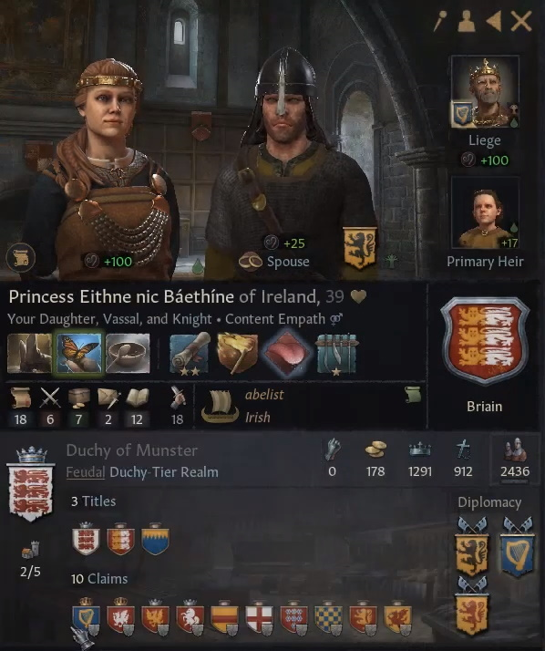

# Princess Eithne nic Baethine of England, 1238-, Briain

## FAMILY TREE
```
Princess Eithne nic Baethine of England, 1238-, Briain
    King Baethine, 1205-1281, Briain
        Dubh Briain, 1183-1234
            Somhairle Briain, 1158-1223
                Duke Aengus I, 1123-1190
                Duchess Rhiandrech, 1116-1187
            Heulwen Ynys Cybi, 1158-1208
                Duke Owain II, 1139-1166
                Agata de Lacon, 1137-1207
        Catriona of Carrick, 1187-1215
            King Conall II, 1155-1215
                Fingal of Carrick, 1137-1192
                Ennoguent de Rennes, 1135-1198
            Philippa Sigurdr-Lindisfarne, 1153-1221
                Ralph Sigurdr-Lindisfarne, 1136-1159
                Catriona Dunkeld-Dunbar,1136-1206
    Martha Kyle, 1210-, Kyle
        Prince Ewan, 1178-1216
            King Andrew, 1113-1188
                King Uisdean, 1085-1145
                Raymonde Capet, 1085-1153
            Princess Elin, 1158-1222
                King Toke, 1129-1182
                Sofia Andreievich, 1128-1194
        Gudrun av Rost, 1174-1228
            Grettir av Rost, 1157-1213
                John av Rost, 1124-1160
                Gunhild Tre Rutor, 1134-1188
            Martha Cetchatach-Banff, 1156-1219
                Mormaer Lugaed, 1121-1156   
                Countess Saerlaith, 1118-1160
```

# REFERENCES

## ANCESTORS
* [Somhairle mag Aengus, 1158-1223, Briain](somhairle_mag_aengus_1158.md)
* [King Baethine Dubhson of England, 1205-1281, Briain](baethine_dubhson_1205.md)
* [Duke Aengus I mac Cobflaith of Meath, 1123-1190, Briain](aengus_i_mac_cobflaith_1123.md)
* [Martha Kyle, 1210-1279, Kyle](martha_kyle_1210.md)
* [Dubh mac Somhairle, 1183-1234, Briain](dubh_mac_somhairle_1183.md)

## DESCENDANTS

## RELATIVES

##### END RELATIVES 
## HISTORY
* [1278.md](../h/1278.md)
* [1294.md](../h/1294.md)

#### END REFERENCES

# PORTRAITS

## 1278


#### END PORTRAITS

