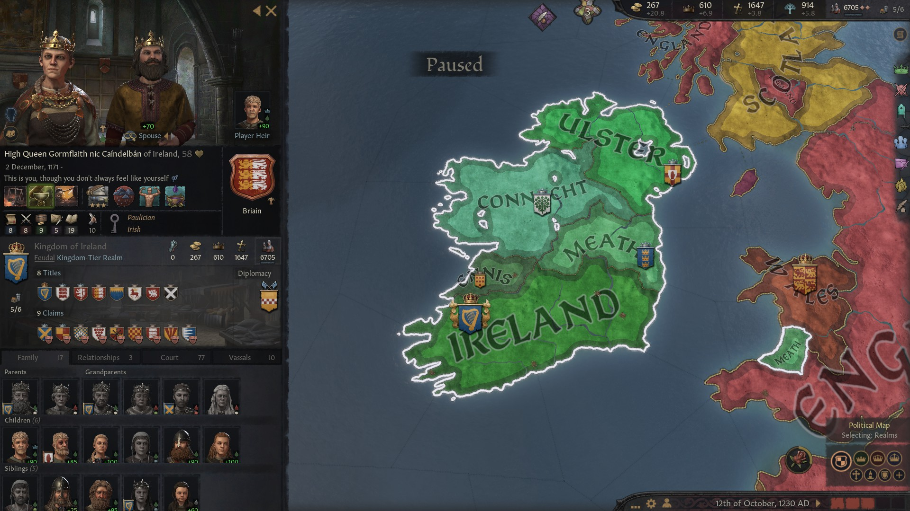

# High Queen Gormflaith nic Caindelban of Ireland, 1171-1253, Briain

## FAMILY TREE 
```
High Queen Gormflaith nic Caindelban of Ireland, 1171-1253, Briain
    High King Caindelban II, 1147-1227
        High King Caindelban I, 1114-1186
            High King Faelan, 1084-1136
                High King Brian II, 1048-1111
                Hunydd Mathrafal, 1042-1099
            Elisabet Crovan, 1083-1148
                Duke Gudrod, 1049-1115
                Princess Ragnhild, 1045-1110
        High Queen Flann, 1117-1172
            Domnall ua Neill Noigiallaich, 1069-1120
                Earl Flaithbertach, 1045-1110
                Flann, 1037-1111
            Rois Neill, 1071-1145
                Domnall Neill, 1030-1077
                Eua, 1040-1090
    High Queen Constance, 1144-1209
        Prince Randolph I, 1108-1149
            King Richard, 1055-1113
                King William, 1027-1092
                Mathilde van Vlaanderen, 1032-1095
            Duchess Octreda, 1091-1108
                Duke Eadwin, 1044-1106
                Mor Dunkeld, 1073-1125
        Lerthan Crovan, 1108-1169
            Dimmasach Crovan, 1074-1116
                Domnall Crovan, 1053-1117
                Maria Yngling, 1047-1101
            Duchess Sybilla, 1081-1115
                Duke Morcar, 1046-1084
                Duchess Gwenllian, 1042-1103
        
```

## HISTORY

### [1249](../h/1249.md)




# REFERENCES

## ANCESTORS
* [High King Brian II mac Murchad of Munster, 1048-1111, Briain](brian_ii_mac_murchad_1048.md)
* [High King Caindelban I mac Faelan of Ireland, 1114-1186, Briain](caindelban_i_mac_faelan_1114.md)
* [High King Caindelban II mac Caindelban of Ireland, 1147-1227, Briain](caindelban_ii_mac_caindelban_1147.md)
* [High Queen Constance of Randolph of Ireland, 1144-1209, Normandie-Bedford](constance_randolph_1144.md)
* [Elisabet Gudrodsdatter, 1083-1148, Crovan](elisabet_gudrodsdatter_1083.md)
* [High King Faelan mac Brian of Ireland, 1084-1136, Briain](faelan_mac_brian_1084.md)
* [Hunydd ferch Bleddyn, 1042-1099, Mathrafal](hunydd_ferch_bleddyn_1042.md)

## DESCENDANTS
* [King Abel mac Gormflaith of Ireland, 1190-1269, Briain](abel_mac_gormflaith_1190.md)
* [Lord Aindle mac Cuan of Brycheiniog, 1242-1268, Briain](aindle_mac_cuan_1242.md)
* [Duke Beorhtric Muirennson of Leinster, 1265-, Briain](beorhtric_muirennson_1265.md)
* [Duke Buaidbeo mac Cuan of Essex, 1247-, Briain](buaidbeo_mac_cuan_1247.md)
* [Princess Caintigern Abeldohtor of Ireland, 1215-1279, Briain](caintigern_abeldohtor_1215.md)
* [Princess Cathalan mag Abel of Ireland, 1220-1242, Briain](cathalan_mag_abel_1220.md)
* [Princess Cathan Abeldohtor of Ireland, 1218-1292, Briain](cathan_abeldohtor_1218.md)
* [Duchess Cathan Cathandohtor of Cornwall, 1247-, Briain](cathan_cathandohtor_1247.md)
* [Duke Cilline mac Failenn of Connacht, 1215-1282, Briain](cilline_mac_failenn_1215.md)
* [Lady Cnes nic Labraid of Ferlix, 1207-1283, Briain](cnes_nic_labraid_1207.md)
* [Lord Coilboth mag Etain of Brycheiniog, 1287-, Briain](coilboth_mag_etain_1287.md)
* [Duchess Cristina nic Cristina of Connacht, 1277-, gCais-Macclesfield](cristina_nic_cristina_1277.md)
* [Earl Cuan mac Cuan of Derby, 1245-, Briain](cuan_mac_cuan_1245.md)
* [Prince Cuan mac Gormflaith of Ireland, 1216-1249, Briain](cuan_mac_gormflaith_1216.md)
* [Earl Ernad Seonaidson of Warwickshire, 1245-, Briain](ernad_seonaidson_1245.md)
* [Lady Etain nig Aindle of Brycheniog, 1267-1290, Briain](etain_nig_aindle_1267.md)
* [Duke Ewan of East Anglia, 1232-1298, Briain](ewan_1232.md)
* [Princess Failenn nic Gormflaith of Ireland, 1193-1266, Briain](failenn_nic_gormflaith_1193.md)
* [Petty King Flaithgus mac Cuan of Deheubarth, 1236-1299, Briain](flaithgus_mac_cuan_1236.md)
* [Princess Gormflaith Abeldohtor of Ireland, 1211-1274, Briain](gormflaith_abeldohtor_1211.md)
* [Prince Labraid mac Gormflaith of Ireland, 1188-1257, Briain](labraid_mac_gormflaith_1188.md)
* [Earl Lethlobur mag Euginia of Northumberland, 1241-, Briain](lethlobur_mag_euginia_1241.md)
* [Duke Liam II of Northumbria, 1214-1271, Briain](liam_ii_1214.md)
* [Duchess Mael-Muire Gormflaithdohtor of East Seaxe, 1268-, hEochadha](mael-muire_gormflaithdohtor_1268.md)

## RELATIVES

##### END RELATIVES 
## HISTORY
* [1209.md](../h/1209.md)
* [1227.md](../h/1227.md)
* [1249.md](../h/1249.md)
* [1265.md](../h/1265.md)
* [1278.md](../h/1278.md)
* [1294.md](../h/1294.md)

#### END REFERENCES
