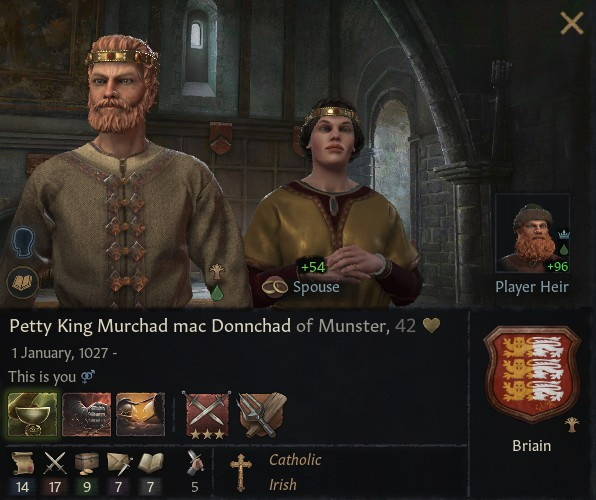
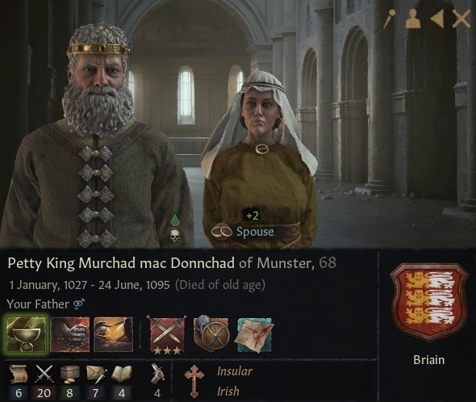

# Petty King Murchad mac Donnchad of Munster

## LIFE

01.01.1027-

## HOUSE

Briain

## DINASTY

Briain

## TITLES 

- Petty Kingdom of Munster (1063 - inherited)
- Earldom of Thomond (1063 - inherited)
- Earldom of Ennis (1063 - inherited)
- Earldom of Ossory (1083 - conquered by claimant)
- Petty Kingdom of Ulster (1094 - created)

## VASSALS

- Earl Domnall mag Aed of Ailech
- Earl Olav mac Ragnvald of Ormond

## PARENTS

- Donnchad mac Brian Briain
- ?

## GRANDPARENTS

- King Brian mac Cennetig of Ireland
- Gormflaith nic Murchad ua Faelain
- ?
- ?

- ## CHILDREN

- Petty King Briain II mac Murchad of Munster
- Petty King Donnchad mac Murchad of Ulster
- Earl Enguerrand mac Murchad of Ennis
- Ceithernach mac Murchad Briain

## PHOTOS

1069

1095

