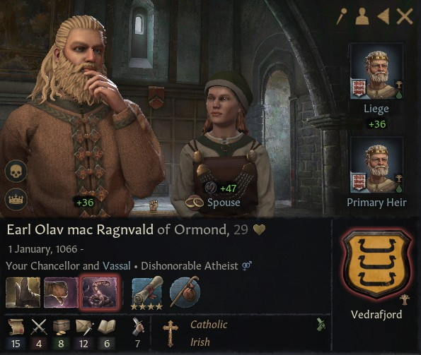

# Earl Olav mac Ragnvald of Ormond

## LIFE

01.01.1066 - HOUSE

Vedrafjord

## DINASTY

Vedrafjord

## LIEGE

[Petty King Murchad mac Donnchad of Munster](murchad_mac_donnchad_1027.md)

## TITLES 

- Earl of Ormond (30.09.1079 - inherited)
- Earldom of Desmond (22.07.1090 - conquered by claimant)

## PARENTS

- Earl Rangvald mac Sigtrygg of Ormond
- ?

## GRANDPARENTS

- Earl Sigtrygg Ivarsson of Ormond
- Ben-Muman nic Cu-Muman au Rubann
- ?
- ?

- ## CHILDREN

## PHOTOS

### 1095

