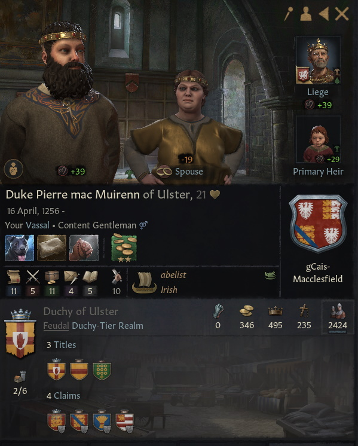

# Duke Pierre mac Muirenn of Ulster, 1256-, gCais-Macclesfield

## FAMILY TREE
```
Duke Pierre mac Muirenn of Ulster, 1256-, gCais-Macclesfield
    Duke Natfraich, 1224-12741274
        Laidine Got, 1200-1231
            Dimmasach Got, 1173-1243
                Prince Dinertach, 1141-1210
                Hawise Normandie-Bedford, 1141-1213
            Narbflaith Briain, 1173-1242
                Aed Briain, 1142-1207
                Ciar gCais-Cruachu, 1148-1222
        Aine Got, 1200-1268
            Morann Got, 1182-1250
                Cu-Bretan Got, 1161-1232
                Duchess Ida, 1162-1230
            Muirne gCais-Inis, 1183-1259
                Earl Ailpin, 1158-1222
                Ellbrig Briain, 1155-1223
    Duchess Morien, 1226-
        Rhun Caerloyw-Penfro, 1201-1258
            Rhufon Caerloyw-Penfro, 1179-1229
                Cynwrig Caerloyw-Penfro, 1157-1222
                Duchess Dubchoblaig, 1157-1179
            Annwyl Caerloyw-Tyddewi, 1171-1251
                Lord Iorwerth, 1129-1191
                Ffraid Caerloyw-Penfro, 1145-1208
        Cacht Briain, 1201-1255
            Loeguire Briain, 1182-1244
                High King Caindelban II, 1147-1227
                High Queen Constance, 1144-1209
            Morien LLewellyn, 1183-1251
                Duke Rian I, 1144-1211
                Duchess Finneacht, 1143-1205
```

# REFERENCES

## ANCESTORS
* [Cacht nic Morien, 1201-1255, Briain](cacht_nic_morien_1201.md)
* [High King Caindelban II mac Caindelban of Ireland, 1147-1227, Briain](caindelban_ii_mac_caindelban_1147.md)
* [High Queen Constance of Randolph of Ireland, 1144-1209, Normandie-Bedford](constance_randolph_1144.md)
* [Duchess Finneacht mac Fiachnae of Meath, 1143-1205, gCais-Cruachu](finneacht_mac_fiachnae_1143.md)
* [Duke Natfraich mag Aine of Ulster, 1224-1274, Got](natfraich_mag_aine_1224.md)
* [Laidine mac Narbflaith, 1200-1231, Got](laidine_mac_narbflaith_1200.md)
* [Earl Ailpin mac Mael-Muire of Briefne, 1158-1222, gCais-Inis](ailpin_mac_mael-muire_1158.md)
* [Ellbrig nig Aileann, 1155-1223, Briain](ellbrig_nig_aileann_1155.md)
* [Cu-Bretan mac Dinertach, 1161-1232, Got](cu-bretan_mac_dinertach_1161.md)
* [Morien nic Finneacht, 1183-1251, LLewellyn](morien_nic_finneacht_1183.md)
* [Dimmasach mac Dinertach, 1173-1243, Got](dimmasach_mac_dinertach_1173.md)
* [Ciar nic Fiachnae, 1148-1222, gCais-Cruachu](ciar_nic_fiachnae_1148.md)
* [Prince Loeguire mac Caindelban of Ireland, 1182-1244, Briain](loeguire_mac_caindelban_1182.md)
* [Aed mag Ite, 1142-1207, Briain](aed_mag_ite_1142.md)
* [Prince Dinertach mac Caindelban of Ireland, 1141-1210, Briain](dinertach_mac_caindelban_1141.md)
* [Lord Iorwerth ap Gwenllian of Morgannwg, 1129-1191, Caerloyw-Tyddewi](iorwerth_ap_gwenllian_1129.md)
* [Duke Rian I ab Aengus of Meath, 1144-1211, LLewellyn](rian_i_ab_aengus_1144.md)
* [Cynwrig ap Rhufon, 1157-1222, Caerloyw-Penfro](cynwrig_ap_rhufon_1157.md)
* [Duchess Morien of Lancaster, 1226-, gClais-Macclesfield](morien_1226.md)

## DESCENDANTS

## RELATIVES

##### END RELATIVES 
## HISTORY
* [1278.md](../h/1278.md)

#### END REFERENCES

# PORTRAITS

## 1278


#### END PORTRAITS

