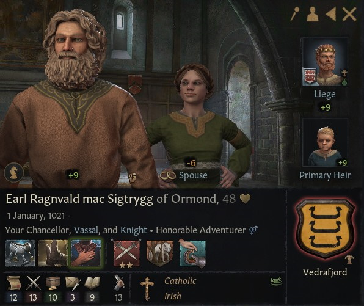
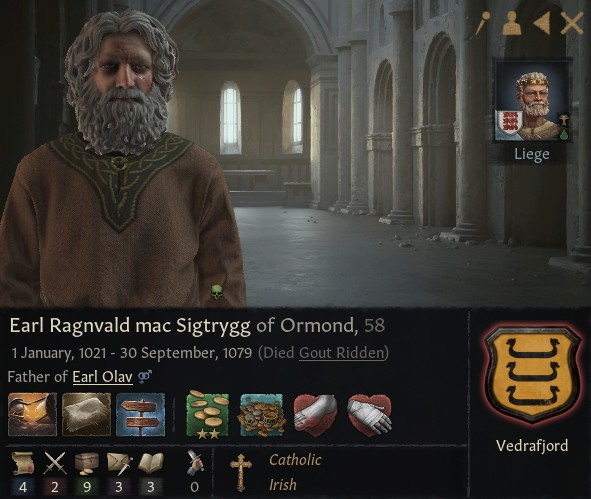

# Earl Ragnvald mac Sigtrygg of Ormond

### 1069

## LIFE

01.01.1021-30.09.1079

## HOUSE

Vedrafjord

## DINASTY

Vedrafjord

## LIEGE

[Petty King Murchad mac Donnchad of Munster](murchad_mac_donnchad_1027.md)

## TITLES 

- Earl of Ormond (01.07.1038 - inherited)

## PARENTS

- Earl Sigtrygg Ivarsson of Ormond
- Ben-Muman nic Cu-Muman au Rubann

## GRANDPARENTS

- Earl Ivar of Ormond 
- ?
- Earl Cu-Muman of Ormond
- ?

- ## CHILDREN

- Earl Olav mac Ragnvald of Ormond

## PHOTOS

### 1079

