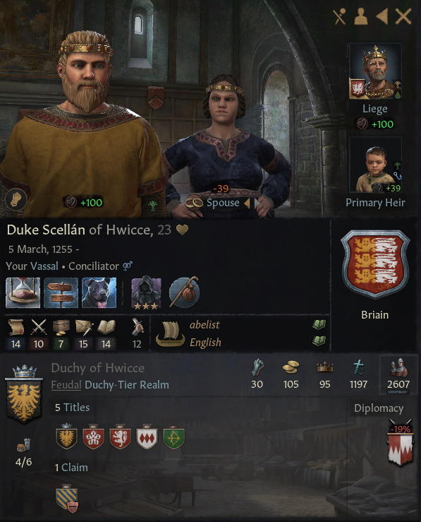

# Duke Scellan of Hwicce, 1255-, Briain

## FAMILY TREE
```
Duke Scellan of Hwicce, 1255-, Briain
    Earl Fuacarta, 1212-1267
        Scellan Ceiteach, 1189-1250
            Baron Gilla-Comgain, 1158-1221
                ?
                ?
            Effros of Bamburgh, 1166-1236
                ?
                ?
        Ben-Muman Briain, 1181-1249
            Fuacarta Briain, 1162-1228
                Prince Jacques of Lotharingia, 1133-1171
                Aibilin Briain, 1135-1203
            Viola z Homberka, 1163-1233
                Count Jaros, 1137-1217
                Princess Vilemina, 1137-1192            
    Thiedburga von Wettin, 1210-
        ?
        Elbrig, 1244
            ?
            ?
```

# REFERENCES

## ANCESTORS
* [Earl Fuacarta mac Ben-Muman of Leicestershire, 1212-, Briain](fuacarta_mac_ben-muman_1212.md)
* [Princess Aibilin mac Caindelban of Ireland, 1135-1203, Briain](aibilin_mac_caindelban_1135.md)

## DESCENDANTS

## RELATIVES

##### END RELATIVES 
## HISTORY
* [1278.md](../h/1278.md)

#### END REFERENCES

# PORTRAITS

## 1278


#### END PORTRAITS

