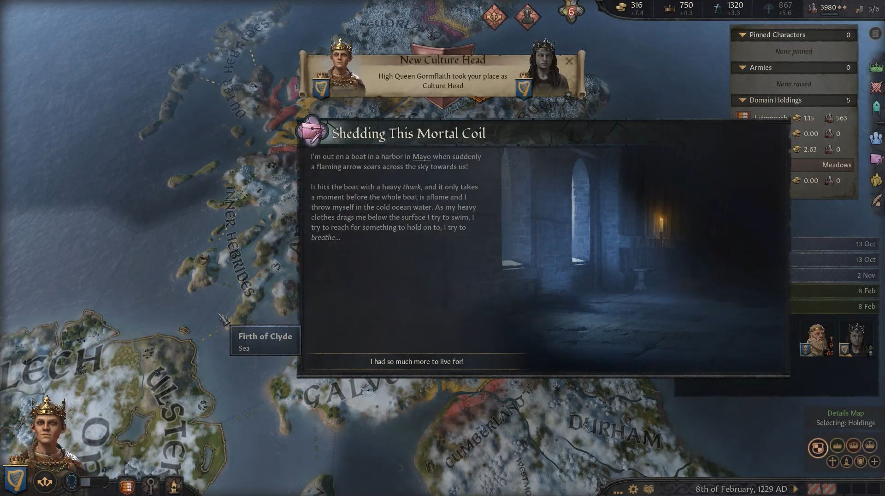

# High Queen Slaine nic Caindelban of Ireland, 1212-1229, Briain

## FAMILY TREE 
```
High Queen Slaine nic Caindelban of Ireland, 1212-1229, Briain
	High King Caindelban II, 1147-1227
		High King Caindelban I, 1114-1186
			High King Faelan, 1084-1136
				High King Brian II, 1048-1111
				Hunydd Mathrafal, 1042-1099
			Elisabet Crovan, 1083-1148
				Duke Gudrod, 1049-1115
				Princess Ragnhild, 1045-1110
		High Queen Flann, 1117-1172
			Domnall ua Neill Noigiallaich, 1069-1120
				Earl Flaithbertach, 1045-1110
				Flann, 1037-1111
			Rois Neill, 1071-1145
				Domnall Neill, 1030-1077
				Eua, 1040-1090
	Maer, 1167- 
		?
		?
		
```

## HISTORY

### [1249](../h/1249.md)




# REFERENCES

## ANCESTORS
* [Elisabet Gudrodsdatter, 1083-1148, Crovan](elisabet_gudrodsdatter_1083.md)
* [High King Faelan mac Brian of Ireland, 1084-1136, Briain](faelan_mac_brian_1084.md)
* [High King Caindelban II mac Caindelban of Ireland, 1147-1227, Briain](caindelban_ii_mac_caindelban_1147.md)
* [High King Caindelban I mac Faelan of Ireland, 1114-1186, Briain](caindelban_i_mac_faelan_1114.md)

## HISTORY
* [1227.md](../h/1227.md)
#### END REFERENCES* [1249.md](../h/1249.md)
#### END REFERENCES