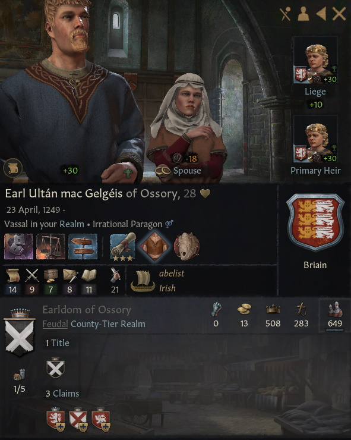

# Earl Ultan mac Gelgeis of Ossory, 1249-, Briain

## FAMILY TREE
```
Earl Ultan mac Gelgeis of Ossory, 1249-, Briain
    Earl Muirgius, 1190-1250
        Gilla-na-Naem, 1165-1229
            Earl Abban, 1132-1191
                Duke Udalschalk, 1096-1162
                Countess Cobflaith, 1101-1176
            Gnathnad mac Mathgamna, 1134-1193
                Gilla-na-Naem mac Mathgamna, 1105-1135
                Lady Nest, 1104-1172 
        Muirenn I gCais-Cruachu, 1165-1230
            Gilla-Ruad gCais-Cruachu, 1142-1204
                Duke Fiachnae, 1125-1184
                Morien Caerloyw-Tyddewi, 1122-1192
            Sybilla de Beaumont, 1130-1203
                Ralph de Beaumont, 1111-1166
                Aelwyd Morgannwg, 1093-1158
    Duchess Gelgeis, 1217-1277
        Earl Abban, 1181-1234
            Eochad Briain, 1163-1191
                Earl Abban, 1132-1192
                Gnathnad mac Mathgamna, 1134-1193
            Countess Jagoda, 1148-1211
                Baron Petar, 1111-1165
                Baroness Aurengarde, 1111-1164
        Countess Gnathnad, 1191-1219
            Gormgus Briain, 1167-1221
                Earl Abban, 1132-1192
                Gnathnad mac Mathgamna, 1134-1193
            Garb Briain, 1147-1214
                Gwyn Ynys Cybi, 1127-1168
                Muirgel Briain, 1130-1201
```

# REFERENCES

## ANCESTORS
* [Eochad mag Abban, 1163-1191, Briain](eochad_mag_abban_1163.md)
* [Lady Nest ferch Morien of Eryri, 1104-1172, Caerloyw-Tyddewi](nest_ferch_morien_1104.md)
* [Earl Abban mag Eochad of Athlone, 1181-1234, Briain](abban_mag_eochad_1181.md)
* [Gilla-Ruad mac Fiachnae, 1142-1204, gCais-Cruachu](gilla-ruad_mac_fiachnae_1142.md)
* [Duke Fiachnae mac Faelan of Connacht, 1125-1184, gCais-Cruachu](fiachnae_mac_faelan_1125.md)
* [Countess Gnathnad nic Garb of Athlone, 1191-1219, Briain](gnathnad_nic_garb_1191.md)
* [Countess Cobflaith nic Faelan of Ceredigion, 1101-1176, Briain](cobflaith_nic_faelan_1101.md)
* [Muirenn I nic Gilla-Ruad, 1165-1230, gCais-Cruachu](muirenn_i_nic_gilla-ruad_1165.md)

## DESCENDANTS

## RELATIVES

##### END RELATIVES 
## HISTORY
* [1278.md](../h/1278.md)

#### END REFERENCES

# PORTRAITS

## 1278


#### END PORTRAITS

